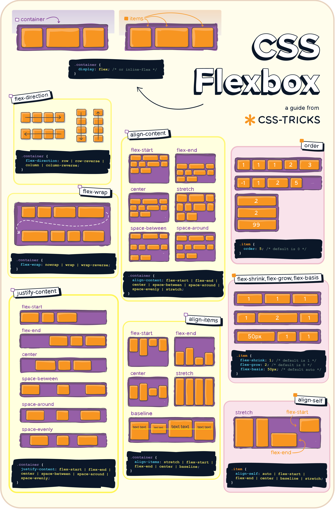

## Overview
### The Design of CSS
**CSS** (Cascading Style Sheets) is the language that governs the visual presentation of documents
written in HTML and XML. Where HTML defines *what* content is, CSS defines *how* it looks: its
colors, typefaces, spacing, and layout. This separation of structure from presentation is the
foundational design principle behind CSS, and it matters in practice. A single HTML document can be
paired with multiple stylesheets to produce entirely different visual results, making it possible to
redesign a site without touching its content, or to serve different layouts to different devices from
the same markup.

CSS is a **declarative language**. You describe the desired visual state of an element rather than
writing instructions for how to compute it. The browser's rendering engine resolves those
descriptions into pixels. Because rules can come from many sources, can conflict, and can apply
partially, the engine follows well-defined resolution rules to produce a deterministic result.

### The Cascade
The word "cascading" refers to the algorithm that determines which styles apply when multiple rules
could match the same element and property. Rules from different sources layer in a defined order:
browser defaults at the bottom, author stylesheets in the middle, and user overrides at the top.
Within an author stylesheet, rules are ordered first by **specificity** and then by **source order**
(the later rule wins when specificity is equal).

This layering is not a limitation; it is the architecture. It allows a general rule to establish a
baseline that more specific rules selectively override, without requiring every property to be
declared for every element.

### Inheritance
Many CSS properties **inherit** from parent elements to their children. Text-related properties such
as `font-family`, `color`, and `line-height` propagate down the document tree automatically, which
is why setting a font on the `<body>` element applies it throughout the page. Layout properties such
as `margin`, `padding`, and `border` do not inherit, because they describe the geometry of an
individual element rather than a characteristic shared with its descendants.

Four keywords give explicit control over inheritance. `inherit` forces a property to take its
parent's computed value. `initial` resets it to the CSS specification's default. `unset` behaves as
`inherit` for naturally inheriting properties and as `initial` for those that do not.
`revert` rolls the value back to the browser's default stylesheet.

## Selectors
A **selector** is the part of a CSS rule that identifies which elements in the document the rule
applies to. CSS provides a rich selector language that can target elements by their type,
attributes, position in the document tree, and interactive state.

### Simple Selectors
#### Type Selectors
A **type selector** (also called an element selector) matches every element of a given HTML tag
name.

```css
p {
    line-height: 1.6;
}

h2 {
    font-size: 1.5rem;
}
```

#### The Universal Selector
The **universal selector** (`*`) matches every element in the document. It is most commonly used to
reset browser defaults or to apply `box-sizing` globally.

```css
*,
*::before,
*::after {
    box-sizing: border-box;
}
```

#### Class Selectors
A **class selector** matches elements whose `class` attribute includes the specified name. It is
prefixed with a period.

```css
.highlight {
    background-color: yellow;
}
```

An element may belong to multiple classes. Chaining class selectors without spaces requires all of
them to be present on the same element:

```css
/* Matches elements that have both 'card' and 'featured' classes */
.card.featured {
    border: 2px solid gold;
}
```

#### ID Selectors
An **ID selector** matches a single element whose `id` attribute equals the specified value. It is
prefixed with a hash symbol.

```css
#main-header {
    position: sticky;
    top: 0;
}
```

::: {.callout-note title="IDs vs. Classes"}
Because an `id` must be unique within a document, ID selectors are rarely used in production
stylesheets. Their high specificity makes them difficult to override. Class selectors are almost
always preferred.
:::

#### Attribute Selectors
**Attribute selectors** match elements based on the presence or value of their HTML attributes.
They are written inside square brackets and offer seven distinct matching modes:

| Selector        | Matches when the attribute...                 |
|:----------------|:----------------------------------------------|
| `[attr]`        | is present, regardless of value               |
| `[attr="val"]`  | equals `val` exactly                          |
| `[attr~="val"]` | contains `val` as a whitespace-separated word |
| `[attr\|="val"]` | equals `val` or begins with `val-`            |
| `[attr^="val"]` | begins with `val`                             |
| `[attr$="val"]` | ends with `val`                               |
| `[attr*="val"]` | contains `val` as a substring                 |

```css
/* Any element with a 'disabled' attribute */
[disabled] {
    opacity: 0.5;
    cursor: not-allowed;
}

/* Links pointing to external sites */
a[href^="https://"] {
    color: teal;
}

/* Images whose alt text ends with "diagram" */
img[alt$="diagram"] {
    border: 1px solid #ccc;
}
```

Attribute value matching is case-sensitive by default. Appending the `i` flag before the closing
bracket enables case-insensitive matching: `[attr="val" i]`.

### Combinators
**Combinators** describe the structural relationship between two selectors. They are the mechanism
by which you express document-tree relationships rather than just individual element properties.

#### Descendant Combinator
A **space** between two selectors matches elements that are descendants (children, grandchildren,
and so on) of the first element.

```css
/* Any <a> inside a <nav>, however deeply nested */
nav a {
    text-decoration: none;
}
```

#### Child Combinator
The **child combinator** (`>`) matches elements that are direct children only, not deeper
descendants.

```css
/* Only direct <li> children of <ul>, not items in nested lists */
ul > li {
    list-style-type: disc;
}
```

#### Adjacent Sibling Combinator
The **adjacent sibling combinator** (`+`) matches an element that immediately follows a specified
sibling at the same level in the tree.

```css
/* A <p> that immediately follows an <h2> */
h2 + p {
    margin-top: 0;
}
```

#### General Sibling Combinator
The **general sibling combinator** (`~`) matches all subsequent siblings at the same level, not
just the immediate one.

```css
/* All <p> elements that follow an <h2> within the same parent */
h2 ~ p {
    color: #555;
}
```

### Pseudo-Classes
A **pseudo-class** selects an element based on a state or condition that cannot be expressed with
attribute or structural information alone: user interaction, document position, or form validity.
Pseudo-classes are prefixed with a single colon.

#### User Action States
| Pseudo-class     | Matches when...                                               |
|:-----------------|:--------------------------------------------------------------|
| `:hover`         | the pointer is positioned over the element                    |
| `:active`        | the element is being pressed or activated                     |
| `:focus`         | the element has received keyboard focus                       |
| `:focus-visible` | the element has focus and the browser would show a focus ring |
| `:focus-within`  | the element or any of its descendants has focus               |

::: {.callout-note title=":focus-visible vs. :focus"}
`:focus` fires for all focus events, including mouse clicks. `:focus-visible` fires only when the
browser determines a visible focus indicator is appropriate, typically for keyboard navigation.
Using `:focus-visible` preserves accessibility without showing focus rings on mouse-clicked
elements.
:::

#### Link States
| Pseudo-class | Matches when...                                              |
|:-------------|:-------------------------------------------------------------|
| `:link`      | an unvisited `<a>` element with an `href`                    |
| `:visited`   | an `<a>` element the user has already visited                |
| `:any-link`  | any `<a>` or `<area>` element with an `href`, visited or not |

The conventional order for link styling is `:link`, `:visited`, `:hover`, `:active` (remembered as
**LVHA**) because specificity is equal across these pseudo-classes and source order determines which
rule wins.

#### Structural Pseudo-Classes
These pseudo-classes match elements based on their position in the document tree.

| Pseudo-class           | Matches...                                                |
|:-----------------------|:----------------------------------------------------------|
| `:root`                | the document root element (the `<html>` element in HTML)  |
| `:empty`               | elements that have no children and no text content        |
| `:first-child`         | an element that is the first child of its parent          |
| `:last-child`          | an element that is the last child of its parent           |
| `:only-child`          | an element that is the only child of its parent           |
| `:nth-child(n)`        | elements at the nth position among all siblings           |
| `:nth-last-child(n)`   | elements at the nth position counting from the last child |
| `:first-of-type`       | the first sibling of its tag type within its parent       |
| `:last-of-type`        | the last sibling of its tag type within its parent        |
| `:only-of-type`        | the only sibling of its tag type within its parent        |
| `:nth-of-type(n)`      | the nth sibling of its tag type                           |
| `:nth-last-of-type(n)` | the nth sibling of its tag type, counting from the last   |

The `n` argument in `:nth-child()` and `:nth-of-type()` accepts a number, the keywords `odd` or
`even`, or an **An+B** expression where A is the step and B is the offset:

```css
/* Every other row starting from the second */
tr:nth-child(even) {
    background-color: #f9f9f9;
}

/* Every third item starting from the first */
li:nth-child(3n+1) {
    font-weight: bold;
}

/* The last three list items */
li:nth-last-child(-n+3) {
    color: crimson;
}
```

#### Form and Input States
| Pseudo-class         | Matches when the input...                                               |
|:---------------------|:------------------------------------------------------------------------|
| `:enabled`           | is interactive (not disabled)                                           |
| `:disabled`          | has the `disabled` attribute                                            |
| `:checked`           | is a checkbox or radio button that is checked                           |
| `:indeterminate`     | is a checkbox in an indeterminate (neither checked nor unchecked) state |
| `:required`          | has the `required` attribute                                            |
| `:optional`          | does not have the `required` attribute                                  |
| `:valid`             | passes its built-in validation constraints                              |
| `:invalid`           | fails its built-in validation constraints                               |
| `:in-range`          | has a value within the defined `min` and `max` range                    |
| `:out-of-range`      | has a value outside the defined `min` and `max` range                   |
| `:placeholder-shown` | is currently displaying its placeholder text                            |
| `:read-only`         | has the `readonly` attribute                                            |
| `:read-write`        | is editable (does not have the `readonly` attribute)                    |

#### Logical Pseudo-Classes
These pseudo-classes accept selector arguments, enabling complex matching logic.

**`:not(selector)`** matches elements that do *not* match the argument. Modern CSS accepts a
selector list.

```css
/* All inputs except submit buttons */
input:not([type="submit"]) {
    border: 1px solid #ccc;
}

/* All list items except the last */
li:not(:last-child) {
    border-bottom: 1px solid #eee;
}
```

**`:is(selector-list)`** matches elements that match any selector in the list. Its specificity
equals that of its most specific argument.

```css
/* Equivalent to: h1 a, h2 a, h3 a */
:is(h1, h2, h3) a {
    color: inherit;
}
```

**`:where(selector-list)`** behaves identically to `:is()` but always contributes **zero
specificity**. It is ideal for base styles and resets that should be easily overridden by anything.

```css
/* These styles have zero specificity and yield to any other rule */
:where(ul, ol) {
    padding-left: 1.5em;
}
```

**`:has(selector)`** matches an element if the given relative selector matches at least one of its
descendants. It functions as the CSS equivalent of a parent selector.

```css
/* A <figure> that contains an  */
figure:has(img) {
    display: flex;
    flex-direction: column;
    align-items: center;
}

/* A form field wrapper that contains an invalid input */
.field:has(input:invalid) {
    outline: 2px solid crimson;
}
```

#### Other Pseudo-Classes
| Pseudo-class  | Matches...                                                 |
|:--------------|:-----------------------------------------------------------|
| `:target`     | an element whose `id` matches the current URL fragment     |
| `:lang(code)` | elements with a matching `lang` attribute value            |
| `:scope`      | the element acting as the reference point for the selector |

### Pseudo-Elements
A **pseudo-element** targets a specific part of an element's content or generates virtual content
that has no corresponding node in the HTML source. Pseudo-elements are prefixed with two colons
(though a single colon is accepted for legacy compatibility).

| Pseudo-element   | Targets...                                                      |
|:-----------------|:----------------------------------------------------------------|
| `::before`       | a generated box inserted before the element's content           |
| `::after`        | a generated box inserted after the element's content            |
| `::first-line`   | the first rendered line of a block element                      |
| `::first-letter` | the first letter of a block element                             |
| `::placeholder`  | the placeholder text of an `<input>` or `<textarea>`            |
| `::selection`    | the portion of text currently selected by the user              |
| `::marker`       | the marker box of a list item (the bullet or number)            |
| `::backdrop`     | the full-viewport backdrop rendered behind a `<dialog>` element |

`::before` and `::after` require the `content` property to render. The value can be an empty string
when only visual styling is needed.

```css
/* Decorative quotation mark added via CSS, not HTML */
blockquote::before {
    content: "\201C";    /* Left double quotation mark */
    font-size: 3em;
    color: #ccc;
    float: left;
    margin-right: 0.1em;
}

/* Append the href of a link in printed output */
@media print {
    a[href]::after {
        content: " (" attr(href) ")";
    }
}

/* Style list markers independently of list item text */
li::marker {
    color: teal;
    font-weight: bold;
}
```

### Specificity
**Specificity** is the weight the browser assigns to a selector to determine which rule wins when
multiple rules target the same element and property. It is calculated as a three-part score:
**(ID count, Class/Attribute/Pseudo-class count, Type/Pseudo-element count)**. The scores are
compared left to right; a single ID outweighs any number of class selectors.

| Selector         | ID  | Class / Attr / Pseudo-class | Type / Pseudo-element | Score   |
|:-----------------|:---:|:---------------------------:|:---------------------:|:-------:|
| `p`              | 0   | 0                           | 1                     | (0,0,1) |
| `.warning`       | 0   | 1                           | 0                     | (0,1,0) |
| `p.warning`      | 0   | 1                           | 1                     | (0,1,1) |
| `#header`        | 1   | 0                           | 0                     | (1,0,0) |
| `#header .nav a` | 1   | 1                           | 1                     | (1,1,1) |
| `:not(p)`        | 0   | 0                           | 1                     | (0,0,1) |
| `:is(h1, h2)`    | 0   | 0                           | 1                     | (0,0,1) |
| `:where(h1, h2)` | 0   | 0                           | 0                     | (0,0,0) |

**Inline styles** declared with the `style` attribute on an element beat all selector-based rules.
The `!important` declaration overrides everything, including inline styles, and should be treated as
a last resort because it breaks the natural cascade and makes future overrides difficult.

When two rules share equal specificity, the one that appears **later in the source** wins. This is
the cascade at work: rules flow downward, and later rules prevail on equal footing.

## Element Types and the Box Model
### The Display Model
Every HTML element has a default **display type** that determines how it participates in layout. The
`display` property overrides this default and is the primary lever for controlling how an element
behaves in document flow.

#### Block Elements
A **block element** generates a block-level box. It occupies the full width available in its
container by default, starts on a new line, and forces subsequent content onto a new line. Block
elements respond to all four sides of `width`, `height`, `margin`, and `padding`.

Default block elements include `<div>`, `<p>`, `<h1>` through `<h6>`, `<ul>`, `<ol>`, `<li>`,
`<section>`, `<article>`, `<nav>`, and `<footer>`.

#### Inline Elements
An **inline element** generates one or more inline-level boxes that flow within a line of text. It
does not start a new line; its dimensions are determined by its content. The `width` and `height`
properties have no effect. Padding and border apply on all four sides, but vertical `margin` does
not push surrounding lines apart.

Default inline elements include `<span>`, `<a>`, `<strong>`, `<em>`, `<code>`, and `<label>`.

#### Inline-Block
`display: inline-block` is a hybrid: the element flows in line with text like an inline element,
but it responds to `width`, `height`, and all four sides of `margin` and `padding` like a block
element. This is the natural choice for buttons, badges, and any component that must sit inline
while also having precise dimensions.

```css
.badge {
    display: inline-block;
    padding: 0.2em 0.6em;
    border-radius: 1em;
    font-size: 0.8em;
}
```

#### Replaced Elements
A **replaced element** is one whose content is controlled by an external resource rather than by
CSS. The browser renders it according to its intrinsic dimensions. ``, `<video>`, `<canvas>`,
`<iframe>`, and form controls are replaced elements. They behave like inline-block by default and
accept `width` and `height`.

#### The `display` Property
The `display` property accepts a broad set of values:

| Value          | Behavior                                                                               |
|:---------------|:---------------------------------------------------------------------------------------|
| `block`        | Block-level box                                                                        |
| `inline`       | Inline-level box                                                                       |
| `inline-block` | Inline-level box with block-like interior                                              |
| `none`         | Element and its descendants are removed from layout entirely                           |
| `flex`         | Block-level flex container                                                             |
| `inline-flex`  | Inline-level flex container                                                            |
| `grid`         | Block-level grid container                                                             |
| `inline-grid`  | Inline-level grid container                                                            |
| `contents`     | The element generates no box; its children participate directly in the parent's layout |
| `list-item`    | Generates a block box and a `::marker` box                                             |

### The Box Model
Every element in CSS is represented as a rectangular **box** composed of four nested regions:

1. **Content box**: The area where the element's text or child elements are rendered.
2. **Padding box**: Transparent space between the content and the border.
3. **Border box**: A stroke that surrounds the padding.
4. **Margin box**: Transparent space outside the border that separates the element from its
   neighbors.

Padding and border are visible (or at least occupy space) and contribute to the element's rendered
size. Margins are always transparent and collapse in specific circumstances.

#### `box-sizing`
The `box-sizing` property controls what the `width` and `height` properties actually measure.

- **`content-box`** (the browser default): `width` and `height` set the content area only. Padding
   and border are added on top, so the rendered element is larger than the declared dimensions.
- **`border-box`**: `width` and `height` include padding and border. The content area shrinks to
   accommodate them, so declared dimensions match rendered dimensions precisely.

`border-box` is almost universally preferred in modern CSS. Applying it globally is standard
practice:

```css
*,
*::before,
*::after {
    box-sizing: border-box;
}
```

#### Margin Collapse
Adjacent **vertical** margins between block elements collapse into a single margin equal to the
larger of the two values. This does not apply to horizontal margins, flexbox children, or grid
items.

```css
p {
    margin-top: 1em;
    margin-bottom: 1em;
}

/* The gap between two consecutive <p> elements is 1em, not 2em */
```

## Positioning
CSS provides several positioning systems. Elements in **normal flow** are laid out in document
order: block elements stack vertically in a block formatting context, and inline elements flow
horizontally within lines. Every positioning tool described below either modifies normal flow or
replaces it.

### The `position` Property
#### Relative Positioning
`position: relative` offsets an element from where it would naturally appear, using the `top`,
`right`, `bottom`, and `left` properties. The element's original space in the flow is preserved;
surrounding elements are not affected and do not shift to fill the gap.

```css
.nudged {
    position: relative;
    top: 4px;     /* Moves the element 4px down from its natural position */
    left: -2px;   /* Moves it 2px to the left */
}
```

Relative positioning also establishes a **containing block** for any absolutely positioned
descendants.

#### Absolute Positioning
`position: absolute` removes an element from normal flow entirely. It is positioned relative to its
nearest **positioned ancestor**, which is any ancestor with a `position` value other than `static`.
If no positioned ancestor exists, the element is positioned relative to the initial containing
block (effectively the viewport).

```css
.parent {
    position: relative;   /* Establishes a containing block */
}

.tooltip {
    position: absolute;
    top: 100%;       /* Directly below the parent's bottom edge */
    left: 0;
    width: 200px;
}
```

Specifying both `left` and `right` without an explicit `width` stretches the element to span the
horizontal space between those two inset values. The same principle applies to `top` and `bottom`.

#### Fixed Positioning
`position: fixed` positions an element relative to the **viewport** rather than any ancestor. It
does not scroll with the page, making it the standard approach for persistent navigation bars,
floating action buttons, and modal overlays.

```css
.top-bar {
    position: fixed;
    top: 0;
    left: 0;
    right: 0;
    z-index: 100;
}
```

::: {.callout-note title="Transforms Break Fixed Positioning"}
If any ancestor has a `transform`, `filter`, or `perspective` property applied to it, `position:
fixed` behaves like `position: absolute` relative to that ancestor rather than the viewport. This
is specified behavior and a common source of confusion.
:::

#### Sticky Positioning
`position: sticky` is a hybrid of relative and fixed. The element behaves as `position: relative`
until scrolling would cause it to cross a specified threshold, at which point it "sticks" and
behaves as `position: fixed` within the bounds of its containing block. When the containing block
scrolls out of view, the element unsticks and disappears with it.

```css
thead th {
    position: sticky;
    top: 0;           /* Sticks to the top of the scroll container */
    background: white;
}
```

#### `z-index` and Stacking Order
When elements overlap, their paint order is governed by **stacking contexts**. Within a stacking
context, elements are painted back to front according to their `z-index`. A positioned element with
`z-index: 1` is painted on top of a positioned element with `z-index: 0`.

A new stacking context is created by any positioned element with a `z-index` value other than
`auto`, as well as by elements with `opacity` less than 1, or with `transform`, `filter`, or
`will-change` applied. Stacking contexts are hierarchical: a child can never paint on top of
another stacking context at a higher level than its own parent.

### Flexbox
::: {.subheading}
One-Dimensional Layout
:::

**Flexbox** (`display: flex`) is designed for distributing space and aligning items along a single
axis. It elegantly solves a large class of layout problems: centering content vertically,
distributing items with equal spacing, and building responsive navigation bars.

#### Concepts
The **flex container** is the element with `display: flex`. Its direct children become **flex
items**. Two axes govern alignment:

- The **main axis** runs in the direction defined by `flex-direction`.
- The **cross axis** runs perpendicular to the main axis.

#### Container Properties
| Property          | Values                                                                              | Effect                                        |
|:-----------------------|:-------------------------------------------------------------------------------|:----------------------------------------------|
| `flex-direction`  | `row` (default), `row-reverse`, `column`, `column-reverse`                          | Sets the main axis direction                  |
| `flex-wrap`       | `nowrap` (default), `wrap`, `wrap-reverse`                                          | Allows items to wrap onto multiple lines      |
| `flex-flow`       | shorthand for `flex-direction` and `flex-wrap`                                      |                                               |
| `justify-content` | `flex-start`, `flex-end`, `center`, `space-between`, `space-around`, `space-evenly` | Distributes space along the main axis         |
| `align-items`     | `stretch` (default), `flex-start`, `flex-end`, `center`, `baseline`                 | Aligns items along the cross axis             |
| `align-content`   | same as `justify-content` plus `stretch`                                            | Distributes space between lines when wrapping |
| `gap`             | length or percentage                                                                | Space between items                           |

```css
/* Classic vertically and horizontally centered layout */
.container {
    display: flex;
    justify-content: center;
    align-items: center;
    min-height: 100vh;
}
```

```css
/* Navigation bar with logo on the left, links on the right */
.navbar {
    display: flex;
    flex-direction: row;
    justify-content: space-between;
    align-items: center;
    padding: 0 1.5rem;
    gap: 1rem;
}
```

#### Item Properties
| Property      | Values                              | Effect                                                |
|:--------------|:------------------------------------|:------------------------------------------------------|
| `flex-grow`   | number (default: 0)                 | How much of the remaining space the item absorbs      |
| `flex-shrink` | number (default: 1)                 | How much the item shrinks when space is limited       |
| `flex-basis`  | length, `auto` (default), `content` | The item's base size before growing or shrinking      |
| `flex`        | shorthand for `grow shrink basis`   | `flex: 1` expands to `1 1 0`                          |
| `align-self`  | same as `align-items`               | Overrides `align-items` for a single item             |
| `order`       | integer (default: 0)                | Visual order of the item, independent of source order |

```css
/* Holy grail layout: fixed sidebars, growing center */
.sidebar-left  { flex: 0 0 200px; }   /* Fixed 200px, no growing, no shrinking */
.main-content  { flex: 1; }            /* Grows to fill all remaining space */
.sidebar-right { flex: 0 0 160px; }   /* Fixed 160px */
```

{fig-align="center" width=10in}

### CSS Grid
::: {.subheading}
Two-Dimensional Layout
:::

**CSS Grid** (`display: grid`) controls rows and columns simultaneously. Where Flexbox works along
one axis at a time, Grid governs both axes together, making it the right tool for page-level layouts
and any design that requires precise alignment across rows and columns.

#### Defining the Grid
The grid container's columns and rows are declared with `grid-template-columns` and
`grid-template-rows`.

```css
.page {
    display: grid;
    grid-template-columns: 220px 1fr 1fr;   /* One fixed column, two flexible */
    grid-template-rows: auto 1fr auto;       /* Header, main content, footer */
    gap: 1rem;
}
```

The **`fr` unit** represents a fraction of the available space after fixed lengths and content sizes
are subtracted. It is analogous to `flex-grow`.

**`repeat()`** shortens repetitive declarations:

```css
/* Three equal columns */
grid-template-columns: repeat(3, 1fr);

/* Responsive columns: as many 200px columns as fit, each growing to fill space */
grid-template-columns: repeat(auto-fill, minmax(200px, 1fr));
```

**`minmax(min, max)`** sets a size range for a track, allowing it to be flexible within bounds:

```css
grid-template-columns: minmax(150px, 1fr) 2fr;
```

#### Placing Items
Grid items can be placed explicitly by line number, span count, or named area.

```css
/* Spanning from grid line 1 to line 3 (occupying two column tracks) */
.header {
    grid-column: 1 / 3;
    grid-row: 1;
}

/* Spanning two columns from wherever the item is auto-placed */
.featured {
    grid-column: span 2;
}
```

#### Named Grid Areas
Named areas provide a visual description of the layout directly in the CSS:

```css
.page {
    display: grid;
    grid-template-areas:
        "header  header"
        "sidebar main  "
        "footer  footer";
    grid-template-columns: 220px 1fr;
    grid-template-rows: 60px 1fr 40px;
}

.page-header  { grid-area: header; }
.page-sidebar { grid-area: sidebar; }
.page-main    { grid-area: main; }
.page-footer  { grid-area: footer; }
```

A period (`.`) in a template area string denotes an empty cell. Area names must form contiguous
rectangles; irregular shapes are not permitted.

#### Auto-Placement
Items not explicitly placed are inserted by the **auto-placement algorithm**, which fills cells in
row order by default. `grid-auto-flow: column` switches to column order. `grid-auto-rows` and
`grid-auto-columns` define the size of implicitly created tracks.

```css
/* Responsive image gallery */
.gallery {
    display: grid;
    grid-template-columns: repeat(auto-fill, minmax(180px, 1fr));
    grid-auto-rows: 180px;
    gap: 1rem;
}
```

## Drawing
CSS provides a rich set of properties for rendering visible decoration on elements. Borders, fills,
gradients, and shadows operate on the box model regions and are composited in a defined order:
background color first, then background images (including gradients), then borders, then box
shadows.

### Borders
The `border` shorthand sets width, style, and color in one declaration. The `border-style` value is
required; a border with no defined style does not render regardless of other settings.

```css
.box {
    border: 2px solid #333;
}
```

Individual sides are controlled with `border-top`, `border-right`, `border-bottom`, and
`border-left`. The constituent properties can also be set independently using the familiar
top-right-bottom-left shorthand order:

```css
.box {
    border-width: 1px 2px 1px 2px;
    border-style: solid;
    border-color: #ccc;
}
```

Valid `border-style` values include: `none`, `hidden`, `solid`, `dashed`, `dotted`, `double`,
`groove`, `ridge`, `inset`, and `outset`.

#### Border Radius
`border-radius` rounds the corners of the border box. A single value applies equally to all four
corners. Four values apply in top-left, top-right, bottom-right, bottom-left order. A slash-separated
pair specifies separate horizontal and vertical radii for elliptical corners.

```css
/* All corners equally rounded */
.pill {
    border-radius: 999px;
}

/* Rounded top corners only */
.tab {
    border-radius: 6px 6px 0 0;
}

/* Elliptical corners */
.ellipse {
    border-radius: 50% / 30%;
}
```

A `border-radius` of `50%` on an element with equal `width` and `height` produces a perfect circle.

#### Outline
`outline` renders similarly to `border` but does not participate in the box model. It occupies no
space and does not affect layout. Outlines are drawn outside the border and are most commonly used
for focus indicators.

```css
:focus-visible {
    outline: 2px solid royalblue;
    outline-offset: 3px;   /* Gap between the element's border and the outline */
}
```

### Backgrounds and Fills
The `background` shorthand composes one or more background layers. Multiple layers are painted front
to back, separated by commas. The `background-color` is always the bottommost layer.

#### Background Color
```css
.card {
    background-color: #f5f5f5;
}
```

#### Background Image
Any URL-referenced image can serve as a background:

```css
.hero {
    background-image: url("images/banner.jpg");
    background-size: cover;          /* Scale to cover the entire element */
    background-position: center;     /* Anchor to the center */
    background-repeat: no-repeat;
}
```

| Property                | Common Values                                      | Effect                                     |
|:------------------------|:---------------------------------------------------|:-------------------------------------------|
| `background-size`       | `cover`, `contain`, `auto`, length                 | How the image is scaled                    |
| `background-position`   | `center`, `top right`, `50% 25%`                   | Where the image origin is placed           |
| `background-repeat`     | `repeat`, `no-repeat`, `repeat-x`, `repeat-y`      | Tiling behavior                            |
| `background-attachment` | `scroll` (default), `fixed`, `local`               | Whether the image scrolls with the element |
| `background-origin`     | `border-box`, `padding-box`, `content-box`         | Which box the position is relative to      |
| `background-clip`       | `border-box`, `padding-box`, `content-box`, `text` | Which box clips the painted area           |

`background-clip: text` combined with a transparent text color allows a gradient to show through
the text glyphs themselves.

### Gradients
CSS gradients are generated images. They can be used anywhere an image value is accepted and require
no external files.

#### Linear Gradients
`linear-gradient()` transitions colors along a straight line.

```css
/* Default direction: top to bottom */
background: linear-gradient(#e66465, #9198e5);

/* Left to right */
background: linear-gradient(to right, #e66465, #9198e5);

/* At a 45-degree angle */
background: linear-gradient(45deg, #e66465, #9198e5);

/* Multiple color stops with explicit positions */
background: linear-gradient(
    to bottom,
    #fff 0%,
    #f0f0f0 50%,
    #e0e0e0 100%
);

/* Hard stop: no transition between colors */
background: linear-gradient(to right, red 50%, blue 50%);
```

#### Radial Gradients
`radial-gradient()` radiates colors outward from a center point. The default shape is an ellipse
sized to the farthest corner.

```css
/* Default: ellipse centered in the element */
background: radial-gradient(#e66465, #9198e5);

/* Circular gradient anchored to the top left */
background: radial-gradient(circle at top left, #fff, #333);
```

The extent keywords `closest-side`, `farthest-side`, `closest-corner`, and `farthest-corner`
control how the gradient's endpoint is sized relative to the container:

```css
background: radial-gradient(circle closest-side at 50% 50%, white, black);
```

#### Conic Gradients
`conic-gradient()` rotates colors around a center point, producing a sweep effect analogous to a
color wheel or pie chart.

```css
/* A full color wheel */
background: conic-gradient(red, yellow, green, blue, red);

/* Pie chart with three segments */
background: conic-gradient(
    #4e79a7  0%  40%,    /* 40% slice */
    #f28e2b 40%  65%,    /* 25% slice */
    #e15759 65% 100%     /* 35% slice */
);

/* Starting angle and center position */
background: conic-gradient(from 90deg at 50% 50%, red, blue);
```

#### Repeating Gradients
Each gradient function has a `repeating-` variant that tiles the pattern indefinitely:

```css
/* Diagonal stripes */
background: repeating-linear-gradient(
    45deg,
    transparent,
    transparent 10px,
    #ccc 10px,
    #ccc 20px
);
```

#### Multiple Backgrounds
Gradients and images can be layered freely. Each layer is a comma-separated value:

```css
.card {
    background-image:
        linear-gradient(rgba(0, 0, 0, 0.4), rgba(0, 0, 0, 0.4)),
        url("photo.jpg");
    background-size: cover;
    background-color: #333;   /* Fallback if the image fails to load */
}
```

### Box Shadow
`box-shadow` renders one or more shadows outside or inside an element's border box. Multiple shadows
are composited front to back, separated by commas.

```css
/* Single subtle shadow */
.card {
    box-shadow: 0 2px 8px rgba(0, 0, 0, 0.15);
}

/* Layered shadows for depth */
.elevated {
    box-shadow:
        0 1px 3px rgba(0, 0, 0, 0.12),
        0 4px 12px rgba(0, 0, 0, 0.10);
}

/* Inset shadow (drawn inside the border) */
.input:focus {
    box-shadow: inset 0 1px 3px rgba(0, 0, 0, 0.2);
}
```

| Component       | Description                                                               |
|:----------------|:--------------------------------------------------------------------------|
| `offset-x`      | Horizontal offset; positive values push the shadow right                  |
| `offset-y`      | Vertical offset; positive values push the shadow down                     |
| `blur-radius`   | Size of the blur; 0 produces a sharp-edged shadow                         |
| `spread-radius` | Expands or contracts the shadow; 0 matches the element's size exactly     |
| `color`         | Shadow color; semi-transparent values blend naturally with the background |
| `inset`         | Optional keyword; draws the shadow inside the border rather than outside  |

## Further Reading
- [MDN Web Docs: CSS](https://developer.mozilla.org/en-US/docs/Web/CSS){target="_blank" rel="noopener noreferrer"} — The
   definitive reference for every CSS property, selector, and function.
- Meyer, E., & Weyl, E. (2023). *CSS: The Definitive Guide* (5th ed.). O'Reilly Media.
- [CSS-Tricks: A Complete Guide to Flexbox](https://css-tricks.com/snippets/css/a-guide-to-flexbox/){target="_blank" rel="noopener noreferrer"}
- [CSS-Tricks: A Complete Guide to Grid](https://css-tricks.com/snippets/css/complete-guide-grid/){target="_blank" rel="noopener noreferrer"}
