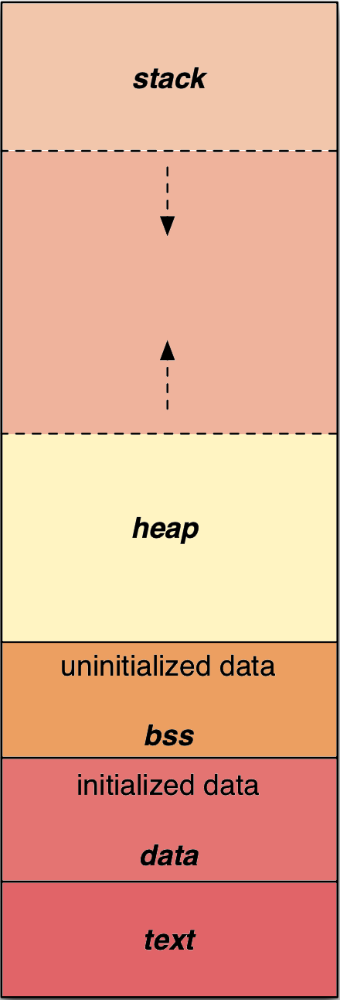
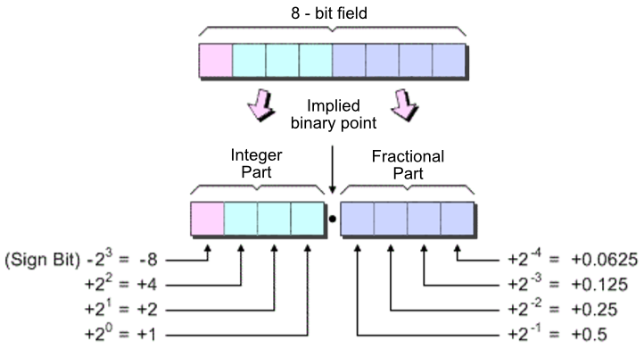
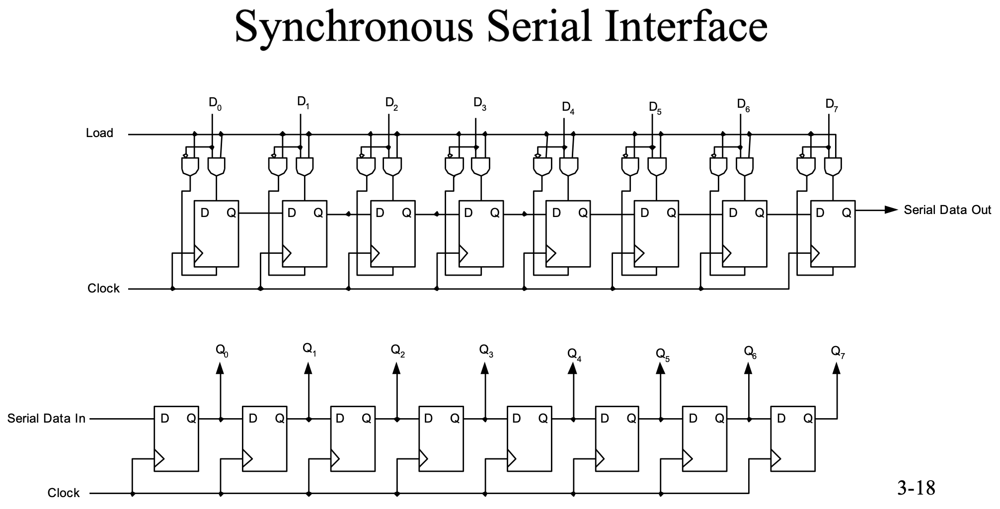

## Overview
Our stock pile of terms. We are structured in that the terms are alphabetical. For each term, attempt to include:

1. A rigorous definition.
2. An example, if applicable.
3. If applicable, a graphic. Preferably generated by python, but static is good too.
4. See also if applicable.

## Terms
### Block Started by Symbol
:::{.subheading}
BSS
:::
The **block starting symbol** (abbreviated to `.bss` or BSS) is the portion of an object file, executable, or assembly language code that contains statically allocated variables that are declared but have not been assigned a value yet. It is often referred to as the "bss section" or "bss segment".

{fig-align="center" width=2.25in}

On some platforms, some or all of the bss section is initialized to zeroes. Unix-like systems and Windows initialize the bss section to zero. In C, statically allocated objects without an explicit initializer are initialized to zero (for arithmetic types) or a null pointer (for pointer types). Implementations of C typically represent zero values and null pointer values using a bit pattern consisting solely of zero-valued bits.


### Circular Buffer

### Comparator
An electronic component that compares two input voltages and outputs a digital signal indicating which is larger. It is essentially a specialized operational amplifier designed to operate in open-loop mode (without negative feedback).

##### The Logic
The comparator has two analog inputs ($V_+$ and $V_-$) and one binary digital output ($V_{out}$).

$$
V_{out} = \begin{cases}
V_{High} & \text{if } V_+ > V_- \\
V_{Low} & \text{if } V_+ < V_-
\end{cases}
$$

Where $V_{High}$ and $V_{Low}$ are typically the positive and negative (or ground) supply rails.

##### Visualization
::: {.subheading}
Zero-Crossing Detector
:::

The following plot demonstrates a comparator configured to switch when the input signal crosses 0V. This effectively converts a sine wave into a square wave.

```{python}
#| label: fig-comparator
#| fig-cap: "Comparator Operation: Converting a Sine Wave (Analog) to a Square Wave (Digital)."
#| code-fold: true

import numpy as np
import matplotlib.pyplot as plt

t = np.linspace(0, 1, 1000)
freq = 2.5
amplitude = 5

# Analog Input: Sine Wave
v_in = amplitude * np.sin(2 * np.pi * freq * t)

# Reference Voltage (Threshold)
v_ref = 0

# Comparator Output (Digital)
# Ideally switches between +5V and 0V
v_out = np.where(v_in > v_ref, 5, 0)

fig, (ax1, ax2) = plt.subplots(2, 1, figsize=(8, 6), sharex=True)

# Plot Analog Input
ax1.plot(t, v_in, label='$V_{in}$ (Analog)', color='tab:blue')
ax1.axhline(v_ref, color='black', linestyle='--', label='$V_{ref}$ (0V)')
ax1.set_title("Input: Analog Signal")
ax1.set_ylabel("Voltage (V)")
ax1.legend(loc='upper right')
ax1.grid(True, alpha=0.3)

# Plot Digital Output
ax2.plot(t, v_out, label='$V_{out}$ (Digital)', color='tab:red', linewidth=2)
ax2.set_title("Output: Digital Logic Level")
ax2.set_ylabel("Voltage (V)")
ax2.set_xlabel("Time (s)")
ax2.set_ylim(-1, 6)
ax2.legend(loc='upper right')
ax2.grid(True, alpha=0.3)

plt.tight_layout()
plt.show()
```

##### Key Properties

- **1-Bit ADC**: A comparator acts as the simplest possible Analog-to-Digital Converter. It produces a single bit of information: "Is $A$ larger than $B$?"
- **Speed**: Comparators are designed to recover quickly from saturation, making them much faster at switching than standard Op-Amps.
- **Hysteresis**: To prevent rapid, erratic switching due to noise when inputs are nearly equal, positive feedback is often added to create a "dead zone" or hysteresis. This configuration is known as a **Schmitt Trigger**.


### Fixed Point Numbers
A method of representing real (fractional) numbers using standard integer hardware by implicitly fixing the position of the binary point.

{fig-align='center' width='6in'}

In a fixed-point system, there is no physical difference between an integer and a fixed-point number in memory; the difference lies entirely in how the programmer *interprets* the bits.

##### The "Integers as Reals" Concept
To represent a fractional value $x$ using an integer $I$, we use a scaling factor $S$ (typically a power of two, $2^n$):

$$
 x = \frac{I}{S}
$$

*   **The Computer Sees**: $I$ (e.g., The integer 16,384)
*   **The Programmer Sees**: $x$ (e.g., The fraction 0.5)
*   **The Link**: The scaling factor (e.g., $2^{15} = 32,768$)

##### Visualization
The bit pattern `01000000` (64 decimal) can mean different things depending on where we "fix" the point:

| Format | Point Position | Calculation | Value |
| :--- | :--- | :--- | :--- |
| **Integer** | `01000000.` | $64 \times 2^0$ | **64** |
| **Fixed Q4.4** | `0100.0000` | $64 \times 2^{-4}$ | **4.0** |
| **Fixed Q0.8** | `.01000000` | $64 \times 2^{-8}$ | **0.25** |

##### Key Properties
*   **Determinism**: Precision is uniform across the entire range (unlike floating-point, where precision varies).
*   **Speed**: Arithmetic operations (add, subtract) are identical to integer operations, making them extremely fast on standard hardware.
*   **Limited Range**: You cannot represent very large and very small numbers simultaneously.
*   **Overflow Risk**: Because the range is fixed, operations must be carefully scaled to avoid wrapping around.


### Floating Point Numbers
A method of representing real numbers where the position of the radix point (decimal or binary point) is not fixed, allowing it to "float" based on the magnitude of the number. This format is the computer equivalent of scientific notation.

##### The Logic
A floating-point number is composed of three parts: a **Sign** ($S$), an **Exponent** ($E$), and a **Mantissa** or Significand ($M$). The value $V$ is calculated as:

$$
V = (-1)^S \times (1.M) \times 2^{(E - Bias)}
$$

*   **Sign**: Determines if the number is positive or negative.
*   **Exponent**: Scales the number (moves the binary point).
*   **Mantissa**: The fractional part of the number (precision).

##### Visualization
::: {.subheading}
IEEE 754 Single Precision (32-bit)
:::

The following diagram illustrates how the 32 bits are allocated in the standard IEEE 754 format.

```{python}
#| label: fig-float-ieee
#| fig-cap: "Structure of a 32-bit Floating Point Number (IEEE 754). The binary point is implicitly just to the right of the leading '1' (which is not stored), and moved by the exponent."
#| code-fold: true

import matplotlib.pyplot as plt
import matplotlib.patches as patches

fig, ax = plt.subplots(figsize=(10, 3))

# Draw Main Box
rect_total = patches.Rectangle((0, 0), 32, 1, facecolor='none', edgecolor='black', linewidth=2)
ax.add_patch(rect_total)

# Sign Bit (1 bit)
rect_sign = patches.Rectangle((31, 0), 1, 1, facecolor='tab:red', alpha=0.5, edgecolor='black')
ax.add_patch(rect_sign)
ax.text(31.5, 0.5, "S", ha='center', va='center', fontweight='bold', fontsize=12)
ax.text(31.5, 1.2, "Sign\n(1 bit)", ha='center', va='bottom', fontsize=9)

# Exponent (8 bits)
rect_exp = patches.Rectangle((23, 0), 8, 1, facecolor='tab:green', alpha=0.5, edgecolor='black')
ax.add_patch(rect_exp)
ax.text(27, 0.5, "Exponent", ha='center', va='center', fontweight='bold', fontsize=12)
ax.text(27, 1.2, "Exponent\n(8 bits)", ha='center', va='bottom', fontsize=9)

# Mantissa (23 bits)
rect_mant = patches.Rectangle((0, 0), 23, 1, facecolor='tab:blue', alpha=0.5, edgecolor='black')
ax.add_patch(rect_mant)
ax.text(11.5, 0.5, "Mantissa / Fraction", ha='center', va='center', fontweight='bold', fontsize=12)
ax.text(11.5, 1.2, "Mantissa\n(23 bits)", ha='center', va='bottom', fontsize=9)

# Axis formatting
ax.set_xlim(-1, 33)
ax.set_ylim(-0.5, 2)
ax.axis('off')
plt.title("IEEE 754 Single Precision Structure", y=0.9)
plt.show()
```

##### Key Properties

-   **Dynamic Range**: Can represent extremely large ($~10^{38}$) and extremely small ($~10^{-38}$) numbers, which is impossible for a 32-bit fixed-point number.
-   **Variable Precision**: The absolute precision depends on the magnitude.
    -   Small numbers have very fine precision (bits are close together).
    -   Large numbers have coarse precision (gaps between representable numbers are large).
-   **Complexity**: Arithmetic operations are significantly more complex than integer/fixed-point math. They typically require a dedicated Floating Point Unit (FPU) or slow software emulation.
-   **Not Associative**: Due to rounding errors, $(a + b) + c$ does not always equal $a + (b + c)$.

### MAC
:::{.subheading}
Multiply and Accumulate
:::

A fundamental hardware operation in Digital Signal Processors that computes the product of two numbers and adds that product to an accumulator in a single clock cycle.

##### The Governing Equation
The operation updates an accumulator ($A$) using two input operands ($B$ and $C$):

$$
A \leftarrow A + (B \times C)
$$

This is the most common operation in DSP algorithms, especially those involving linear combinations.

##### Visualization
::: {.subheading}
Hardware Architecture
:::

The following diagram illustrates the data flow within a dedicated MAC unit. Note the feedback loop from the Accumulator back to the Adder, which allows for efficient summation over many iterations.

```{python}
# | label: fig-mac-unit
# | fig-cap: "Functional block diagram of a MAC unit. The multiplier computes the product, which is then added to the previous value stored in the accumulator."
# | code-fold: true

import matplotlib.pyplot as plt
import matplotlib.patches as patches

fig, ax = plt.subplots(figsize=(9, 3))

# Multiplier Box
mult = patches.Rectangle(
    (1, 2), 1.5, 1, facecolor="tab:blue", alpha=0.3, edgecolor="black"
)
ax.add_patch(mult)
ax.text(1.75, 2.5, "Multiplier\n($B \\times C$)", ha="center", va="center")

# Adder Box
adder = patches.Rectangle(
    (4, 2), 1.5, 1, facecolor="tab:red", alpha=0.3, edgecolor="black"
)
ax.add_patch(adder)
ax.text(4.75, 2.5, "Adder\n(+)", ha="center", va="center")

# Accumulator Box (Register)
acc = patches.Rectangle(
    (7, 2), 1.6, 1, facecolor="tab:green", alpha=0.3, edgecolor="black"
)
ax.add_patch(acc)
ax.text(7.75, 2.5, "Accumulator\nRegister (A)", ha="center", va="center")

# Arrows
# Inputs to Multiplier
ax.annotate("B", xy=(1, 2.7), xytext=(0, 2.7), arrowprops=dict(arrowstyle="->"))
ax.annotate("C", xy=(1, 2.3), xytext=(0, 2.3), arrowprops=dict(arrowstyle="->"))

# Multiplier to Adder
ax.annotate("", xy=(4, 2.5), xytext=(2.5, 2.5), arrowprops=dict(arrowstyle="->"))

# Adder to Accumulator
ax.annotate("", xy=(7, 2.5), xytext=(5.5, 2.5), arrowprops=dict(arrowstyle="->"))

# Feedback loop (Accumulator to Adder)
ax.annotate(
    "",
    xy=(4.75, 3),
    xytext=(7.75, 3),
    arrowprops=dict(arrowstyle="->", connectionstyle="bar,fraction=0.2", color="gray"),
)
ax.text(6.25, 3.725, "Feedback (Previous Sum)", ha="center", color="gray")

# Output
ax.annotate(
    "Result", xy=(8.6, 2.5), xytext=(9.2, 2.465), arrowprops=dict(arrowstyle="<-")
)

ax.set_xlim(-0.5, 10)
ax.set_ylim(1, 5)
ax.axis("off")
plt.title("MAC Unit Architecture", fontsize=14, fontweight="bold")
plt.show()
```

##### Key Properties

- **Efficiency**: In a general-purpose CPU, a MAC operation might take several cycles (Fetch, Mult, Add, Store). A DSP (like the dsPIC33) can perform a 16x16-bit MAC in a **single cycle**.
- **Algorithm Foundation**: MAC is the "workhorse" of DSP. It is the core operation for:
    - **Digital Filters (FIR/IIR)**: Computing the weighted sum of samples.
    - **Correlation/Convolution**: Sliding dot products.
    - **FFT**: Butterfly computations.
- **Precision (Guard Bits)**: To prevent overflow during repeated additions, MAC accumulators are usually wider than the input data. For example, a 16-bit DSP might have 40-bit accumulators (16*16=32 bits, plus 8 "guard bits" to allow 256 additions without overflow).

### Multiplexer
::: {.subheading}
MUX
:::

A device that selects between several input signals and forwards the selected input to a single
output line. In electronic systems, a multiplexer (or MUX) acts as a digitally controlled
multi-position switch.

##### The Selection Logic
A multiplexer with $2^n$ inputs requires $n$ selection lines to determine which input is routed to
the output. For a basic 2-to-1 MUX with inputs $I_0, I_1$ and select line $S$:

$$
Y = \bar{S}I_0 + SI_1
$$

Where:

- $Y$ is the output.
- $S=0$ selects input $I_0$.
- $S=1$ selects input $I_1$.

##### Visualization
::: {.subheading}
Time-Division Multiplexing (TDM)
:::

In DSP and communications, multiplexing often refers to sharing a single channel by rapidly
switching between signals. This is called Time-Division Multiplexing.

```{python}
#| label: fig-mux-tdm
#| fig-cap: "Time-Division Multiplexing of two signals. The 'MUX Output' switches between Signal A and Signal B based on a high-frequency clock signal."
#| code-fold: true

import numpy as np
import matplotlib.pyplot as plt

# Parameters
fs = 2000
t = np.linspace(0, 0.1, fs)

# Two different signals to multiplex
sig_a = np.sin(2 * np.pi * 50 * t)          # 50 Hz Sine
sig_b = 0.5 * np.sign(np.sin(2 * np.pi * 30 * t)) # 30 Hz Square

# Selector signal (Switching at 200 Hz)
# When > 0, select sig_b; when <= 0, select sig_a
f_select = 200
selector = (np.sin(2 * np.pi * f_select * t) > 0).astype(float)

# Multiplexed Output
mux_out = np.where(selector == 0, sig_a, sig_b)

# Plotting
fig, axes = plt.subplots(3, 1, figsize=(8, 10), sharex=True)

axes[0].plot(t, sig_a, color='tab:blue', label='Signal A (Sine)')
axes[0].set_title('Input Signal A')
axes[0].legend(loc='upper right')
axes[0].grid(True, alpha=0.3)

axes[1].plot(t, sig_b, color='tab:green', label='Signal B (Square)')
axes[1].set_title('Input Signal B')
axes[1].legend(loc='upper right')
axes[1].grid(True, alpha=0.3)

axes[2].step(t, mux_out, color='tab:red', where='post', label='MUX Output')
axes[2].set_title('Multiplexed Output (TDM)')
axes[2].set_xlabel('Time (s)')
axes[2].legend(loc='upper right')
axes[2].grid(True, alpha=0.3)

# Add background shading for selector state
for i in range(0, len(t)-1, 10): # Sparse shading for performance
    if selector[i] > 0:
        axes[2].axvspan(t[i], t[min(i+10, len(t)-1)], color='tab:green', alpha=0.1)
    else:
        axes[2].axvspan(t[i], t[min(i+10, len(t)-1)], color='tab:blue', alpha=0.1)

plt.tight_layout()
plt.show()
```

##### Key Properties

- **Many-to-One**: The fundamental role of a MUX is to concentrate multiple data streams into a single
  physical medium.
- **Transparency**: In an ideal multiplexer, the selected signal is passed to the output without
  distortion or modification.
- **Complementary Operation**: The inverse process is performed by a **Demultiplexer (DEMUX)**, which
  takes a single input and routes it to one of many possible outputs.


### Parallel Interface

A **parallel interface** is a data communication method where multiple bits of data are transmitted simultaneously over separate wires or channels. In contrast to serial communication where bits are sent one at a time over a single channel, parallel interfaces use multiple data lines to transfer an entire data word (typically 8, 16, or 32 bits) in a single clock cycle.

##### Key Characteristics

- **Multiple Data Lines**: Uses separate physical conductors for each bit (e.g., an 8-bit parallel interface requires 8 data lines plus control signals)
- **Higher Speed Potential**: Can achieve higher data transfer rates for short distances since multiple bits are transmitted simultaneously
- **Distance Limitations**: Susceptible to signal skew and crosstalk at longer distances, limiting practical cable lengths
- **Cost**: Requires more physical connections, making cables and connectors more expensive and bulky

##### Common Examples

- **Parallel Printer Port** (IEEE 1284): Traditional PC printer connection using 8 data lines
- **PCI Bus**: Computer expansion bus using parallel data transfer
- **Memory Interfaces**: RAM connections typically use wide parallel buses (64+ bits)
- **Parallel I/O Ports**: GPIO ports on microcontrollers that can read/write multiple pins simultaneously

##### Trade-offs

While parallel interfaces offer theoretical speed advantages through simultaneous bit transmission, modern high-speed serial interfaces (USB, PCIe, SATA) have largely replaced parallel interfaces in many applications. This is because serial interfaces can achieve higher aggregate data rates through faster clock speeds without the signal integrity issues that plague parallel transmission at high frequencies.


### Register

The term **register** in embedded systems refers to two distinct but related concepts:

#### CPU Registers
:::{.subheading}
Working Registers
:::

Fast storage locations *inside the CPU core* used for computation and data manipulation. These are the processor's "scratch pad" for arithmetic operations, loop counters, function arguments, and intermediate values.

##### Characteristics

- **Location**: Internal to the CPU
- **Speed**: Extremely fast (1-cycle access)
- **Quantity**: Limited (dsPIC33F has 16 working registers: W0-W15)
- **Purpose**: Pure data storage for computation
- **Side effects**: None: writing/reading only affects the stored value

##### Example
```c
int x = a + b;  // Compiler uses CPU registers (e.g., W0, W1)
                // to hold a, b, and result
```

#### Hardware Registers
:::{.subheading}
Special Function Registers / SFRs
:::

Memory-mapped control locations that configure and interact with hardware peripherals. Despite the name "register," these are actually *memory addresses* in a special region of the address space (typically 0x0000-0x0FFF). Writing to these locations has *side effects*: the hardware logic "listens" to these addresses and changes physical behavior accordingly.

##### Characteristics

- **Location**: Memory-mapped addresses in peripheral space
- **Speed**: Normal memory access speed
- **Quantity**: Hundreds (one or more per hardware feature)
- **Purpose**: Control GPIO pins, timers, ADC, UART, etc.
- **Side effects**: Writing changes physical hardware state!

##### Examples

- `TRISC`: Controls pin direction (input/output) on Port C
- `LATB`: Controls output state (high/low) on Port B
- `ADC1BUF0`: Holds the most recent ADC conversion result
- `T1CON`: Configures Timer 1 operation

```c
TRISCbits.TRISC1 = 0;  // Writing to memory address 0x0042
                       // → Hardware sees write
                       // → Configures pin C1 as output
                       // → Physical pin direction changes!
```

##### Memory-Mapped I/O

Hardware registers use **memory-mapped I/O**, where peripheral controls are accessed like normal memory locations but have special behavior. The dsPIC memory map typically looks like:

- `0x0000 - 0x0FFF`: Special Function Registers (SFRs) - hardware control
- `0x1000 - 0x7FFF`: RAM - regular data storage
- `0x8000 - 0xFFFF`: Flash - program code

##### Key Distinction

When you hear "register" in embedded contexts, pay attention to context:

- "Store the result in register W0" → CPU register (computation)
- "Configure the TRISC register" → Hardware register (peripheral control)

Both are called "registers," but they serve completely different purposes and live in different parts of the system.

### Saturate

In the context of *CPUs* and *DSP processors*, **saturation** (or saturate arithmetic) is a method of handling arithmetic overflow where results that exceed the representable range are "clamped" to the maximum or minimum value instead of wrapping around.

##### The Problem: Overflow Wrapping

In standard two's complement arithmetic, when a computation exceeds the maximum representable value, the result wraps around to the opposite end of the range. For example, with 8-bit signed integers:

$$
\underbrace{01111111}_{127} + \underbrace{00000001}_{1} = \underbrace{10000000}_{-128}
$$

This is catastrophic in audio and control systems—a loud signal suddenly becomes maximally negative, causing audible clicks or system instability.

##### Saturation Arithmetic
:::{.callout-note title="Who's the Boss of Saturation?"}
DSP saturation is primarily done by the hardware processor itself, but it is enabled and configured by the programmer. DSP chips contain hardware units (such as accumulation registers) designed to catch arithmetic overflows and cap them at the maximum or minimum value rather than wrapping around.

- **Processor Hardware:** When the processor is in "saturation mode," it automatically restricts results to valid ranges (e.g., $0x7FFFFFFF$ in a 32-bit system).
- **Programmer/Software:** The programmer must explicitly configure this behavior, usually by setting a control register, enabling a flag, or using specific instructions (e.g., in assembly or intrinsics) to turn on saturation arithmetic.
- **Alternatives:** If the processor does not support hardware saturation or the programmer does not enable it, the programmer must implement saturation using software logic (e.g., ), which is slower.
:::

With saturation enabled, overflow is handled by clamping to the boundary:

$$
\text{saturate}(x) = \begin{cases}
\text{MAX} & \text{if } x > \text{MAX} \\
\text{MIN} & \text{if } x < \text{MIN} \\
x & \text{otherwise}
\end{cases}
$$

- **For 8-bit signed:** $127 + 1 = 127$ (saturates at maximum).
- **For 8-bit signed:** $-128 - 1 = -128$ (saturates at minimum).

##### DSP Hardware Support

Many DSP processors (including the *dsPIC*) provide saturate instructions and modes:

- **SFTAC instruction**: Shift with automatic saturation
- **CORCON register**: Control bits to enable global saturation for accumulator operations
- **Accumulator saturation**: 40-bit accumulators can be configured to saturate when stored to 16-bit registers

This prevents distortion in digital audio, maintains stability in control loops, and ensures graceful degradation under clipping conditions.

##### Example

```c
// On dsPIC with saturation enabled
int16_t a = 30000;
int16_t b = 10000;
int16_t result = a + b;  // Result saturates to 32767 instead of wrapping to -25536
```

Saturation is essential for [fixed-point](#fixed-point-numbers) DSP where dynamic range management is critical.


### Serial Interface

A **serial interface** is a data communication method where information is transmitted sequentially, one bit at a time, over a single channel or wire. This stands in contrast to parallel interfaces which transmit multiple bits simultaneously over multiple channels.

##### Key Characteristics

- **Sequential Transmission**: Bits are sent one after another in a time-multiplexed manner
- **Fewer Physical Connections**: Requires minimal wiring (often just two wires: transmit and receive, plus ground)
- **Clock Recovery**: May use embedded clocking or separate clock lines depending on synchronous vs. asynchronous operation
- **Scalability**: Better suited for long-distance communication due to reduced signal integrity issues
- **Lower Pin Count**: Particularly advantageous for integrated circuits where pin count directly affects cost

##### Types of Serial Interfaces
:::{.subheading}
Synchronous Serial
:::

In synchronous serial communication, a separate clock signal coordinates the timing of data transmission between sender and receiver. Both devices share the same clock reference.

{fig-align='center' width=9in}

**Examples:**

- **SPI (Serial Peripheral Interface)**: Master-slave protocol with separate clock line (SCK), commonly used for sensors and memory devices
- **I²C (Inter-Integrated Circuit)**: Two-wire interface (SDA for data, SCL for clock) supporting multiple devices on a single bus
- **I²S (Inter-IC Sound)**: Protocol for transmitting digital audio data between devices

:::{.subheading}
Asynchronous Serial
:::

In asynchronous serial communication, no separate clock signal is transmitted. Instead, timing is established through agreed-upon baud rates and special start/stop bits frame each data word.

**Examples:**

- **UART (Universal Asynchronous Receiver-Transmitter)**: Standard for asynchronous serial communication, often using RS-232 voltage levels
- **RS-232/RS-485**: Physical layer standards for serial communication
- **USB (Universal Serial Bus)**: High-speed serial interface with differential signaling
- **SATA (Serial ATA)**: High-speed storage interface

##### Advantages Over Parallel

Modern high-speed serial interfaces often outperform parallel interfaces because:

1. **Higher Clock Rates**: Serial links can operate at much higher frequencies without signal skew issues
2. **Differential Signaling**: Many serial protocols use differential pairs for superior noise immunity
3. **Simpler Routing**: Fewer traces on PCBs reduce complexity and cost
4. **Reduced EMI**: Fewer simultaneous transitions reduce electromagnetic interference


### UART
::: {.subheading}
Universal Asynchronous Receiver/Transmitter
:::

A hardware communication protocol used for serial communication between devices. Unlike synchronous
protocols (such as SPI or I2C), **UART** does not use a shared clock signal. Instead, the
transmitter and receiver must agree on a timing parameter called the **Baud Rate** beforehand.

##### The UART Frame
Communication is performed in discrete "packets" or "frames." A standard frame consists of:

1. **Start Bit**: A logic '0' (low) signal that alerts the receiver to an incoming byte.
2. **Data Bits**: Typically 8 bits of information, usually transmitted Least Significant Bit (LSB)
   first.
3. **Parity Bit**: An optional bit used for simple error detection.
4. **Stop Bit(s)**: One or more logic '1' (high) signals to signify the end of the frame and return
   the line to its idle high state.

##### Visualization
::: {.subheading}
UART Serial Frame (8N1)
:::

The following plot illustrates a single UART frame transmitting the character 'A' (ASCII 0x41,
Binary `01000001`). Note the LSB-first transmission order.

```{python}
#| label: fig-uart-frame
#| fig-cap: "Timing diagram of a standard UART frame (8 bits, No parity, 1 stop bit). The signal is 'Idle High'. The transition to '0' signals the Start Bit."
#| code-fold: true

import numpy as np
import matplotlib.pyplot as plt

# Data for ASCII 'A' (0x41) -> 01000001
# Transmitted LSB first: 1, 0, 0, 0, 0, 0, 1, 0
data = [1, 0, 0, 0, 0, 0, 1, 0]
frame = [0] + data + [1]  # Start(0), Data, Stop(1)
bit_labels = ['Start', 'D0\n(LSB)', 'D1', 'D2', 'D3', 'D4', 'D5', 'D6', 'D7\n(MSB)', 'Stop']

# Prepare signal for plotting (Idle High -> Frame -> Idle High)
bits = [1] + frame + [1]
t = np.arange(len(bits))

plt.figure(figsize=(10, 4))
plt.step(t, bits, where='post', color='tab:blue', linewidth=2)

# Annotate Bits
for i in range(1, len(bits)-1):
    plt.text(i + 0.5, 0.5, bit_labels[i-1], ha='center', va='center', fontsize=9, fontweight='bold')
    plt.axvline(i, color='gray', linestyle='--', alpha=0.3)

plt.axvline(len(bits)-1, color='gray', linestyle='--', alpha=0.3)

# Labeling
plt.title("UART Timing Diagram: Transmitting 'A' (0x41)")
plt.xlabel("Bit Period")
plt.ylabel("Logic Level")
plt.ylim(-0.2, 1.2)
plt.yticks([0, 1], ['0 (Low)', '1 (High)'])
plt.grid(False)
plt.tight_layout()
plt.show()
```

##### Key Properties

- **Asynchronous**: No clock line is required, saving pins and simplifying wiring. However, both devices must have independent, stable oscillators.
- **Baud Rate**: The speed of transmission (bits per second). Common rates include 9600, 115200, and 921600. Timing mismatch between RX and TX (usually > 3%) will cause data corruption.
- **Full-Duplex**: Most UART hardware (like that found on the dsPIC33) supports simultaneous transmission and reception using two dedicated wires (TX and RX).
- **8N1 Convention**: The most common configuration, standing for **8** data bits, **N**o parity bit, and **1** stop bit.
