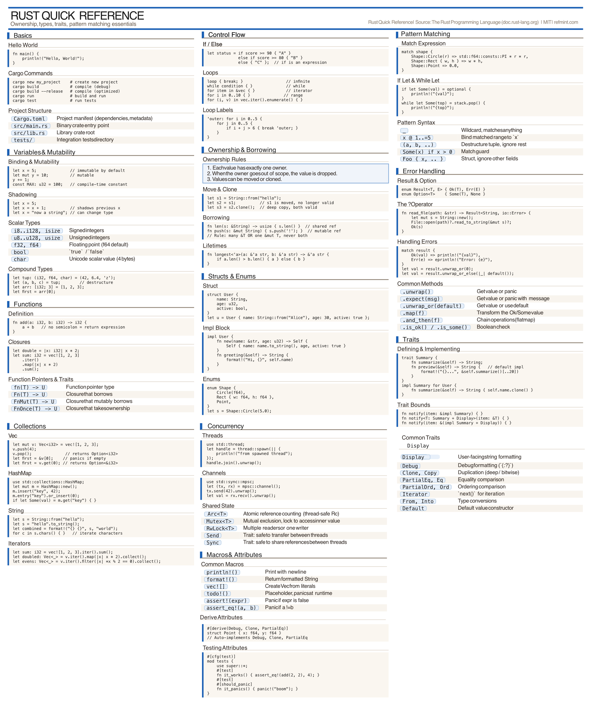
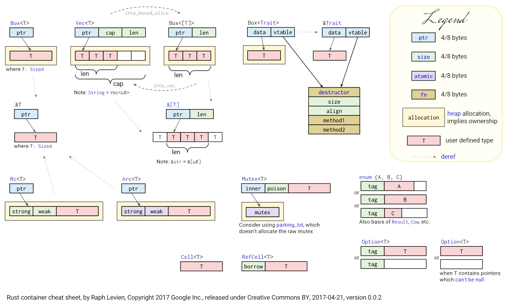

## Why Rust Exists
Rust was created at Mozilla Research around 2010 and reached 1.0 in 2015. The motivation was straightforward and familiar to anyone who has debugged a segfault at 2am: **systems programming is unsafe by default**, and the traditional tools (C, C++) leave memory safety entirely to the programmer.

The designers asked a pointed question: *can we have the performance of C with memory safety guaranteed at compile time, without a garbage collector?*

The answer is Rust.

### The Core Design Decisions
###### 1. Ownership replaces manual memory management
Rather than `malloc`/`free` or smart pointers bolted on after the fact, Rust builds ownership into the type system. The compiler tracks who owns what, and memory is freed automatically when the owner goes out of scope. No GC, no runtime overhead.

###### 2. Borrowing replaces raw pointers
Instead of passing pointers around freely, Rust has a formal concept of *borrowing* — you can lend a reference to data without transferring ownership. The compiler (the *borrow checker*) enforces that references are always valid. No dangling pointers, no use-after-free.

###### 3. Fearless concurrency
Data races are a compile error. The same ownership rules that prevent memory bugs also make entire classes of concurrency bugs impossible.

###### 4. Zero-cost abstractions
Rust's high-level features ([iterators](#iterators), [generics](#generics-and-trait-bounds), [traits](#traits)) compile down to the same machine code you'd write by hand. You don't pay for what you don't use — the same guarantee C++ makes, but delivered more consistently.

###### 5. Explicit over implicit
Rust rarely does things behind your back. Integer overflow is checked in debug builds and wraps in release (with explicit opt-in). Type coercions are almost never automatic. Mutability must be declared. This is intentionally more verbose than C++ in places, in exchange for fewer surprises.

## Cheat Sheet
I looked over here, and I looked over there. Then I found the cheat sheet I was looking for. He's all squished together and highly 2 dimensional. I edited him a little to get him to fit on a single page, but otherwise it's all [RefMint](https://refmint.com/topics/rust/){target=_blank}.

{fig-align="center" width=14in}

## Project Anatomy
Three nested concepts organize Rust code: **packages**, **crates**, and **modules**. They map roughly — but not exactly — onto what you know from C and Python.

[{fig-align="center" width=9in}](https://iota-for-flutter.github.io/tutorial/fundamentals/rust/project-structure.html){target="_blank" rel="noopener noreferrer"}

### Crates
A **crate** is the fundamental unit of compilation, meaning it is the smallest unit of code that Rust will compile. The Rust compiler takes a crate and produces either an executable or a library. Think of it as the equivalent of a compiled C library (`.a`, `.so`) or a Python package on PyPI — the distributable unit that other projects depend on.

Two kinds of crates:

- **Binary crate** — has a `main()` entry point, produces an executable. Root file is `src/main.rs`.
- **Library crate** — no `main()`, produces a library for other code to use. Root file is `src/lib.rs`.

### Packages
A **package** is what Cargo manages: a directory with a `Cargo.toml` manifest. A package contains at least one crate. Most projects you will work on are a single package with a single binary crate:

```
my_project/
├── Cargo.toml      # manifest: name, version, dependencies
├── Cargo.lock      # exact resolved dependency versions (commit this to git)
└── src/
    └── main.rs     # root of the binary crate
```

A library package has the same structure, but the crate root is `src/lib.rs` instead of `src/main.rs`. A package can contain both a `main.rs` and a `lib.rs`, producing a binary and a library from the same source tree.

::: {.callout-note title="`lib.rs` vs `mod.rs`?"}
They are the same in that they are both "roots" that define how code is organized, but they differ in scope:

- `lib.rs` (Crate Root): The entry point for the entire library. It defines the top-level API exposed to external users and integration tests.
- `mod.rs` (Module Root): The entry point for a sub-module located in a directory. It tells Rust that a folder (like src/commands/) is a module and manages the visibility of the files within that folder.

In modern Rust (since 2018), `mod.rs` is often replaced by a file with the same name as the folder (e.g., `src/commands.rs` instead of
`src/commands/mod.rs`) to keep the file tree flatter, but their purpose remains identical.
:::

### Modules
A **module** is a namespace within a crate — the closest equivalent to a Python module. Modules organize code into logical units and control what is visible outside (`pub`) versus private. Items are **private by default** — you opt into visibility explicitly. Before we dive deep on our own, we are to share *The Rust Programming Language*'s  ["Modules Cheat Sheet"](https://doc.rust-lang.org/book/ch07-02-defining-modules-to-control-scope-and-privacy.html){target="_blank"}. It was just what I was looking for when learning about modules; so, here it is word for word:

::: {.exploration data-label="Modules Cheat Sheet"}
Before we get to the details of modules and paths, here we provide a quick reference on how modules, paths, the use keyword, and the pub keyword work in the compiler, and how most developers organize their code. We’ll be going through examples of each of these rules throughout this chapter, but this is a great place to refer to as a reminder of how modules work.

**Start from the crate root:** When compiling a crate, the compiler first looks in the crate root file (usually src/lib.rs for a library crate or src/main.rs for a binary crate) for code to compile.

**Declaring modules:** In the crate root file, you can declare new modules; say you declare a “garden” module with `mod garden`;. The compiler will look for the module’s code in these places:

- Inline, within curly brackets that replace the semicolon following `mod garden`
- In the file src/garden.rs
- In the file src/garden/mod.rs

**Declaring submodules:** In any file other than the crate root, you can declare submodules. For example, you might declare `mod vegetables`; in src/garden.rs. The compiler will look for the submodule’s code within the directory named for the parent module in these places:

- Inline, directly following mod vegetables, within curly brackets instead of the semicolon
- In the file src/garden/vegetables.rs
- In the file src/garden/vegetables/mod.rs

**Paths to code in modules:** Once a module is part of your crate, you can refer to code in that module from anywhere else in that same crate, as long as the privacy rules allow, using the path to the code. For example, an Asparagus type in the garden vegetables module would be found at `crate::garden::vegetables::Asparagus`.

**Private vs. public:** Code within a module is private from its parent modules by default. To make a module public, declare it with `pub mod` instead of `mod`. To make items within a public module public as well, use pub before their declarations.

**The use `keyword`** Within a scope, the use keyword creates shortcuts to items to reduce repetition of long paths. In any scope that can refer to crate::garden:: vegetables::Asparagus, you can create a shortcut with use crate::garden:: vegetables::Asparagus; and from then on you only need to write Asparagus to make use of that type in the scope.

Here, we create a binary crate named backyard that illustrates these rules. The crate’s directory, also named backyard, contains these files and directories:

```
backyard
├── Cargo.lock
├── Cargo.toml
└── src
   ├── garden
   │ └── vegetables.rs
   ├── garden.rs
   └── main.rs
```

The crate root file in this case is `src/main.rs`, and it contains:

```rust
use crate::garden::vegetables::Asparagus;
pub mod garden;

fn main() {
    let plant = Asparagus {};
    println!("I'm growing {:?}!", plant);
}
```

The pub mod garden; line tells the compiler to include the code it finds in `src/garden.rs`, which is:

```rust
pub mod vegetables;
```

Here, `pub` mod `vegetables` means the code in `src/garden/vegetables.rs` is included too. That code is:

```rust
 #[derive(Debug)]
pub struct Asparagus {}
```

Now let’s get into the details of these rules and demonstrate them in action!
:::

##### 1. Inline
::: {.subheading}
Right here, right now!
:::

You can declare a module inline:

```rust
mod math {
    pub fn add(a: i32, b: i32) -> i32 { a + b }

    fn internal_helper() { }   // private: not accessible outside this module
}

// call it
math::add(1, 2);
```

##### 2. File Based
::: {.subheading}
Rust looks for src/math.rs
:::

For larger code, modules live in their own files. Writing `mod math;` in `main.rs` tells Rust to look for the module's code in `src/math.rs`:

```
src/
├── main.rs     ← contains: mod math;
└── math.rs     ← the math module
```

##### 3. Directory Based
::: {.subheading}
Rust looks for src/math/mod.rs
:::

A module that has its own submodules gets a directory instead:

```
src/
├── main.rs
└── math/
    ├── mod.rs      # the math module root
    └── geometry.rs # submodule, accessed as math::geometry
```

::: {.callout-warning title="Rauchen ist verboten"}
For cases 2 and 3, Rust decides which to use based on which file exists. You cannot have both `src/math.rs` and `src/math/mod.rs`.
:::

#### Visibility
Four levels, from narrowest to widest:

| Keyword      | Visible to                                         |
|--------------|----------------------------------------------------|
| (none)       | Only code within the same module                   |
| `pub(super)` | The parent module only                             |
| `pub(crate)` | Anywhere within this crate, but not external users |
| `pub`        | Everyone — including external users of the crate   |

```rust
// src/geometry/shapes.rs
pub struct Circle {
    pub radius: f64,        // visible to all
    center: Point,          // private — only code in this module can touch it
}

pub fn area(c: &Circle) -> f64 {
    std::f64::consts::PI * c.radius * c.radius
}

pub(crate) fn internal_check() { }  // crate-internal only
```

#### Submodules
A module can contain other modules. You declare them in the parent's `mod.rs` the same way you declare top-level modules in `main.rs`:

```rust
// src/geometry/mod.rs
pub mod shapes;      // public submodule — accessible as geometry::shapes
pub mod transforms;  // public submodule — accessible as geometry::transforms
mod utils;           // private submodule — internal to geometry, invisible outside
```

You reference them with `::`:

```rust
use geometry::shapes::Circle;
use geometry::transforms::rotate;
```

Or fully qualified without `use`:

```rust
let c = geometry::shapes::Circle { radius: 5.0 };
```

##### This Hole is Deep
The nesting is arbitrarily deep. The directory layout mirrors the module tree at each level:

```
src/
├── main.rs
└── geometry/
    ├── mod.rs              # pub mod shapes; pub mod transforms;
    ├── shapes/
    │   ├── mod.rs          # pub mod circle; pub mod rectangle;
    │   ├── circle.rs       # geometry::shapes::circle
    │   └── rectangle.rs    # geometry::shapes::rectangle
    └── transforms.rs       # geometry::transforms
```

Each level follows the same rule: a `mod.rs` declares what is inside it, and child files or directories implement those submodules.

#### Spreading a Module's API Across Files
The internal file structure does not have to match the public API. `pub use` re-exports items from submodules into the parent's namespace, so callers see a flat surface regardless of how the code is organized internally:

```rust
// src/geometry/mod.rs
mod shapes;      // private — callers cannot reach geometry::shapes directly
mod transforms;  // private

// re-export selected items into geometry:: directly
pub use shapes::Circle;
pub use shapes::Rectangle;
pub use transforms::rotate;
```

Now from the outside:

```rust
use geometry::Circle;   // works — even though Circle lives in shapes.rs
use geometry::rotate;   // works — even though rotate lives in transforms.rs
```

The internal structure is hidden. The public surface of `geometry` looks like one flat module. This is how most published Rust libraries are organized: files and submodules for the authors' benefit, `pub use` for a clean external interface.

`mod.rs` itself can also define things directly in the module's namespace alongside its declarations:

```rust
// src/geometry/mod.rs
pub mod shapes;

// these live in geometry:: directly, not in any submodule
pub struct Point { pub x: f64, pub y: f64 }
pub fn origin() -> Point { Point { x: 0.0, y: 0.0 } }
```

#### Bringing Items Into Scope
`use` avoids writing the full path repeatedly:

```rust
use geometry::shapes::Circle;          // bring one item into scope
use geometry::shapes::*;               // bring everything public — use sparingly
use geometry::{shapes, transforms};    // bring multiple submodules at once
```

::: {.callout-note title="Inline Modules: `mod Name { }`"}
You can declare and define a module in one place, without a separate file:

```rust
mod config {
    pub const MAX_RETRIES: u32 = 3;
    pub fn default_timeout() -> u64 { 30 }
}
```

This is the right choice for small, tightly related helpers that do not warrant their own file. The most common use case, however, is **unit tests**. The idiomatic Rust pattern puts tests in an inline module at the bottom of the file they test:

```rust
// src/math.rs
pub fn add(a: i32, b: i32) -> i32 { a + b }

#[cfg(test)]
mod tests {
    use super::*;   // reach up to the parent module's items

    #[test]
    fn test_add() {
        assert_eq!(add(2, 3), 5);
    }
}
```

`#[cfg(test)]` means the module is compiled only when running `cargo test` — it is absent from release builds entirely. `use super::*` brings the parent module's items into scope, which is why `add` can be called directly without a path prefix. For anything beyond a handful of items, a separate file is almost always cleaner.
:::

### External Dependencies
Dependencies from crates.io (Rust's public registry, the equivalent of PyPI) go in `Cargo.toml`:

```toml
[dependencies]
serde = { version = "1.0", features = ["derive"] }
regex = "1.10"
```

Run `cargo add regex` from the command line and Cargo writes the entry for you. Then use it in code:

```rust
use regex::Regex;
```

This is the `pip install` + `import` of Rust, collapsed into one tool that also handles building, testing, and formatting.

### The Analogy Table
| Concept               | C                        | Python              | Rust              |
|-----------------------|--------------------------|---------------------|-------------------|
| Distributable unit    | `.a` / `.so`             | Package (PyPI)      | Crate (crates.io) |
| Project manifest      | Makefile                 | `pyproject.toml`    | `Cargo.toml`      |
| Namespace / file unit | (file, no formal system) | Module (`.py` file) | Module (`mod`)    |
| Import                | `#include`               | `import`            | `use`             |
| Package manager       | (none built in)          | pip                 | cargo             |

## The Basics
### Variables
::: {.subheading}
and Mutability
:::

In C you declare a variable and it's mutable by default. In Rust, variables are **immutable by default**. You opt into mutability with `mut`.

```rust
let x = 5;          // immutable
let mut y = 5;      // mutable
y += 1;             // fine
// x += 1;          // compile error
```

This isn't just style — the compiler uses immutability information to reason about your program. It's a habit worth building early.

### Types
::: {.definition data-label="Scalar Type"}
A **scalar type** represents a single value.
:::

#### Scalar Types
Rust is statically typed. Types are usually inferred, but you can annotate explicitly. Rust has four primary *scalar types*: integers, floating-point numbers, Booleans, and characters:

```rust
let a: i32  = -42;       // signed 32-bit integer
let b: u64  = 1_000_000; // unsigned 64-bit (underscores ok in literals)
let c: f64  = 3.14;      // 64-bit float
let d: bool = true;
let e: char = 'z';       // Unicode scalar, 4 bytes (not u8!)
```

Integer types: `i8`, `i16`, `i32`, `i64`, `i128`, `isize` and their `u` counterparts. `isize`/`usize` are pointer-sized, like `ptrdiff_t`/`size_t` in C.

No implicit numeric conversions. You cast explicitly with `as`:

```rust
let x: i32 = 42;
let y: f64 = x as f64;
```

#### Tuples
A tuple groups a fixed number of values of different types into a single compound value. Unlike arrays, the elements do not have to share a type.

```rust
let point: (f64, f64) = (1.0, 2.5);
let record: (i32, &str, bool) = (42, "alice", true);
```

**Accessing elements** uses dot notation with a zero-based index. The index must be a literal — you cannot index a tuple with a variable.

```rust
let t = (10, "hello", 3.14);

let n = t.0;    // 10   — i32
let s = t.1;    // "hello" — &str
let f = t.2;    // 3.14 — f64
```

**Destructuring** is the idiomatic way to unpack a tuple, especially when returning multiple values from a function:

```rust
fn min_max(v: &[i32]) -> (i32, i32) {
    let mut lo = v[0];
    let mut hi = v[0];
    for &x in v {
        if x < lo { lo = x; }
        if x > hi { hi = x; }
    }
    (lo, hi)
}

let (low, high) = min_max(&[3, 1, 4, 1, 5, 9]);
println!("{} {}", low, high);   // 1 9
```

Use `_` to ignore fields you don't need:

```rust
let (_, second, _) = (1, 2, 3);
```

**The unit type `()`** is the zero-element tuple. It is Rust's equivalent of `void` — the implicit return type of functions that return nothing, and the success payload in `Result<(), E>` when a function either succeeds with no data or fails.

```rust
fn greet(name: &str) -> () {    // () is implicit, rarely written explicitly
    println!("Hello, {}!", name);
}
```

Tuples are stack-allocated and implement `Copy` when all their elements do. They are most useful for returning multiple values from a function and for temporary groupings where defining a named struct would be overkill. For anything you'll pass around extensively, prefer a named struct — it documents intent and the fields have names.

#### Fixed-Length Arrays
Arrays in Rust are fixed-size collections of elements of the same type, allocated on the stack. The syntax is `[T; N]` where `T` is the element type and `N` is the length, which must be known at compile time.

```rust
// Array of 5 integers
let arr: [i32; 5] = [1, 2, 3, 4, 5];

// Initialize all elements to the same value
let zeros = [0; 100];        // 100 zeros
let buffer = [0u8; 1024];    // 1024-byte buffer

// Access elements (zero-indexed, bounds-checked at runtime)
let first = arr[0];          // 1
let last = arr[4];           // 5

// Length is part of the type
println!("Length: {}", arr.len());  // 5
```

###### Key characteristics
- **Stack-allocated** — arrays live on the stack, not the heap
- **Fixed size** — length cannot change after creation
- **Type includes length** — `[i32; 3]` and `[i32; 5]` are different, incompatible types
- **Bounds-checked** — indexing out of bounds causes a runtime panic

Arrays are useful when you know the exact size at compile time (RGB colors, matrix dimensions, fixed buffers). For dynamic sizing, use `Vec<T>` instead ([covered later](#common-collections)).

```rust
// Iterating over arrays
let colors = [[255, 0, 0], [0, 255, 0], [0, 0, 255]];

for color in &colors {
    println!("RGB: {:?}", color);
}

// Arrays can be passed to functions by reference
fn sum(arr: &[i32; 5]) -> i32 {
    arr.iter().sum()
}
```

#### String Types
::: {.subheading}
`String` and `&str`
:::

Rust has two string types. The distinction maps directly onto owned vs. borrowed:

| Type     | Owned? | Mutable? | Lives on  | Analogy                    |
|----------|--------|----------|-----------|----------------------------|
| `String` | Yes    | Yes      | Heap      | `std::string` in C++       |
| `&str`   | No     | No       | Anywhere  | `std::string_view` in C++  |

##### Representation

`String` stores three things: a pointer to heap memory, a length (bytes used), and a capacity (bytes allocated). It is **not** null-terminated. The length field is what tells Rust where the string ends.

`&str` is a fat pointer: a pointer into some UTF-8 buffer plus a length. It borrows that buffer — it owns nothing and cannot outlive the data it points into.

Both types are guaranteed to contain valid UTF-8. Rust will not let you construct an invalid string.

##### Creating a `String`

```rust
let a = String::from("hello");       // from a literal
let b = "hello".to_string();         // same, alternate spelling
let c = format!("{} {}", a, b);      // build from parts — like sprintf
let d = String::new();               // empty, build up with push/push_str
let mut e = String::new();
e.push('!');                         // append a char
e.push_str(" world");                // append a &str
```

##### String literals are `&str`

```rust
let s: &str = "hello";               // stored in the binary, 'static lifetime
let t: &str = &a[0..3];             // slice of an existing String
```

##### Common methods

Most string methods are defined on `&str` and are therefore available on both `String` and `&str`. Methods that produce a new owned string return `String`; methods that just inspect or slice return `&str` or a primitive.

```rust
let s = String::from("  Hello, World!  ");

// Inspection
s.len();                            // byte count (not char count)
s.is_empty();                       // true if len() == 0
s.contains("World");                // true
s.starts_with("  He");             // true
s.ends_with("!  ");                // true

// Searching
s.find("World");                    // Some(9) — byte offset of first match
s.trim();                           // "&Hello, World!" — strip whitespace both ends
s.trim_start();                     // strip leading whitespace only
s.trim_end();                       // strip trailing whitespace only

// Transforming (returns new String)
s.to_lowercase();                   // "  hello, world!  "
s.to_uppercase();                   // "  HELLO, WORLD!  "
s.replace("World", "Rust");        // "  Hello, Rust!  "
s.replacen("l", "L", 2);          // replace first 2 occurrences

// Splitting (returns iterators — collect into Vec if you need indexing)
let words: Vec<&str> = s.split_whitespace().collect();  // ["Hello,", "World!"]
let parts: Vec<&str> = "a,b,c".split(',').collect();    // ["a", "b", "c"]
let lines: Vec<&str> = "one\ntwo\nthree".lines().collect();

// Characters (UTF-8 aware)
"hello".chars().count();            // 5 — char count, not byte count
"hello".chars().nth(1);            // Some('e')

// Repeating
"ab".repeat(3);                     // "ababab"
```

| Method                   | Returns         | What it does                              |
|--------------------------|-----------------|-------------------------------------------|
| `.len()`                 | `usize`         | Byte length                               |
| `.is_empty()`            | `bool`          | True if zero bytes                        |
| `.contains(pat)`         | `bool`          | True if pattern is present                |
| `.starts_with(pat)`      | `bool`          | Prefix check                              |
| `.ends_with(pat)`        | `bool`          | Suffix check                              |
| `.find(pat)`             | `Option<usize>` | Byte offset of first match                |
| `.trim()`                | `&str`          | Strip leading and trailing whitespace     |
| `.to_lowercase()`        | `String`        | New lowercased string                     |
| `.to_uppercase()`        | `String`        | New uppercased string                     |
| `.replace(from, to)`     | `String`        | Replace all occurrences                   |
| `.split(pat)`            | iterator        | Split on pattern                          |
| `.split_whitespace()`    | iterator        | Split on any whitespace, skipping empties |
| `.lines()`               | iterator        | Split on line endings                     |
| `.chars()`               | iterator        | Unicode scalar values (not bytes)         |
| `.repeat(n)`             | `String`        | Concatenate `n` copies                    |

##### When to use which

Use `&str` for function parameters whenever you only need to read the text. It accepts both `String` and literals without any conversion:

```rust
fn greet(name: &str) {
    println!("Hello, {}!", name);
}

greet("world");                      // literal — works
greet(&String::from("Alice"));       // String — works, coerces automatically
```

Use `String` when you need to own or mutate the text.

### Values
::: {.subheading}
The "Null Problem"
:::

In languages like Java, Python, or C++, any variable can technically be *null*. This leads to the infamous "Null Pointer Exception" or "Segment Fault" when you try to use a variable that isn't actually there. The rust way is: `Option<T>`. If a value might be missing, you must explicitly wrap it in an Option:

```rust
enum Option<T> {
    Some(T), // The value is present
    None,    // The "null" equivalent
}
```

Why this is better:

1. **The Compiler Forces You to Handle It**: If you have an `Option<String>`, you cannot call methods like `.len()` on it directly. You must use a match statement or an if let to "unwrap" the value first.
2. **Type Safety**: You can never accidentally treat a "null" value as a real one. If a variable is just a `String`, it is guaranteed to be a valid string. If it's an `Option<String>`, you know it might be empty.
3. **Efficiency**: Rust uses a "null-pointer optimization." For types like references or Box, an `Option<T>` takes up the same amount of memory as a regular `T`. The None case is represented by a literal null pointer under the hood, but the language makes it impossible for you to interact with that pointer unsafely.

#### Unit Type
In Rust, `()` is called the **unit type** (and also the **unit value**). It is essentially Rust's version of `void` from languages like C, C++, or Java, but with a key difference: it is an actual value that occupies zero bytes of memory. You will frequently see it used in `Ok(...)` statements: `Ok(())`. Looks a little weird doesn't it? It looks like we are calling a function without specifying the function name. Here is the breakdown of `Ok(())`:

1. The inner `()`: This is the "unit value." It represents "nothing" or "empty success."
2. The outer `Ok(...)`: This is the success variant of the Result enum.

**Why do we use it?** Most of our command functions (like execute) return a `Result<(), Box<dyn Error>>`. Since the Result type must contain something in the Ok case, we use () to say: "The operation finished successfully, but there isn't a specific piece of data (like an integer or a string) to return to the caller." Gemini told me to think of it like this:

- `Ok(42)` -> "I succeeded, and here is the answer: 42."
- `Ok(())` -> "I succeeded. That's all you need to know."

In short, `()` is Rust's way to say "no meaningful value," whether as a function's return type or as the success payload in types like `Result<(), E>`.


### Slices
::: {.subheading}
A view into a sequence, without copying
:::

A slice is a reference to a contiguous subsequence of an array or string. It is a *fat pointer*: two words wide, carrying both a pointer to the first element and a length. No heap allocation, no copy.

```rust
let a = [10, 20, 30, 40, 50];

let all   = &a[..];      // [10, 20, 30, 40, 50] — the whole array
let first = &a[..3];     // [10, 20, 30]           — open on the right
let last  = &a[2..];     // [30, 40, 50]           — open on the left
let mid   = &a[1..4];    // [20, 30, 40]           — half-open (end excluded)
let incl  = &a[1..=3];   // [20, 30, 40]           — inclusive end with ..=
```

#### Range syntax

| Syntax    | Meaning                          |
|-----------|----------------------------------|
| `[..]`    | Entire sequence                  |
| `[a..b]`  | From index `a` up to (not including) `b` |
| `[a..=b]` | From index `a` through `b` (inclusive)   |
| `[a..]`   | From index `a` to the end        |
| `[..b]`   | From the start up to (not including) `b` |

#### No negative indices

Unlike Python, Rust slices do not accept negative indices. To index relative to the end, use `len()`:

```rust
let a = [10, 20, 30, 40, 50];

let last_one = &a[a.len() - 1..];   // [50]       — Python's [-1:]
let last_two = &a[a.len() - 2..];   // [40, 50]   — Python's [-2:]
let all_but_last = &a[..a.len()-1]; // [10,20,30,40] — Python's [:-1]
```

#### Slice types

| Type    | Meaning                              |
|---------|--------------------------------------|
| `&[T]`  | Shared slice of any array or `Vec<T>` |
| `&str`  | String slice (a view into UTF-8 text) |

These are the idiomatic types for function parameters that only need to read a sequence. A function accepting `&[i32]` works with arrays, `Vec<i32>`, and slices of either. A function accepting `&str` works with `String`, string literals, and string slices.

### Conversions
::: {.subheading}
Look at the target type, not the source
:::

Rust's conversions are deliberate and explicit. The key mental shift from languages like Python: think about what type you want to end up with, then find the method or trait that produces it.

#### Numeric casts with `as`

`as` performs primitive numeric casts. It is explicit and never implicit:

```rust
let i: i32 = 42;
let f: f64 = i as f64;
let b: u8  = 255i32 as u8;    // truncates if out of range — be careful
```

#### `From` and `Into`

For non-primitive conversions, Rust uses the `From` and `Into` traits. If `A: From<B>`, then you can write `A::from(b)` or, equivalently, `b.into()` (the compiler figures out the target from context):

```rust
let s: String = String::from("hello");   // &str → String via From
let s: String = "hello".into();          // same, using Into
let n: i64    = i64::from(42i32);        // i32 → i64
```

`From`/`Into` conversions are infallible by definition. If the conversion can fail, use `TryFrom`/`TryInto` instead, which return `Result`.

#### Parsing strings with `.parse()`

`.parse()` converts a `&str` to any type that implements `FromStr`. The target type is inferred from context:

```rust
let n: i32  = "42".parse().unwrap();
let f: f64  = "3.14".parse().unwrap();
let b: bool = "true".parse().unwrap();
```

Because `.parse()` returns `Result`, you handle failure explicitly. In real code use `?` or match rather than `.unwrap()`.

#### `String` and `&str`

| From      | To       | How                        |
|-----------|----------|----------------------------|
| `&str`    | `String` | `String::from(s)` or `s.to_string()` or `s.into()` |
| `String`  | `&str`   | `&s` or `s.as_str()` (coercion, no copy) |
| `String`  | `&str`   | `&s[..]` — explicit slice  |

The `String` → `&str` direction is free: it is just taking a reference to the existing buffer.

::: {.callout-important title="Wonder-Twin Power Activate in the form of Turbofish"}
The following example is taken out of our [exs24](https://github.com/celsasser/exs24-parser){target=_blank} parser:

```rust
let seconds: f32 = seconds_text
    .parse::<f32>()
    .map_err(|error| format!("Invalid seconds value '{}': {}", seconds_text, error))?;
```

Notice the `::<f32>` attached to `parse`. That fella is called a *turbofish*. In the example above, I found that I could remove it and it would still compile. So I asked Claude, and this is what he said:

---

It is not a cast. It is called the **turbofish** syntax, and it is a way to supply a generic type parameter directly to a method call. `parse()` is defined as:

```rust
fn parse<F: FromStr>(&self) -> Result<F, F::Err>
```

The `F` is a generic parameter. Rust needs to know what type F is before it can do anything. There are two ways to tell it:

1. Turbofish on the method:

    ```rust
    "3.14".parse::<f32>()
    ```

2. Type annotation on the binding:

    ```rust
    let seconds: f32 = seconds_text.parse()...
    ```

In your code, both are present at the same time, which is why removing the *turbofish* is fine. The `: f32` annotation on seconds gives the compiler enough information to infer `F = f32` without being told explicitly on the `.parse()` call. The *turbofish* becomes necessary when there is no annotation for the compiler to infer from, or when the inference is ambiguous. For example:

```rust
// compiler has no idea what type to parse into — turbofish required
let n = "42".parse::<i32>().unwrap();

// annotation does the same job — turbofish optional
let n: i32 = "42".parse().unwrap();
```

The `::<>` spelling looks strange but follows the same pattern as other generic syntax. The extra `::` is there because `<` alone would be ambiguous with a less-than operator at the call site.

:::

### Functions
```rust
fn add(a: i32, b: i32) -> i32 {
    a + b       // no semicolon = expression = return value
}

fn greet(name: &str) {
    println!("Hello, {}!", name);  // no return value = returns ()
}
```

The last expression in a block is its value. `return` exists but is idiomatic only for early returns.

### Control Flow
```rust
// if is an expression
let max = if a > b { a } else { b };

// loop
loop {
    break;   // only way to exit a bare loop
}

// while
while x > 0 {
    x -= 1;
}

// for over a range
for i in 0..10 {        // 0 to 9
    println!("{}", i);
}

// for over a collection
let nums = vec![1, 2, 3];
for n in &nums {
    println!("{}", n);
}
```

See [Common Programming Concepts](https://doc.rust-lang.org/book/ch03-00-common-programming-concepts.html){target="_blank" rel="noopener noreferrer"} in *The Rust Programming Language* for more information.

### Operators
::: {.subheading}
Complete reference ordered by precedence
:::

Rust operators are listed here from highest to lowest precedence. Higher precedence operators bind more tightly (are evaluated first).

| Precedence | Operator | Description | Example |
|:----:|:----:|-------------|-------------|
| **Highest** | | | |
| 1 | `::` | Path separator (namespace) | `std::io::Read`, `Vec::<i32>::new()` |
| 2 | `.` | Method call or field access | `obj.method()`, `point.x` |
| 2 | `[]` | Array/slice indexing | `arr[0]`, `vec[i]` |
| 2 | `()` | Function call | `foo()`, `add(1, 2)` |
| 2 | `?` | Error propagation | `file.read()?` (early return on `Err`) |
| 3 | `-expr` | Negation (arithmetic) | `-5`, `-x` |
| 3 | `!expr` | Logical/bitwise NOT | `!true`, `!0b1010` |
| 3 | `*expr` | Dereference | `*ptr`, `*boxed_value` |
| 3 | `&expr` | Borrow (immutable reference) | `&x`, `&y` |
| 3 | `&mut expr` | Mutable borrow | `&mut y`, `&mut vec` |
| 4 | `as` | Type cast | `x as f64`, `5 as u8` |
| 5 | `*` | Multiplication | `3 * 4` |
| 5 | `/` | Division | `10 / 2` |
| 5 | `%` | Remainder (modulo) | `10 % 3` |
| 6 | `+` | Addition | `1 + 2` |
| 6 | `-` | Subtraction | `5 - 3` |
| 7 | `<<` | Left shift | `1 << 3` (8) |
| 7 | `>>` | Right shift | `8 >> 2` (2) |
| 8 | `&` | Bitwise AND | `0b1100 & 0b1010` |
| 9 | `^` | Bitwise XOR | `0b1100 ^ 0b1010` |
| 10 | `\|` | Bitwise OR | `0b1100 \| 0b1010` |
| 11 | `==` | Equality | `x == y` |
| 11 | `!=` | Inequality | `x != y` |
| 11 | `<` | Less than | `x < y` |
| 11 | `>` | Greater than | `x > y` |
| 11 | `<=` | Less than or equal | `x <= y` |
| 11 | `>=` | Greater than or equal | `x >= y` |
| 12 | `&&` | Logical AND (short-circuit) | `a && b` |
| 13 | `\|\|` | Logical OR (short-circuit) | `a \|\| b` |
| 14 | `..` | Range (exclusive end) | `0..10` (0 to 9) |
| 14 | `..=` | Range (inclusive end) | `0..=10` (0 to 10) |
| 15 | `=` | Assignment | `x = 5` |
| 15 | `+=` | Add and assign | `x += 1` |
| 15 | `-=` | Subtract and assign | `x -= 1` |
| 15 | `*=` | Multiply and assign | `x *= 2` |
| 15 | `/=` | Divide and assign | `x /= 2` |
| 15 | `%=` | Remainder and assign | `x %= 3` |
| 15 | `&=` | Bitwise AND and assign | `x &= 0xFF` |
| 15 | `\|=` | Bitwise OR and assign | `x \|= 0x80` |
| 15 | `^=` | Bitwise XOR and assign | `x ^= mask` |
| 15 | `<<=` | Left shift and assign | `x <<= 2` |
| 15 | `>>=` | Right shift and assign | `x >>= 2` |
| **Lowest** | | | |

**Special Operators and Constructs**

| Syntax | Description | Example |
|--------|-------------|---------|
| `_` | Wildcard pattern (match anything) | `match x { _ => {} }` |
| `..` | Pattern: ignore remaining fields | `Point { x, .. }` |
| `@` | Pattern binding | `match x { val @ 1..=5 => {} }` |
| `\|` | Pattern alternatives | `match x { 1 \| 2 \| 3 => {} }` |
| `::<>` | Turbofish (explicit type parameters) | `Vec::<i32>::new()`, `parse::<i32>()` |

**Not Operators**

These look like operators but are actually conventions or syntax:

| Syntax | What It Is | Example |
|--------|------------|---------|
| `::new()` | Convention for constructors (associated function) | `String::new()`, `Vec::new()` |
| `?` | Error propagation (actually IS an operator, see above) | `file.read()?` |
| `.await` | Async/await syntax (postfix keyword) | `future.await` |

**Operator Overloading**

Many operators can be overloaded by implementing traits from `std::ops`:

```rust
use std::ops::Add;

struct Point { x: i32, y: i32 }

impl Add for Point {
    type Output = Point;

    fn add(self, other: Point) -> Point {
        Point {
            x: self.x + other.x,
            y: self.y + other.y,
        }
    }
}

let p1 = Point { x: 1, y: 2 };
let p2 = Point { x: 3, y: 4 };
let p3 = p1 + p2;  // uses our Add implementation
```

**Common Operator Traits**

| Operator | Trait | Method |
|----------|-------|--------|
| `+` | `Add` | `add()` |
| `-` | `Sub` | `sub()` |
| `*` | `Mul` | `mul()` |
| `/` | `Div` | `div()` |
| `%` | `Rem` | `rem()` |
| `==`, `!=` | `PartialEq` | `eq()`, `ne()` |
| `<`, `>`, `<=`, `>=` | `PartialOrd` | `partial_cmp()` |
| `[]` | `Index` | `index()` |
| `[]` (mut) | `IndexMut` | `index_mut()` |

See [Appendix B: Operators](https://doc.rust-lang.org/book/appendix-02-operators.html){target="_blank" rel="noopener noreferrer"} in *The Rust Programming Language* for the complete reference.

## Macros
Throughout this chapter you have seen `println!`, `vec!`, `format!`, and `panic!`. The `!` signals a **macro call**, not a function call. Macros in Rust are code that writes code at compile time, before the compiler type-checks anything.

Why do macros exist? Because they can do things ordinary functions cannot. For example, `println!` accepts a variable number of arguments of different types — impossible for a regular Rust function without significant compromise. Macros solve this by expanding at compile time into whatever code is needed.

```rust
println!("hello");                    // no arguments
println!("{}", x);                    // one argument
println!("{} and {}", x, y);          // two arguments, different types fine
```

::: {.explanation data-label="Rust Macros vs. C Macros"}
The fundamental difference is that C macros are based on string substitution (text manipulation), while Rust macros are syntax-aware (token manipulation). Somebody deemed Rust macros "hygienic" and C macros "unhygienic" (poor C).

- **Hygienic**: variables defined inside a macro do not accidentally clash with variables in the surrounding code.
- **Unhygienic**: variables can unintentionally shadow or overwrite local variables.

###### Input Handling
- **C Macros**: Treat inputs as raw text. This can lead to operator precedence bugs (e.g.,  becoming  instead of ) unless you manually add parentheses.
- **Rust Macros**: Match against specific syntax categories like  (expression),  (identifier), or . This ensures the input is syntactically valid before expansion.

###### Types of Macros
- **C**: Has only one type—the `#define` preprocessor directive.
- **Rust**: Features two main systems:
    - **Declarative (macro_rules!)**: Uses pattern matching similar to a  expression to generate code.
    - **Procedural**: Functions that take a stream of tokens as input and return a stream of tokens as output, allowing for complex transformations like `#[derive]`.

###### Compilation Stage
C macros are handled by a separate preprocessor before the compiler sees the code. Rust macros are expanded during the early stages of compilation, meaning the compiler "understands" the structure of the expanded code.

###### Visual Distinction
In Rust, function-like macros are called with a trailing `!` (e.g., `println!`, `vec!`), making them instantly distinguishable from standard functions for better readability. C macros look identical to function calls.
:::

Common macros you will use regularly:

| Macro              | Purpose                                                             |
|--------------------|---------------------------------------------------------------------|
| `println!(...)`    | Print to stdout with newline                                        |
| `eprint!(...)`     | Print to stderr                                                     |
| `eprintln!(...)`   | Print to stderr with newline                                        |
| `format!(...)`     | Build a `String` using the same syntax as `println!`                |
| `vec![...]`        | Create a `Vec<T>` from a list of values                             |
| `panic!(...)`      | Terminate the program with an error message                         |
| `assert!(cond)`    | Panic if a condition is false                                       |
| `assert_eq!(a, b)` | Panic if two values are not equal (prints both on failure)          |
| `todo!()`          | Placeholder that compiles but panics at runtime                     |
| `dbg!(expr)`       | Print the file, line, and value of an expression; returns the value |

`#[derive(...)]` is a different kind of macro — a *procedural macro* — that generates [trait](#traits) implementations automatically:

```rust
#[derive(Debug, Clone, PartialEq)]
struct Point { x: f64, y: f64 }

// Now you can:
println!("{:?}", p);    // Debug formatting
let p2 = p.clone();     // Clone
assert_eq!(p, p2);      // PartialEq
```

You can write your own macros with `macro_rules!` (declarative macros) or procedural macro crates. For most work, the standard library macros and [`derive`](https://doc.rust-lang.org/book/ch20-05-macros.html#custom-derive-macros){target="_blank" rel="noopener noreferrer"} cover what you need.

See [Macros](https://doc.rust-lang.org/book/ch20-05-macros.html){target="_blank" rel="noopener noreferrer"} in *The Rust Programming Language* for more information.

### Formatting
I am a prehistoric man. I assumed that `eprint!`, `eprintln`, `format!`, `println` would all live together and essentially use the same formatting code. But, if they do, it's not immediately apparent from looking at the source. Let's comare `format!` and `println`:

`format!`'s location: `/lib/rustlib/src/rust/library/alloc/src/macros.rs`
```rust
#[macro_export]
#[stable(feature = "rust1", since = "1.0.0")]
#[allow_internal_unstable(hint_must_use, liballoc_internals)]
#[rustc_diagnostic_item = "format_macro"]
macro_rules! format {
    ($($arg:tt)*) => {
        $crate::__export::must_use({
            $crate::fmt::format($crate::__export::format_args!($($arg)*))
        })
    }
}
```

`println`'s location: `./lib/rustlib/src/rust/library/std/src/macros.rs`
```rust
#[macro_export]
#[stable(feature = "rust1", since = "1.0.0")]
#[cfg_attr(not(test), rustc_diagnostic_item = "println_macro")]
#[allow_internal_unstable(print_internals, format_args_nl)]
macro_rules! println {
    () => {
        $crate::print!("\n")
    };
    ($($arg:tt)*) => {{
        $crate::io::_print($crate::format_args_nl!($($arg)*));
    }};
}
```

First we notice that they are in entirely different locations. `println!` is part of the standard library, whereas `format!` doesn't appear to be? Strange. And they are calling into two entirely different crates. I hoped to see to what extent they are birds of similar feather, but that's not happening. Let's just stick the the format specification and save the rest for when we are smarter.

#### Positional Parameters
Each formatting argument (`{}`) is allowed to specify which value argument it’s referencing, and if omitted it is assumed to be “the next argument”. For example, the format string `{} {} {}` would take three parameters, and they would be formatted in the same order as they’re given. The format string `{2} {1} {0}`, however, would format arguments in reverse order. It's rare to see format specifiers with positions in them. And for a good reason which is that they also support names.

#### Named Parameters
Named parameters neat. They are listed at the end of the argument list with the following syntax: `<identifier> '=' <expression>`. For example, the following `format!` expressions all use named arguments:

```rust
format!("{argument}", argument = "test");   // => "test"
format!("{name} {}", 1, name = 2);          // => "2 1"
format!("{a} {c} {b}", a="a", b='b', c=3);  // => "a 3 b"
```

Are you thinking the order is weird? I think so too, but beggars can't be choosers and named parameters are pretty darn cool.

#### Formatting Parameters
Finally! Let's go. Each argument being formatted can be transformed by a number of formatting parameters. The colon `:` in format syntax divides identifier of the input data and the formatting options, the colon itself does not change anything, only introduces the options.

```rust
let a = 5;
let b = &a;
println!("{a:e} {b:p}"); // => 5e0 0x7ffe37b7273c
```

##### Width
```rust
// All of these print "Hello x    !"
println!("Hello {:5}!", "x");
println!("Hello {:1$}!", "x", 5);
println!("Hello {1:0$}!", 5, "x");
println!("Hello {:width$}!", "x", width = 5);
let width = 5;
println!("Hello {:width$}!", "x");
```

The width in the above specifies the “minimum width” that the format should take up. If the value’s string does not fill up this many characters, then the padding specified by [fill/alignment](#fillalignment) will be used to take up the required space.

The width can also be provided dynamically by referencing another argument with a `$` suffix. Use `{:N\\$}` to reference the $N^{th}$ positional argument (where $N$ is an integer), or `{:name$}` to reference a named argument. The referenced argument must be of type usize.

Referring to an argument with the dollar syntax does not affect the “next argument” counter, so it’s usually a good idea to refer to arguments by position, or use named arguments.

##### Fill/Alignment
```rust
assert_eq!(format!("Hello {:<5}!", "x"),  "Hello x    !");
assert_eq!(format!("Hello {:-<5}!", "x"), "Hello x----!");
assert_eq!(format!("Hello {:^5}!", "x"),  "Hello   x  !");
assert_eq!(format!("Hello {:>5}!", "x"),  "Hello     x!");
```

The optional fill character and alignment is provided normally in conjunction with the width parameter. It must be defined before width, right after the `:`. This indicates that if the value being formatted is smaller than width some extra characters will be printed around it. Filling comes in the following variants for different alignments:

- `[fill]<` - the argument is left-aligned in width columns
- `[fill]^` - the argument is center-aligned in width columns
- `[fill]>` - the argument is right-aligned in width columns

The default fill/alignment for non-numerics is a space and left-aligned. The default for numeric formatters is also a space character but with right-alignment. If the `0` flag (see below) is specified for numerics, then the implicit fill character is `0`.

Note that alignment might not be implemented by some types. In particular, it is not generally implemented for the Debug trait. A good way to ensure padding is applied is to format your input, then pad this resulting string to obtain your output:

```rust
println!("Hello {:^15}!", format!("{:?}", Some("hi"))); // => "Hello   Some("hi")   !"
```

##### Sign/#/0
```rust
assert_eq!(format!("Hello {:+}!", 5), "Hello +5!");
assert_eq!(format!("{:#x}!", 27), "0x1b!");
assert_eq!(format!("Hello {:05}!", 5),  "Hello 00005!");
assert_eq!(format!("Hello {:05}!", -5), "Hello -0005!");
assert_eq!(format!("{:#010x}!", 27), "0x0000001b!");
```

These are all flags altering the behavior of the formatter.

- `+`: This is intended for numeric types and indicates that the sign should always be printed. By default only the negative sign of signed values is printed, and the sign of positive or unsigned values is omitted. This flag indicates that the correct sign (+ or -) should always be printed.
- `-`: Currently not used

- `#`: This flag indicates that the “alternate” form of printing should be used. The alternate forms are:
    - `#?`: pretty-print the Debug formatting (adds linebreaks and indentation)
    - `#x`: precedes the argument with a `0x`
    - `#X`: precedes the argument with a `0x`
    - `#b`: precedes the argument with a `0b`
    - `#o`: precedes the argument with a `0o`

    See [Formatting traits](https://doc.rust-lang.org/std/fmt/#formatting-traits) for a description of what the `?`, `x`, `X`, `b`, and `o` flags do.

- `0` - This is used to indicate for integer formats that the padding to width should both be done with a 0 character as well as be sign-aware. A format like `{:08}` would yield `00000001` for the integer `1`, while the same format would yield `-0000001` for the integer `-1`. Notice that the negative version has one fewer zero than the positive version. Note that padding zeros are always placed after the sign (if any) and before the digits. When used together with the `#` flag, a similar rule applies: padding zeros are inserted after the prefix but before the digits. The prefix is included in the total width. This flag overrides the fill character and alignment flag.

##### Precision
For non-numeric types, this can be considered a “maximum width”. If the resulting string is longer than this width, then it is truncated down to this many characters and that truncated value is emitted with proper fill, alignment and width if those parameters are set.

For *integral types*, this is ignored. For *floating-point types*, this indicates how many digits after the decimal point should be printed.

There are three possible ways to specify the desired precision:

1. An integer `.N`: the integer `N` itself is the precision.
2. An integer or name followed by dollar sign `.N$`: use the value of format argument `N` (which must be a usize) as the precision. An integer refers to a positional argument, and a name refers to a named argument.
3. An asterisk
    - `.*`: `.*` means that this `{...}` is associated with two format inputs rather than one:
        - If a format string in the fashion of `{:<spec>.*}` is used, then the first input holds the usize precision, and the second holds the value to print.
        - If a format string in the fashion of `{<arg>:<spec>.*}` is used, then the `<arg>` part refers to the value to print, and the precision is taken like it was specified with an omitted positional parameter (`{}` instead of `{<arg>:}`).

For example, the following calls all print the same thing `Hello x is 0.01000`:

```rust
// Hello {arg 0 ("x")} is {arg 1 (0.01) with precision specified inline (5)}
println!("Hello {0} is {1:.5}", "x", 0.01);

// Hello {arg 1 ("x")} is {arg 2 (0.01) with precision specified in arg 0 (5)}
println!("Hello {1} is {2:.0$}", 5, "x", 0.01);

// Hello {arg 0 ("x")} is {arg 2 (0.01) with precision specified in arg 1 (5)}
println!("Hello {0} is {2:.1$}", "x", 5, 0.01);

// Hello {next arg -> arg 0 ("x")} is {second of next two args -> arg 2 (0.01) with
// precision specified in first of next two args -> arg 1 (5)}
println!("Hello {} is {:.*}",    "x", 5, 0.01);

// Hello {arg 1 ("x")} is {arg 2 (0.01) with precision specified in next arg -> arg 0 (5)}
println!("Hello {1} is {2:.*}",  5, "x", 0.01);

// Hello {next arg -> arg 0 ("x")} is {arg 2 (0.01) with precision specified in next arg -> arg 1 (5)}
println!("Hello {} is {2:.*}",   "x", 5, 0.01);

// Hello {next arg -> arg 0 ("x")} is {arg "number" (0.01) with precision specified in arg "prec" (5)}
println!("Hello {} is {number:.prec$}", "x", prec = 5, number = 0.01);
```

While these:

```rust
println!("{}, `{name:.*}` has 3 fractional digits", "Hello", 3, name=1234.56);
println!("{}, `{name:.*}` has 3 characters", "Hello", 3, name="1234.56");
println!("{}, `{name:>8.*}` has 3 right-aligned characters", "Hello", 3, name="1234.56");
```

print three significantly different things:

::: {.stdout}
Hello, `1234.560` has 3 fractional digits<br/>
Hello, `123` has 3 characters<br/>
Hello, `     123` has 3 right-aligned characters<br/>
:::

When truncating these values, Rust uses round half-to-even, which is the default rounding mode in IEEE 754. For example,

```rust
print!("{0:.1$e}", 12345, 3);
print!("{0:.1$e}", 12355, 3);
```

Would return:

::: {.stdout}
1.234e4<br/>
1.236e4<br/>
:::

For more information, see [Module fmt](https://doc.rust-lang.org/std/fmt/).

## Memory Management
This is the heart of Rust. If you understand this section, you understand Rust.

### The Stack and the Heap
Same as C/C++:

- **Stack** — fixed-size values, automatically allocated and freed. Fast.
- **Heap** — dynamic allocation, lives until explicitly freed. Flexible.

In C you manage the heap manually. In Rust the compiler does it for you via ownership rules, at zero runtime cost.

### Ownership
Every value in Rust has exactly one **owner**. When the owner goes out of scope, the value is freed. This is *RAII* (Resource Acquisition Is Initialization), but enforced by the type system rather than by convention.

```rust
{
    let s = String::from("hello");  // s owns the heap-allocated string
    // use s...
}   // s goes out of scope: memory freed automatically. No free(), no delete.
```

When `s` goes out of scope, Rust automatically runs `String`’s implementation of the `Drop` [trait](#traits). This `drop` logic is generated and invoked by the compiler at the end of the scope; it releases the resources owned by `s`, typically by returning its heap memory to the allocator. Conceptually, `Drop` plays the same role as a C++ destructor: it is guaranteed to run exactly once when the value’s lifetime ends, and user code cannot forget to call it or call it twice.

**Move semantics** — when you assign an owned value to another variable, the original owner is invalidated. This prevents double-free:

```rust
let s1 = String::from("hello");
let s2 = s1;         // ownership moves to s2
// println!("{}", s1); // compile error: s1 no longer valid
println!("{}", s2);  // fine
```

This is like C++ move semantics, but the compiler *forces* you to use them correctly. You can't accidentally use a moved-from value.

**Copy types** — primitives like integers implement the `Copy` [trait](#traits), so assignment copies the value rather than moving it (same as C):

```rust
let x = 5;
let y = x;  // x is copied, not moved
println!("{}", x);  // fine: x still valid
```

### Borrowing
Moving ownership around constantly would be tedious. *Borrowing* lets you pass references to data without transferring ownership. Like pointers, but guaranteed safe.

```rust
fn print_len(s: &String) {    // borrows s, doesn't take ownership
    println!("{}", s.len());
}

let s = String::from("hello");
print_len(&s);               // lend s to the function
println!("{}", s);           // s still valid after the call
```

##### The Rules
::: {.subheading}
Enforced at compile time
:::

1. You can have *either* one mutable reference *or* any number of immutable references — never both at the same time. The following spells it out:
    - We can create a single mutable reference to it: `let s = String::from("🙂"); let rm1 = &mut s`.
    - We cannot create two mutable references to it: `let s = String::from("😡"); let rm1 = &mut s; let rm2 = &mut s;` ❌. Will fail with compilation error.
    - We cannot create a single mutable reference and an immutable reference: `let s = String::from("😡"); let rm1 = &mut s; let ri1 = &mut s;` ❌. Will fail with compilation error.
    - We can create one or more immutable references: `let s = String::from("🙂"); let ri1 = &s; let ri2 = &s; let ri3 = &s;`
    - Note: reference tracking transcends function boundaries; meaning, it doesn't matter that two references exist to the same object in different functions. It's still two references to the same object.
2. References must always be valid (no dangling references).

```rust
let mut s = String::from("hello");

let r1 = &s;      // immutable borrow
let r2 = &s;      // another immutable borrow — fine
// let r3 = &mut s; // compile error: can't borrow as mutable while immutable borrows exist

println!("{} {}", r1, r2);
// r1 and r2 are last used here — compiler ends their borrows (see callout below)

let r3 = &mut s;  // now a mutable borrow is fine
r3.push_str(", world");
```

This feels restrictive at first. In practice it eliminates a huge class of bugs: data races, iterator invalidation, use-after-free. The compiler is your enforcer.

::: {.callout-important title="Non-Lexical Lifetimes (NLL)" id=NLL}
If the example above seems surprising — how can `r3` be valid when `r1` and `r2` were never explicitly dropped? — the answer is **Non-Lexical Lifetimes**, introduced in Rust 2018.

Before NLL, the compiler tied a borrow's lifetime to its enclosing block (`{}`). That meant `r1` and `r2` would stay alive until the `}` closing whatever scope they were declared in, making `r3 = &mut s` a compile error even though `r1` and `r2` are never touched again after the `println!`. This was a real source of frustration.

With NLL, the compiler performs a dataflow analysis to find the last point where each reference is actually *used*. A borrow ends there, not at the end of the block. After the `println!`, `r1` and `r2` are genuinely dead as far as the compiler is concerned. By the time `r3` is created, no immutable borrows are active, so the mutable borrow is legal.

The practical upshot: you rarely need to introduce extra scopes (`{ }`) just to end a borrow early. The compiler figures it out from how you actually use the references.

If you think about how the stack works, this becomes intuitive. When a function runs, local variables are pushed onto the stack frame. A variable is "live" as long as some future instruction needs its value. Once no instruction downstream references it, it is effectively dead — even if the stack frame hasn't been torn down yet. NLL applies exactly that reasoning to borrows: the compiler walks forward through the code and asks "does anything after this point use `r1`?" If not, the borrow is over. The `}` is just the latest possible point a borrow can end, not the only one.
:::


### Lifetimes
::: {.subheading}
Ensuring references don't outlive their data
:::

Lifetimes are Rust's way of ensuring references are always valid — that they don't outlive the data they point to. In most code the compiler infers them. You only write lifetime annotations when the compiler can't figure out the relationship between input and output references.

The lifetime syntax looks unusual at first (it is the `'a` in `&'a str`), but it's just a way to name the scope during which a reference must remain valid.

#### Quick Reference
```rust
// Setup for examples below
fn longest<'a>(x: &'a str, y: &'a str) -> &'a str {
    if x.len() > y.len() { x } else { y }
}

struct Important<'a> { content: &'a str }
```

| Syntax      | Meaning                                                       | Example                                          |
|-------------|---------------------------------------------------------------|--------------------------------------------------|
| `'a`        | A lifetime parameter named `'a`                               | `fn f<'a>(...)`                                  |
| `&'a T`     | Reference to `T` that lives at least `'a`                     | `fn f<'a>(x: &'a str) -> &'a str`                |
| `&'a mut T` | Mutable reference to `T` that lives at least `'a`             | `fn fill<'a>(buf: &'a mut Vec<u8>)`              |
| `<'a, 'b>`  | Function/struct has two independent lifetimes                 | `fn f<'a, 'b>(x: &'a str, y: &'b str) -> &'a str` |
| `'b: 'a`    | Lifetime `'b` outlives lifetime `'a`                          | `fn f<'a, 'b: 'a>(x: &'a str, y: &'b str) -> &'a str` |
| `T: 'a`     | All references in `T` must outlive `'a`                       | `fn print<'a, T: 'a + std::fmt::Debug>(v: &'a T)` |
| `'static`   | Lives for the entire program (string literals, leaked values) | `let s: &'static str = "hello";`                 |
| `'_`        | Anonymous lifetime (placeholder, let compiler infer)          | `fn first(s: &'_ str) -> &'_ str`               |
| `for<'a>`   | Higher-rank trait bound — works for *any* lifetime            | `where F: for<'a> Fn(&'a str) -> &'a str`       |

#### Basic Lifetime Syntax
```rust
// Function that returns a reference: which input does it come from?
fn longest<'a>(x: &'a str, y: &'a str) -> &'a str {
    if x.len() > y.len() { x } else { y }
}
```

The `<'a>` declares a lifetime parameter (like a generic type parameter). The `&'a str` annotations say:

- Both inputs must live at least as long as `'a`
- The output reference lives at most as long as `'a`

This tells the compiler: "The returned reference is valid for as long as both inputs are valid."

###### Why it matters
```rust
let result;
{
    let s1 = String::from("long string");
    let s2 = String::from("short");
    result = longest(&s1, &s2);
}
println!("{}", result);  // compile error: s1 and s2 are out of scope
```

The compiler prevents the dangling reference at compile time, not runtime.

#### Comprehensive Lifetime Syntax Reference
###### Single lifetime parameter
```rust
fn first_word<'a>(s: &'a str) -> &'a str {
    s.split_whitespace().next().unwrap_or("")
}
```

###### Multiple independent lifetimes
```rust
fn announce<'a, 'b>(x: &'a str, y: &'b str) -> &'a str {
    println!("Announcement: {}", y);  // y can have a different lifetime
    x  // returned reference tied only to x's lifetime
}
```

###### Lifetime bounds
::: {.subheading}
`'b: 'a` means `'b` outlives `'a`**
:::

```rust
fn choose<'a, 'b: 'a>(x: &'a str, y: &'b str) -> &'a str {
    if x.len() > y.len() { x } else { y }
    // y must live at least as long as 'a to be returned
}
```

###### Structs with lifetimes
```rust
struct Excerpt<'a> {
    text: &'a str,  // this struct holds a reference that lives 'a
}

impl<'a> Excerpt<'a> {
    fn announce(&self) -> &str {
        self.text  // lifetime elided — compiler knows it's 'a
    }
}
```

###### Multiple lifetimes in structs
```rust
struct Context<'a, 'b> {
    config: &'a str,
    buffer: &'b mut [u8],
}
```

###### Static lifetime
::: {.subheading}
`'static` lives for entire program
:::

```rust
let s: &'static str = "string literal";  // lives in the binary

fn leak_value() -> &'static str {
    Box::leak(Box::new(String::from("leaked")))  // deliberately leak to get 'static
}
```

###### Lifetime elision
::: {.subheading}
When the compiler infers lifetimes
:::

These three rules let you omit lifetime annotations in many cases:

1. Each elided input lifetime gets a distinct parameter
2. If there's exactly one input lifetime, it's assigned to all outputs
3. If there's a `&self` or `&mut self`, its lifetime is assigned to all outputs

```rust
// Written:
fn first(s: &str) -> &str { s }

// Compiler sees:
fn first<'a>(s: &'a str) -> &'a str { s }
```

###### Trait bounds with lifetimes
```rust
fn print_ref<'a, T>(value: &'a T)
where
    T: std::fmt::Display + 'a  // T must live at least 'a
{
    println!("{}", value);
}
```

###### Higher-Rank Trait Bounds
::: {.subheading}
HRTB: `for<'a>`
:::

Used when a closure or trait must work for *any* lifetime:

```rust
fn apply<F>(f: F)
where
    F: for<'a> Fn(&'a str) -> &'a str  // F must work for all lifetimes 'a
{
    let s = String::from("test");
    println!("{}", f(&s));
}
```

#### Common Lifetime Patterns
###### Returning references from methods
```rust
impl<'a> MyStruct<'a> {
    fn get_field(&self) -> &'a str {
        self.field  // tied to struct's lifetime, not method's &self
    }
}
```

###### Mutable and immutable references with different lifetimes
```rust
fn split_at<'a>(s: &'a mut str, mid: usize) -> (&'a mut str, &'a mut str) {
    // ... splits s into two mutable references
}
```

###### Anonymous lifetime
::: {.subheading}
`'_`
:::

Explicitly acknowledge a lifetime without naming it:

```rust
impl<'a> Excerpt<'a> {
    fn level(&self) -> &'_ str {  // same as &str here due to elision
        self.text
    }
}

// Useful in type position to be explicit:
let x: &'_ str = "hello";
```

#### When You Need Lifetime Annotations
The compiler will tell you. Common situations:

1. **Function returns a reference** and has multiple reference inputs
2. **Struct holds references** — you must name how long those references live
3. **Impl blocks for structs with lifetimes** — repeat the lifetime parameter
4. **Closures that capture references** (usually inferred, but not always)

::: {.callout-tip}
**Don't worry if this feels overwhelming.** In practice:

- The compiler infers lifetimes in most code
- Error messages tell you exactly where annotations are needed
- Most functions only need one lifetime parameter
- You rarely write complex lifetime bounds until you're building advanced libraries

Start simple, let the compiler guide you, and the syntax will become natural over time.
:::

See [Validating References with Lifetimes](https://doc.rust-lang.org/book/ch10-03-lifetime-syntax.html){target="_blank" rel="noopener noreferrer"} in *The Rust Programming Language* for more information.

## Smart Pointers
When you need heap allocation beyond what `Vec` and `String` already handle, Rust provides smart pointer types. C++ developers will recognize the ideas.

### Quick Reference
```rust
// Setup for examples below
use std::rc::Rc;
use std::sync::Arc;

let data = String::from("hello");
```

| Type     | Ownership | Thread-safe | C++ analogy                           | Example                                       |
|----------|-----------|-------------|---------------------------------------|-----------------------------------------------|
| `Box<T>` | Single    | Yes         | `unique_ptr<T>`                       | `let b = Box::new(data);`                     |
| `Rc<T>`  | Shared    | No          | `shared_ptr<T>` (single-threaded)     | `let a = Rc::new(5); let b = Rc::clone(&a);`  |
| `Arc<T>` | Shared    | Yes         | `shared_ptr<T>` with atomic ref count | `let a = Arc::new(5); let b = Arc::clone(&a);` |

### `Box<T>`
::: {.subheading}
Single Ownership on the Heap
:::

`Box<T>` allocates `T` on the heap and owns it. When the box goes out of scope, the memory is freed. This is the Rust equivalent of `std::unique_ptr<T>`.

```rust
let b = Box::new(5);
println!("{}", *b);     // dereference with *
```

Boxes are useful in two main situations.

**Recursive types** — a type that contains itself cannot be given a fixed size without a pointer, because the size calculation would be infinite:

```rust
enum List {
    Cons(i32, Box<List>),   // Box breaks the infinite size cycle
    Nil,
}
```

**Large values** — moving a large struct by value copies all its bytes on the stack; boxing it moves only a pointer.

### `Rc<T>`
::: {.subheading}
Shared Ownership, Single Thread
:::

`Rc<T>` (reference counted) allows multiple owners of the same heap value. The value is freed when the last owner is dropped. Equivalent to `std::shared_ptr<T>`, but **not thread-safe**.

```rust
use std::rc::Rc;

let a = Rc::new(String::from("shared"));
let b = Rc::clone(&a);   // increments reference count, no copy of the data
let c = Rc::clone(&a);

println!("{} owners", Rc::strong_count(&a));  // 3
// value freed when a, b, and c all go out of scope
```

`Rc<T>` gives you immutable shared access. To mutate through an `Rc`, combine it with `RefCell<T>` (interior mutability — an advanced topic for when you need it).

### `Arc<T>`
::: {.subheading}
Shared Ownership Across Threads
:::

`Arc<T>` (atomically reference counted) is the thread-safe version of `Rc<T>`. Use this when sharing data across threads.

```rust
use std::sync::Arc;
use std::thread;

let data = Arc::new(vec![1, 2, 3]);
let data_clone = Arc::clone(&data);

let handle = thread::spawn(move || {
    println!("{:?}", data_clone);
});

handle.join().unwrap();
println!("{:?}", data);   // original still valid
```

For mutable shared state across threads, pair `Arc` with `Mutex<T>`:

```rust
use std::sync::{Arc, Mutex};

let counter = Arc::new(Mutex::new(0));
```

See [Smart Pointers](https://doc.rust-lang.org/book/ch15-00-smart-pointers.html){target="_blank" rel="noopener noreferrer"} in *The Rust Programming Language* for more information.

## Concurrency
::: {.subheading}
Fearless concurrency: the compiler enforces thread safety
:::

Rust's ownership and type system make data races a compile-time error, not a runtime surprise. The two key guarantees:

- A value can be sent to another thread only if its type implements `Send`
- A value can be shared (via reference) across threads only if its type implements `Sync`

The compiler enforces these automatically. If you try to share a non-thread-safe type across threads, it will not compile.

### Threads

`std::thread::spawn` starts a new OS thread. It takes a closure that captures the values it needs. The `move` keyword transfers ownership of captured values into the thread — required because the spawned thread may outlive the calling scope.

```rust
use std::thread;

let handle = thread::spawn(move || {
    println!("running in a new thread");
});

handle.join().unwrap();   // wait for the thread to finish
```

`spawn` returns a `JoinHandle<T>` where `T` is whatever the closure returns. `.join()` blocks until the thread finishes and returns `Result<T, _>`.

#### Spawning multiple threads

```rust
use std::thread;

let handles: Vec<_> = (0..5).map(|i| {
    thread::spawn(move || {
        println!("thread {}", i);
    })
}).collect();

for handle in handles {
    handle.join().unwrap();
}
```

### Shared State with `Mutex<T>`

A `Mutex<T>` (mutual exclusion lock) protects a value so only one thread can access it at a time. You access the value by calling `.lock()`, which blocks until the lock is available and returns a `MutexGuard<T>`. The guard releases the lock automatically when it goes out of scope.

```rust
use std::sync::Mutex;

let m = Mutex::new(0);

{
    let mut val = m.lock().unwrap();
    *val += 1;
}   // lock released here
```

`.lock()` returns `Result` because it can fail if the previous lock holder panicked while holding it (a "poisoned" mutex). `.unwrap()` is common in practice — a poisoned mutex usually means something has gone badly wrong already.

### `Arc<Mutex<T>>`: Shared Mutable State Across Threads

To share mutable state across multiple threads you need both:

- `Arc<T>` — shared ownership across threads (thread-safe reference counting)
- `Mutex<T>` — exclusive access for mutation

Combined as `Arc<Mutex<T>>`, this is the standard pattern for shared mutable state in Rust. It is the direct equivalent of a `shared_ptr<mutex>` guarding a value in C++, but the compiler verifies you always lock before accessing.

```rust
use std::sync::{Arc, Mutex};
use std::thread;

let counter = Arc::new(Mutex::new(0));

let handles: Vec<_> = (0..10).map(|_| {
    let counter = Arc::clone(&counter);
    thread::spawn(move || {
        let mut val = counter.lock().unwrap();
        *val += 1;
    })
}).collect();

for handle in handles {
    handle.join().unwrap();
}

println!("final count: {}", *counter.lock().unwrap());  // 10
```

Each thread gets its own `Arc` clone (cheap: just increments a reference count). Each clone points to the same `Mutex`. Only one thread can hold the lock at a time, so the increments are safe.

### Message Passing with Channels

An alternative to shared state: send values between threads via a channel. `std::sync::mpsc` provides a **multi-producer, single-consumer** channel.

```rust
use std::sync::mpsc;
use std::thread;

let (sender, receiver) = mpsc::channel();

thread::spawn(move || {
    sender.send(42).unwrap();
});

let value = receiver.recv().unwrap();
println!("received: {}", value);   // 42
```

`send` takes ownership of the value — it is moved into the channel. `recv` blocks until a value arrives and returns `Result<T, _>`. Use `try_recv` for a non-blocking check that returns immediately with `Err` if nothing is ready.

Multiple producers are supported by cloning the sender:

```rust
let sender2 = sender.clone();
```

### Quick Reference

| Need                              | Tool                              |
|-----------------------------------|-----------------------------------|
| Run code on a new thread          | `thread::spawn(move \|\| { ... })` |
| Wait for a thread to finish       | `handle.join()`                   |
| Protect shared data               | `Mutex<T>`                        |
| Share data across threads         | `Arc<T>`                          |
| Share mutable data across threads | `Arc<Mutex<T>>`                   |
| Send values between threads       | `mpsc::channel()`                 |
| Send values, multiple producers   | Clone the `Sender`                |

::: {.callout-tip}
Prefer message passing over shared state when the design allows it. Channels make data flow explicit and eliminate the need for locks entirely. Reach for `Arc<Mutex<T>>` when multiple threads genuinely need to read and write the same value.
:::

See [Fearless Concurrency](https://doc.rust-lang.org/book/ch16-00-concurrency.html){target="_blank" rel="noopener noreferrer"} in *The Rust Programming Language* for more information.

## Structs, Enums, and Traits
#### Quick Reference
| Goal                   | Syntax                                           | Location            |
|------------------------|--------------------------------------------------|---------------------|
| Create struct on stack | `let s = MyStruct { ... };`                      | Stack               |
| Create struct on heap  | `let s = Box::new(MyStruct { ... });`            | Heap                |
| Create empty Vec       | `Vec::new()` or `Vec::with_capacity(n)`          | Heap (for elements) |
| Create populated Vec   | `vec![1, 2, 3]`                                  | Heap                |
| Constructor convention | `impl MyStruct { pub fn new() -> Self { ... } }` | N/A                 |
| Default initialization | `impl Default for MyStruct { ... }`              | N/A                 |


### Structs
```rust
struct Point {
    x: f64,
    y: f64,
}

impl Point {
    // Associated function (like a static method) — constructor by convention
    fn new(x: f64, y: f64) -> Self {
        Point { x, y }   // field shorthand when names match
    }

    // Method — first arg is &self (immutable) or &mut self (mutable)
    fn distance_from_origin(&self) -> f64 {
        (self.x * self.x + self.y * self.y).sqrt()
    }
}

let p = Point::new(3.0, 4.0);
println!("{}", p.distance_from_origin()); // 5.0
```

No inheritance. Composition over inheritance is idiomatic Rust.

#### Constructors and Allocation
::: {.subheading}
How structs are created and where they live
:::

Rust doesn't have constructors in the C++/Java sense. There's no special `new` keyword or automatic initialization. Instead, you create structs explicitly, and by convention provide a `new()` associated function (a static method in C++ terms).

###### The `new()` Convention
```rust
struct Config {
    host: String,
    port: u16,
    timeout: u32,
}

impl Config {
    // By convention, new() creates a new instance
    pub fn new(host: String, port: u16) -> Self {
        Config {
            host,
            port,
            timeout: 30,  // default value
        }
    }

    // Can have multiple constructors with different names
    pub fn default_local() -> Self {
        Config {
            host: String::from("localhost"),
            port: 8080,
            timeout: 30,
        }
    }
}

let config = Config::new(String::from("example.com"), 443);
```

`new()` is **not special** — it's just a regular function you write yourself. You can name it anything (`create()`, `make()`, `build()`), but `new()` is the convention.

###### The `Default` Trait
For types with sensible defaults, implement the `Default` trait:

```rust
impl Default for Config {
    fn default() -> Self {
        Config {
            host: String::from("localhost"),
            port: 8080,
            timeout: 30,
        }
    }
}

// Now you can use Default::default() or derive it
let config = Config::default();

// Or in generic contexts
let config = <Config>::default();
```

Many types derive `Default` automatically if all fields implement `Default`:

```rust
#[derive(Default)]
struct Stats {
    count: u32,      // defaults to 0
    total: f64,      // defaults to 0.0
    enabled: bool,   // defaults to false
}
```

###### Stack vs Heap
::: {.subheading}
Where Does Your Struct Live?
:::

This is crucial and often confusing coming from C/C++:

```rust
// Stack-allocated: the struct lives on the stack
let config = Config::new(String::from("example.com"), 443);

// Heap-allocated: the struct lives on the heap (Box is a smart pointer)
let config = Box::new(Config::new(String::from("example.com"), 443));
```

**By default, structs are stack-allocated**. The struct itself lives on the stack, just like in C:

```c
// C equivalent
Config config = make_config("example.com", 443);  // on stack
```

To heap-allocate the entire struct, use `Box::new()`:

```rust
let config = Box::new(Config::default());  // config is a Box<Config> on heap
```

**What About Fields That Contain Heap Data?**

Here's the key insight that trips up C/C++ programmers:

```rust
struct Database {
    connections: Vec<Connection>,  // Vec is heap-allocated
    cache: HashMap<String, Data>,  // HashMap is heap-allocated
    name: String,                   // String is heap-allocated
}

// The Database struct itself is on the stack
// But connections, cache, and name manage heap allocations
let db = Database {
    connections: Vec::new(),     // empty Vec, heap space allocated as needed
    cache: HashMap::new(),       // empty HashMap, heap space allocated as needed
    name: String::from("mydb"),  // heap-allocated string data
};
```

The `Database` struct itself (its stack frame) is small — it contains only the **pointers and metadata** for `Vec`, `HashMap`, and `String`. The actual data lives on the heap:

```
Stack:                    Heap:
┌─────────────┐
│ Database    │
│  connections│──────────> [Connection, Connection, ...]
│  cache      │──────────> {key→value, key→value, ...}
│  name       │──────────> "mydb"
└─────────────┘
```

###### Vector Allocation in Detail
Since your question was about `Vec`, here are all the ways to create one:

```rust
// Empty vector (no heap allocation until you push)
let mut v: Vec<i32> = Vec::new();

// Pre-allocate capacity (allocates heap space for 100 elements, but length is 0)
let mut v: Vec<i32> = Vec::with_capacity(100);
v.push(1);  // doesn't reallocate

// From literal with vec! macro
let v = vec![1, 2, 3, 4, 5];

// From iterator
let v: Vec<i32> = (0..10).collect();

// From existing slice
let arr = [1, 2, 3];
let v = arr.to_vec();

// Clone another vector (new heap allocation)
let v2 = v.clone();
```

###### Applying This to Your `Exs24` Struct
```rust
pub struct Exs24 {
    chunks: Vec<Chunk>,
    headers: Vec<Header>,
    instruments: Vec<Instrument>,
    samples: Vec<Sample>,
    zones: Vec<Zone>,
}

impl Exs24 {
    pub fn new() -> Self {
        Exs24 {
            chunks: Vec::new(),       // each Vec::new() creates an empty heap-allocated vector
            headers: Vec::new(),
            instruments: Vec::new(),
            samples: Vec::new(),
            zones: Vec::new(),
        }
    }

    // Or with expected capacity if you know sizes
    pub fn with_capacity(chunk_count: usize) -> Self {
        Exs24 {
            chunks: Vec::with_capacity(chunk_count),
            headers: Vec::new(),
            instruments: Vec::new(),
            samples: Vec::new(),
            zones: Vec::new(),
        }
    }
}

// Stack-allocated Exs24, but each Vec manages heap data
let mut exs = Exs24::new();
exs.chunks.push(chunk1);  // grows heap allocation as needed

// Heap-allocated Exs24 (if the struct itself is large)
let mut exs = Box::new(Exs24::new());
```

###### When to Use Box
::: {.subheading}
Heap-Allocate the Struct
::::

Most of the time, stack allocation is fine. Use `Box::new()` when:

1. **The struct is very large** (megabytes) and might overflow the stack
2. **You need a stable address** that won't change if you move the struct
3. **Recursive types** (a struct that contains itself) — requires indirection

```rust
// Large struct — might want to heap-allocate
struct HugeBuffer {
    data: [u8; 1024 * 1024],  // 1MB array
}

let buffer = Box::new(HugeBuffer { data: [0; 1024 * 1024] });
```

###### Value vs Reference Semantics
In C, you choose value or reference explicitly:

```c
Config cfg;         // value (on stack)
Config* cfg_ptr;    // reference (pointer)
```

In Rust, types control their semantics, but the principle is similar:

```rust
let cfg = Config::default();        // value (owned, on stack)
let cfg_ref = &cfg;                  // reference (borrowed)
let cfg_box = Box::new(cfg);         // value (owned, on heap)
let cfg_ref_to_box = &cfg_box;       // reference to boxed value
```

The key difference: **ownership is tracked by the compiler**. You can't have dangling pointers or double-frees.

### Enums
::: {.subheading}
From C-style constants to algebraic data types
:::

Enums in Rust serve the same purpose as in C/C++ — defining a type with a fixed set of named variants — but they're far more powerful. Let's start with what you know, then expand.

#### C-Style Enums
::: {.subheading}
Named Constants
:::

Yes, you can use Rust enums exactly like C enums:

```rust
// Simple enum, like C
enum Status {
    Ready,
    Running,
    Stopped,
}

let state = Status::Running;

match state {
    Status::Ready   => println!("ready"),
    Status::Running => println!("running"),
    Status::Stopped => println!("stopped"),
}
```

Unlike C, you don't get implicit integer values. Variants are not integers — they're type-safe values. You can't compare `Status::Ready == 0` unless you explicitly derive traits or assign discriminants.

**Explicit discriminants (like C enum values):**

```rust
enum HttpStatus {
    Ok = 200,
    NotFound = 404,
    InternalError = 500,
}

let code = HttpStatus::NotFound as i32;  // 404
```

Use `as i32` to get the integer value. The reverse (integer to enum) requires manual implementation or a crate like `num_enum`.

#### Rust Enums
::: {.subheading}
Algebraic Data Types
:::

Here's where Rust diverges from C/C++: **each variant can carry data**. This makes enums a tagged union — a type that can be one of several variants, each with its own payload.

```rust
enum Message {
    Quit,                       // no data
    Move { x: i32, y: i32 },   // named fields (like a struct)
    Write(String),              // single unnamed field
    Color(u8, u8, u8),         // tuple-like (RGB)
}

let msg = Message::Write(String::from("hello"));

match msg {
    Message::Quit => println!("quit"),
    Message::Move { x, y } => println!("move to {}, {}", x, y),
    Message::Write(text) => println!("write: {}", text),
    Message::Color(r, g, b) => println!("color: {}, {}, {}", r, g, b),
}
```

This is more powerful than C unions because:

1. The tag (which variant it is) is stored automatically
2. The compiler ensures you can't access the wrong variant's data
3. Each variant can have completely different types

###### Real-world example
```rust
enum Shape {
    Circle(f64),                              // radius
    Rectangle(f64, f64),                      // width, height
    Triangle { base: f64, height: f64 },     // named fields
}

impl Shape {
    fn area(&self) -> f64 {
        match self {
            Shape::Circle(r)             => std::f64::consts::PI * r * r,
            Shape::Rectangle(w, h)       => w * h,
            Shape::Triangle { base, height } => 0.5 * base * height,
        }
    }
}

let circle = Shape::Circle(5.0);
println!("Area: {}", circle.area());  // 78.54
```

#### Standard Library Enums
Two enums you'll use constantly:

###### `Option<T>`
::: {.subheading}
replaces null pointers
:::

```rust
enum Option<T> {
    Some(T),  // value is present
    None,     // value is absent
}

let maybe: Option<i32> = Some(42);
let nothing: Option<i32> = None;

// Must handle both cases
match maybe {
    Some(n) => println!("got {}", n),
    None    => println!("nothing"),
}
```

**`Result<T, E>` — replaces error codes and exceptions**

```rust
enum Result<T, E> {
    Ok(T),   // success value
    Err(E),  // error value
}

fn divide(a: i32, b: i32) -> Result<i32, String> {
    if b == 0 {
        Err(String::from("division by zero"))
    } else {
        Ok(a / b)
    }
}
```

See the [Errors as Values](#errors-as-values) section for comprehensive coverage of `Result`.

#### Methods on Enums
Enums can have methods, just like structs:

```rust
enum TrafficLight {
    Red,
    Yellow,
    Green,
}

impl TrafficLight {
    fn duration(&self) -> u32 {
        match self {
            TrafficLight::Red    => 60,
            TrafficLight::Yellow => 10,
            TrafficLight::Green  => 90,
        }
    }

    fn can_go(&self) -> bool {
        matches!(self, TrafficLight::Green)
    }
}

let light = TrafficLight::Red;
println!("Duration: {}s", light.duration());  // 60s
```

#### Why Rust Enums Are Not Quite Generics
You mentioned enums seem like generics — there's a connection, but they're different:

- **Generics** (`Vec<T>`, `Result<T, E>`) are about parameterizing types — the same code works for many types
- **Enums** are about *choice* — a value is exactly one of several variants

`Option<T>` and `Result<T, E>` are enums *with* generic parameters. The enum defines the structure (`Some` or `None`), and the generic `T` lets you wrap any type:

```rust
let num: Option<i32> = Some(42);        // Option is the enum, i32 is the generic param
let text: Option<String> = Some(s);     // Same enum, different T
```

#### Quick Comparison
| Feature                   | C/C++ enum             | Rust enum                                 |
|---------------------------|------------------------|-------------------------------------------|
| Named constants           | ✓                      | ✓                                         |
| Implicit integer values   | ✓                      | ✗ (must use discriminants)                |
| Variants carry data       | ✗                      | ✓ (each variant can hold different types) |
| Type safety               | Weak (converts to int) | Strong (cannot misuse variants)           |
| Pattern matching required | ✗                      | ✓ (compiler enforces exhaustiveness)      |
| Methods                   | ✗                      | ✓                                         |

#### When to Use Each Style
###### C-style
::: {.subheading}
no data
:::

- State machines (Ready, Running, Stopped)
- Status codes with explicit discriminants
- Simple categorization

###### Algebraic data types
::: {.subheading}
with data
:::

- Representing different kinds of data (shapes, messages)
- Optional values (`Option<T>`)
- Results with success/error variants (`Result<T, E>`)
- Abstract syntax trees, parsers, state with payloads

See [Enums and Pattern Matching](https://doc.rust-lang.org/book/ch06-00-enums.html){target="_blank" rel="noopener noreferrer"} in *The Rust Programming Language* for more information.

### Traits
Traits are Rust's answer to interfaces. A trait defines behaviour; structs implement it.

```rust
trait Describe {
    fn describe(&self) -> String;
}

impl Describe for Point {
    fn describe(&self) -> String {
        format!("({}, {})", self.x, self.y)
    }
}

impl Describe for Shape {
    fn describe(&self) -> String {
        format!("area = {:.2}", self.area())
    }
}

// Accept any type that implements Describe
fn print_description(item: &impl Describe) {
    println!("{}", item.describe());
}
```

Common standard library traits you'll encounter:

- `Debug` — enables `{:?}` formatting (usually derived)
- `Clone` — explicit deep copy
- `Copy` — implicit copy on assignment (primitives)
- `Iterator` — gives you `map`, `filter`, `collect`, etc.
- `Display` — enables `{}` formatting

Derive macros implement common traits automatically:

```rust
#[derive(Debug, Clone)]
struct Point { x: f64, y: f64 }
// Now you can: println!("{:?}", p);
```

::: {.callout-note title="Derive"}
The compiler is capable of providing basic implementations for some traits via the `#[derive]` attribute. These traits can still be manually implemented if a more complex behavior is required.

The following is a list of traits that may be derived:

- `Debug`: Allows formatting using {:?} for printing.
- `Clone`: Enables creating a deep copy of a value (.clone()).
- `Copy`: Gives a type "copy semantics" instead of "move semantics".
- `Default`: Creates a default value for a type (Default::default()).
- `PartialEq`/`Eq`: Allows equality comparisons (==).
- `PartialOrd`/`Ord`: Allows ordering comparisons (<, >).
- `Hash`: Enables hashing of the type.

```rust
#[derive(Debug, Clone, PartialEq)]
struct Point {
    x: i32,
    y: i32,
}

fn main() {
    let p1 = Point { x: 1, y: 2 };
    let p2 = p1.clone();    // Enabled by Clone
    println!("{:?}", p1);   // Enabled by Debug
    assert_eq!(p1, p2);     // Enabled by PartialEq
}
```

For more information, see [Appendix C: Derivable Traits](https://doc.rust-lang.org/book/appendix-03-derivable-traits.html) in *The Rust Programming Language*.
:::

#### Implementing `Display` and `Debug`

`Debug` and `Display` are the two formatting traits you will implement most often.

**`Debug`** is for developer output — `{:?}` and `{:#?}`. It is almost always derived automatically:

```rust
#[derive(Debug)]
struct Point {
    x: f64,
    y: f64,
}

let p = Point { x: 1.0, y: 2.5 };
println!("{:?}", p);    // Point { x: 1.0, y: 2.5 }
println!("{:#?}", p);   // pretty-printed, indented
```

`{:#?}` (the "alternate" format) prints with indentation — useful for nested structures.

**`Display`** is for user-facing output — `{}`. It cannot be derived; you implement it manually via `std::fmt::Display`:

```rust
use std::fmt;

struct Point {
    x: f64,
    y: f64,
}

impl fmt::Display for Point {
    fn fmt(&self, f: &mut fmt::Formatter) -> fmt::Result {
        write!(f, "({}, {})", self.x, self.y)
    }
}

let p = Point { x: 1.0, y: 2.5 };
println!("{}", p);           // (1, 2.5)
let s = p.to_string();       // Display also gives you .to_string() for free
```

The `fmt` method writes into a formatter using `write!` (same syntax as `println!` but targeting the formatter). Return `fmt::Result` — either `Ok(())` on success or an error if writing failed.

**Implementing both** is the standard pattern for any type you plan to use in output or error handling. `Debug` for internal diagnostics, `Display` for anything a user might see:

```rust
use std::fmt;

#[derive(Debug)]
struct Color {
    red: u8,
    green: u8,
    blue: u8,
}

impl fmt::Display for Color {
    fn fmt(&self, f: &mut fmt::Formatter) -> fmt::Result {
        write!(f, "#{:02X}{:02X}{:02X}", self.red, self.green, self.blue)
    }
}

let c = Color { red: 255, green: 128, blue: 0 };
println!("{}", c);    // #FF8000   — Display
println!("{:?}", c);  // Color { red: 255, green: 128, blue: 0 } — Debug
```

Implementing `Display` automatically gives your type `.to_string()` via a blanket impl in the standard library — no extra work required.

| Trait     | Format spec | Derived? | Audience   | Also provides   |
|-----------|-------------|----------|------------|-----------------|
| `Debug`   | `{:?}`      | Yes      | Developer  | `{:#?}` pretty-print |
| `Display` | `{}`        | No       | User       | `.to_string()`  |

See [Structs](https://doc.rust-lang.org/book/ch05-00-structs.html){target="_blank" rel="noopener noreferrer"} in *The Rust Programming Language* for more information.

## Generics and Trait Bounds
Generics are Rust's equivalent of C++ templates, but they interact with the trait system in a way that makes constraints explicit and checked at compile time. A generic function works over any type, constrained by trait bounds:

```rust
fn largest<T: PartialOrd>(a: T, b: T) -> T {
    if a > b { a } else { b }
}

println!("{}", largest(5, 10));      // works with i32
println!("{}", largest(3.0, 2.5));  // works with f64
```

The `T: PartialOrd` bound says "T must implement `PartialOrd`" — the trait that provides `>`, `<`, and so on. Without the bound, the compiler rejects the use of `>` on an unconstrained `T`. Unlike C++ templates, there are no surprise errors at instantiation time; the bounds are checked against the generic definition itself.

Generic structs work the same way:

```rust
struct Pair<T> {
    first: T,
    second: T,
}

impl<T: std::fmt::Display> Pair<T> {
    fn show(&self) {
        println!("({}, {})", self.first, self.second);
    }
}
```

Multiple bounds use `+`:

```rust
fn print_debug<T: Debug + Clone>(item: T) {
    let copy = item.clone();
    println!("{:?}", copy);
}
```

### `impl Trait` vs `dyn Trait`
There are two ways to accept a [trait](#traits) in a function signature, and the choice matters for performance.

**`impl Trait` — static dispatch.** The compiler generates a separate, specialized function for each concrete type at compile time. No runtime overhead, but the type must be known at compile time.

```rust
fn make_sound(animal: &impl Animal) {
    animal.speak();
}
```

**`dyn Trait` — dynamic dispatch.** A fat pointer containing the data address and a vtable of function pointers, resolved at runtime. Slightly slower, but lets you hold mixed types in a collection or return different concrete types from one function.

```rust
fn make_sounds(animals: &[Box<dyn Animal>]) {
    for a in animals {
        a.speak();   // resolved at runtime via vtable
    }
}
```

This is the Rust equivalent of virtual methods in C++. The analogy is direct: `Box<dyn Trait>` is roughly what a pointer-to-base class with a vtable is in C++. Prefer `impl Trait` when the type is known at compile time; reach for `dyn Trait` when you need runtime polymorphism or heterogeneous collections.

See [Generic Types, Traits, and Lifetimes](https://doc.rust-lang.org/book/ch10-00-generics.html){target="_blank" rel="noopener noreferrer"} in *The Rust Programming Language* for more information.

## Pattern Matching
Pattern matching in Rust is deeper than a switch statement. It simultaneously **tests the structure** of a value and **extracts** data from it. Every `match` arm is a pattern, and the compiler guarantees you have handled every possible case — exhaustiveness is enforced at compile time.

### The `match` Expression
[`match`](https://doc.rust-lang.org/book/ch19-01-all-the-places-for-patterns.html#match-arms){target="_blank" rel="noopener noreferrer"} as per *The Rust Programming Language*.

```rust
let n = 7;

match n {
    1       => println!("one"),
    2 | 3   => println!("two or three"),    // | means "or"
    4..=9   => println!("four through nine"), // ..= is an inclusive range
    _       => println!("something else"),  // _ is a wildcard, matches anything
}
```

`match` is an expression — it produces a value, and all arms must have the same type:

```rust
let label = match n {
    1       => "one",
    2 | 3   => "two or three",
    4..=9   => "single digit",
    _       => "large",
};
```

### Matching on `Option<T>`
`Option<T>` represents a value that may or may not exist. It replaces `NULL` entirely and forces you to handle the absent case.

```rust
let maybe: Option<i32> = Some(42);

match maybe {
    Some(n) => println!("got {}", n),   // n is bound to 42
    None    => println!("nothing here"),
}
```

The `Some(n)` pattern does two things simultaneously: it checks that the value *is* a `Some`, and it binds the inner value to `n`. You cannot access `n` outside that arm — the compiler will not let you pretend a `None` is a value.

Compare this to C:

```c
int *p = maybe_get_value();
printf("%d\n", *p);   // crashes at runtime if p is NULL
```

In Rust, not handling `None` is a compile error, not a runtime discovery.

Patterns compose. Nested `Option` values can be matched in one expression:

```rust
let nested: Option<Option<i32>> = Some(Some(7));

match nested {
    Some(Some(n)) => println!("deep value: {}", n),
    Some(None)    => println!("outer Some, inner None"),
    None          => println!("outer None"),
}
```

### Matching on `Result<T, E>`
`Result<T, E>` represents either success (`Ok`) or failure (`Err`). It is how Rust returns errors from functions — no exceptions, no out-of-band error codes.

```rust
let result: Result<i32, &str> = Ok(100);

match result {
    Ok(n)  => println!("success: {}", n),
    Err(e) => println!("failed: {}", e),
}
```

The error variant can carry any type, and you can match on it just as deeply:

```rust
use std::num::ParseIntError;

fn parse_and_double(s: &str) -> Result<i32, ParseIntError> {
    let n: i32 = s.trim().parse()?;   // ? propagates Err early
    Ok(n * 2)
}

match parse_and_double("21") {
    Ok(n)  => println!("result: {}", n),   // prints 42
    Err(e) => println!("parse error: {}", e),
}
```

### Destructuring Structs and Tuples
Patterns work directly on the structure of any type. You are not comparing fields one at a time — you are writing the *shape* of the data you expect, and the compiler matches it.

```rust
struct Point { x: f64, y: f64 }

let p = Point { x: 3.0, y: -1.0 };

match p {
    Point { x: 0.0, y: 0.0 } => println!("at origin"),
    Point { x, y: 0.0 }      => println!("on x-axis at {}", x),
    Point { x: 0.0, y }      => println!("on y-axis at {}", y),
    Point { x, y }            => println!("at ({}, {})", x, y),
}
```

Tuples destructure the same way:

```rust
let pair = (true, 42);

match pair {
    (true, n)  => println!("true with {}", n),
    (false, _) => println!("false"),
}
```

Enum variants that carry data are matched by their payload structure:

```rust
enum Message {
    Quit,
    Move { x: i32, y: i32 },
    Write(String),
    Color(u8, u8, u8),
}

match msg {
    Message::Quit              => println!("quit"),
    Message::Move { x, y }    => println!("move to {},{}", x, y),
    Message::Write(text)       => println!("write: {}", text),
    Message::Color(r, g, b)   => println!("color: {},{},{}", r, g, b),
}
```

### Match Guards
An `if` condition can be added to any arm. The pattern must match *and* the guard must be true for the arm to fire:

```rust
let n = 7;

match n {
    n if n < 0      => println!("negative"),
    0               => println!("zero"),
    n if n % 2 == 0 => println!("positive even"),
    n               => println!("positive odd: {}", n),
}
```

### Binding with `@`
The `@` operator lets you bind a name to a value *while also* testing it against a sub-pattern. This is useful when you need to both check a range and use the specific value:

```rust
match n {
    small @ 1..=9  => println!("{} is a single digit", small),
    large          => println!("{} is large", large),
}
```

### `if let` and `while let`
When you only care about one variant, a full `match` is verbose. `if let` handles one case and ignores the rest:

```rust
let config: Option<&str> = Some("debug");

if let Some(level) = config {
    println!("log level: {}", level);
}
// None is silently ignored
```

`while let` loops until a pattern stops matching — useful for draining a collection:

```rust
let mut stack = vec![1, 2, 3];

while let Some(top) = stack.pop() {
    println!("{}", top);   // prints 3, 2, 1
}
```

### `let` and Function Arguments Are Also Patterns
This surprises people coming from other languages: `let` itself is a pattern match. Any irrefutable pattern (one that always matches) is valid on the left-hand side of a `let`:

```rust
let (a, b, c) = (1, 2, 3);     // tuple destructuring
let Point { x, y } = p;         // struct destructuring
```

Function parameters destructure too:

```rust
fn sum_pair(&(a, b): &(i32, i32)) -> i32 {
    a + b
}
```

Pattern matching is not a special feature bolted onto Rust — it is woven into the language as the primary way to inspect and extract data.

### Exhaustiveness
The compiler rejects a `match` that does not cover all cases:

```rust
enum Direction { North, South, East, West }

let dir = Direction::North;

match dir {
    Direction::North => println!("north"),
    Direction::South => println!("south"),
    // compile error: Direction::East and Direction::West not covered
}
```

Adding a new variant to an enum breaks every exhaustive match in the codebase at compile time. You cannot silently miss a case. This is one of the most powerful refactoring guarantees Rust offers.

See [Pattern Matching](https://doc.rust-lang.org/book/ch19-00-patterns.html){target="_blank" rel="noopener noreferrer"} in *The Rust Programming Language* for more information.

## Closures and Iterators
### Closures
::: {.subheading}
"lambdas" in other worlds
:::

A **closure** is an anonymous function that can capture values from its surrounding scope. C++ and Python programmers will recognize them as *lambdas*.

```rust
let add = |a, b| a + b;
println!("{}", add(2, 3));   // 5

let threshold = 10;
let above = |n| n > threshold;   // captures threshold from the enclosing scope
println!("{}", above(15));        // true
```

Closures infer parameter and return types from context. You can annotate explicitly if needed:

```rust
let square = |x: f64| -> f64 { x * x };
```

Closures are inherently flexible and will do what the functionality requires to make the closure work without annotation. This allows capturing to flexibly adapt to the use case, sometimes moving and sometimes borrowing. Closures can capture variables:

- by reference: `&T`
- by mutable reference: `&mut T`
- by value: `T`

By default closures capture variables by *reference* and only go lower when required.

If you need the closure to own its captured data (to send it to another thread, for example) use `move`. `move` before vertical pipes forces closure to take ownership of captured variables:

```rust
let name = String::from("world");
let greet = move || println!("hello, {}", name);   // name is moved in
greet();
// name is no longer accessible here
```

#### `Fn`, `FnMut`, and `FnOnce`

Every closure implements one or more of three traits. The compiler assigns them automatically based on what the closure does with its captured values. You rarely name these traits when writing closures, but you must understand them when writing functions that *accept* closures as parameters.

| Trait     | Can be called | Captures         | When the compiler assigns it                        |
|-----------|---------------|------------------|-----------------------------------------------------|
| `FnOnce`  | Once only     | By value (moves) | Closure consumes a captured value                   |
| `FnMut`   | Many times    | By mutable ref   | Closure mutates a captured value                    |
| `Fn`      | Many times    | By shared ref    | Closure only reads captured values (or captures none) |

They form a hierarchy: every `Fn` is also `FnMut`, and every `FnMut` is also `FnOnce`. So `FnOnce` is the most permissive bound (accepts all closures) and `Fn` is the most restrictive (only accepts closures that don't mutate or consume captures).

**`FnOnce`** — the closure consumes something it captured, so it can only run once:

```rust
let name = String::from("Alice");
let greet = move || {
    let owned = name;           // name is moved out — closure can only run once
    println!("hello, {}", owned);
};
greet();
// greet();  // compile error: cannot call FnOnce closure more than once
```

**`FnMut`** — the closure mutates a captured value but does not consume it:

```rust
let mut count = 0;
let mut increment = || {
    count += 1;                 // mutably borrows count
    println!("count: {}", count);
};
increment();   // count: 1
increment();   // count: 2
```

**`Fn`** — the closure only reads captured values; safe to call any number of times concurrently:

```rust
let greeting = String::from("hello");
let greet = |name: &str| println!("{}, {}!", greeting, name);  // borrows greeting
greet("Alice");   // hello, Alice!
greet("Bob");     // hello, Bob!
```

#### Choosing the right bound for function parameters

When you write a function that takes a closure, pick the bound based on what you need:

```rust
// Accept any closure — call it once
fn call_once<F: FnOnce()>(f: F) {
    f();
}

// Accept closures that can be called repeatedly
fn call_twice<F: Fn()>(f: F) {
    f();
    f();
}

// Accept closures that mutate state — must be mut
fn call_and_mutate<F: FnMut()>(mut f: F) {
    f();
    f();
}
```

Use the most permissive bound that satisfies your needs. If you only call the closure once, use `FnOnce` — it accepts all closures. If you call it multiple times and don't need mutation, use `Fn`. If you need mutation across calls, use `FnMut`.

Standard library functions follow this pattern. `.map()` takes `FnMut` (called once per element, may mutate state). `thread::spawn` takes `FnOnce + Send` (runs once on a new thread, must own its captures).

See [Closures](https://doc.rust-lang.org/book/ch13-01-closures.html){target="_blank" rel="noopener noreferrer"} in *The Rust Programming Language* for more information.

### Iterators
The `Iterator` [trait](#traits) powers a functional-style pipeline over any collection. The adapters are *lazy* — nothing is computed until you drive the iterator with a terminal operation.

```rust
let nums = vec![1, 2, 3, 4, 5, 6];

let result: Vec<i32> = nums.iter()
    .filter(|&&x| x % 2 == 0)   // keep even numbers
    .map(|&x| x * x)             // square each one
    .collect();                  // drive the iteration, build a Vec

println!("{:?}", result);   // [4, 16, 36]
```

#### `.iter()` vs `.into_iter()` vs `.iter_mut()`

The first decision for any iterator chain is which of the three entry points to use:

| Method         | Yields   | Effect on collection | Use when                        |
|----------------|----------|----------------------|---------------------------------|
| `.iter()`      | `&T`     | Borrows              | Reading without consuming       |
| `.iter_mut()`  | `&mut T` | Mutably borrows      | Modifying elements in place     |
| `.into_iter()` | `T`      | Consumes             | You no longer need the original |

```rust
let mut v = vec![1, 2, 3];

// Borrow — v still usable after
for x in v.iter() { print!("{} ", x); }

// Mutably borrow — modify in place
for x in v.iter_mut() { *x *= 2; }
println!("{:?}", v);   // [2, 4, 6]

// Consume — v is moved, no longer accessible
for x in v.into_iter() { print!("{} ", x); }
```

#### Adapter chain

Adapters transform the iterator without running it. They are chained together and only evaluated when a terminal operation is called.

**`.map(f)`** — transform each element:

```rust
let v = vec![1, 2, 3];
let doubled: Vec<i32> = v.iter().map(|&x| x * 2).collect();  // [2, 4, 6]
```

**`.filter(p)`** — keep elements where predicate is true:

```rust
let evens: Vec<i32> = (1..=10).filter(|x| x % 2 == 0).collect();  // [2, 4, 6, 8, 10]
```

**`.map` + `.filter` together** — the bread and butter of iterator chains:

```rust
let result: Vec<String> = names.iter()
    .filter(|n| n.len() > 3)
    .map(|n| n.to_uppercase())
    .collect();
```

**`.enumerate()`** — pair each element with its zero-based index:

```rust
let fruits = vec!["apple", "banana", "cherry"];
for (i, fruit) in fruits.iter().enumerate() {
    println!("{}: {}", i, fruit);   // 0: apple, 1: banana, 2: cherry
}
```

**`.zip(iter)`** — combine two iterators element by element into tuples, stopping at the shorter one:

```rust
let names = vec!["Alice", "Bob", "Carol"];
let scores = vec![95, 87, 72];

let pairs: Vec<_> = names.iter().zip(scores.iter()).collect();
// [("Alice", 95), ("Bob", 87), ("Carol", 72)]
```

**`.flat_map(f)`** — map each element to an iterator, then flatten one level:

```rust
let words = vec!["hello world", "foo bar"];
let chars: Vec<&str> = words.iter()
    .flat_map(|s| s.split_whitespace())
    .collect();
// ["hello", "world", "foo", "bar"]
```

**`.fold(init, f)`** — reduce to a single accumulated value, starting from `init`:

```rust
let sum = vec![1, 2, 3, 4, 5].iter().fold(0, |acc, &x| acc + x);  // 15

// Building a String from parts
let sentence = vec!["one", "two", "three"]
    .iter()
    .fold(String::new(), |mut acc, &word| {
        if !acc.is_empty() { acc.push(' '); }
        acc.push_str(word);
        acc
    });
// "one two three"
```

**`.take(n)` and `.skip(n)`** — limit or offset the sequence:

```rust
let v = vec![10, 20, 30, 40, 50];
let middle: Vec<_> = v.iter().skip(1).take(3).collect();  // [20, 30, 40]
```

**`.chain(iter)`** — concatenate two iterators:

```rust
let a = vec![1, 2, 3];
let b = vec![4, 5, 6];
let combined: Vec<_> = a.iter().chain(b.iter()).collect();  // [1, 2, 3, 4, 5, 6]
```

**`.any(p)` and `.all(p)`** — short-circuit boolean tests:

```rust
let v = vec![2, 4, 6, 8];
v.iter().all(|&x| x % 2 == 0);   // true — all even
v.iter().any(|&x| x > 5);        // true — at least one > 5
```

#### Terminal operations

Terminal operations consume the iterator and produce a result.

```rust
let v = vec![1, 2, 3, 4, 5];

let total: i32      = v.iter().copied().sum();                  // 15
let product: i32    = v.iter().copied().product();              // 120
let count           = v.iter().filter(|&&x| x > 2).count();    // 3
let found           = v.iter().find(|&&x| x == 3);             // Some(&3)
let position        = v.iter().position(|&x| x == 3);          // Some(2)
let max             = v.iter().max();                           // Some(&5)
let min             = v.iter().min();                           // Some(&1)
let collected: Vec<i32> = v.iter().copied().collect();
```

| Terminal           | Returns           | What it does                            |
|--------------------|-------------------|-----------------------------------------|
| `.collect()`       | collection        | Drive the chain into a `Vec`, `HashMap`, etc. |
| `.count()`         | `usize`           | Count remaining elements                |
| `.sum()`           | `T`               | Sum all elements                        |
| `.product()`       | `T`               | Multiply all elements                   |
| `.max()` / `.min()`| `Option<&T>`      | Largest or smallest element             |
| `.find(p)`         | `Option<&T>`      | First element matching predicate        |
| `.position(p)`     | `Option<usize>`   | Index of first element matching predicate |
| `.any(p)`          | `bool`            | True if any element matches             |
| `.all(p)`          | `bool`            | True if all elements match              |
| `.for_each(f)`     | `()`              | Run a closure on each element           |

::: {.callout-tip}
The compiler optimizes iterator chains aggressively. A `.filter().map().collect()` chain typically compiles to the same machine code as an equivalent hand-written loop. You pay nothing for the abstraction.
:::

See [Iterators](https://doc.rust-lang.org/book/ch13-02-iterators.html){target="_blank" rel="noopener noreferrer"} in *The Rust Programming Language* for more information.

## Errors as Values
::: {.subheading}
Understanding what an error is before learning how to handle it
:::

Rust does not have exceptions. There is no `try`, no `catch`, no `throw`. An error in Rust is not a control-flow mechanism that unwinds the stack — it is an ordinary value returned from a function, like any other return value. This is the single most important thing to understand about Rust error handling.

### The Philosophy
::: {.subheading}
Errors Are Just Data
:::

In languages with exceptions, errors live in a parallel universe. Normal values flow through `return`, but errors use a separate channel (`throw`) and require separate syntax to intercept (`try`/`catch`). The type signature of a function does not tell you what errors it might produce. You find out at runtime.

Rust collapses this duality. An error is a value of a particular type, carried inside a `Result<T, E>` enum. The function signature tells you exactly what can go wrong.

Compare these signatures:

```rust
// C++
std::string read_file(const std::string& path);  // might throw, might not — signature doesn't say

// Rust
fn read_file(path: &str) -> Result<String, io::Error>;  // returns String *or* io::Error
```

The Rust signature is a contract. The function returns either:

- `Ok(String)` — success, here's the file content
- `Err(io::Error)` — failure, here's what went wrong

No hidden control flow. No silent failures. The type system forces you to acknowledge that failure is possible.

### `Result<T, E>` Is Just an Enum
Here is the complete definition of `Result`, copied directly from the standard library:

```rust
enum Result<T, E> {
    Ok(T),
    Err(E),
}
```

That's it. `Result` is not a language keyword or compiler magic. It is an ordinary enum with two variants that carry data, exactly like the `Shape` and `Message` enums you saw in the [Structs, Enums, and Traits](#structs-enums-and-traits) section. Everything you already know about enums applies:

- `Ok` and `Err` are enum variants
- They carry values: `Ok(T)` wraps a success value, `Err(E)` wraps an error value
- You extract those values with pattern matching: `match`, `if let`, or `while let`

The power comes not from `Result` being special, but from the compiler enforcing exhaustive pattern matching. You cannot access the success value without also handling the error case. The compiler will not let you forget.

### Reading Result Type Signatures
When you see:

```rust
fn parse_config(path: &str) -> Result<Config, io::Error>
```

Read it as: "This function returns `Config` on success, or `io::Error` on failure."

The generic parameters `<T, E>` make this explicit:

- `T` (the first parameter) is the **success type** — what you get when everything works
- `E` (the second parameter) is the **error type** — what you get when it fails

Common examples:

```rust
Result<String, io::Error>       // returns String or io::Error
Result<i32, ParseIntError>      // returns i32 or ParseIntError
Result<(), Box<dyn Error>>      // returns nothing (unit type) or any error type
```

The unit type `()` as the success value means "this function either succeeds with no meaningful return value, or fails with an error." You'll see this in functions that perform side effects (write a file, send a network packet) where success means "it worked" and nothing more.

### Matching on Result
Because `Result` is an enum, you destructure it the same way you destructure any other enum:

```rust
use std::fs;

let result = fs::read_to_string("config.toml");

match result {
    Ok(content) => {
        println!("File contents:");
        println!("{}", content);
    }
    Err(e) => {
        eprintln!("Failed to read file: {}", e);
    }
}
```

The pattern `Ok(content)` does two things simultaneously:

1. Tests whether the result is the `Ok` variant (not `Err`)
2. Binds the inner `String` to the name `content`

The pattern `Err(e)` extracts the error value. The name `e` is conventional (short for "error"), but you can use any name. Inside that arm, `e` has type `io::Error` — the `E` in `Result<String, E>`.

If you only care about one outcome, use `if let`:

```rust
if let Ok(content) = fs::read_to_string("config.toml") {
    println!("{}", content);
}
// silently ignore errors
```

Or handle only the error:

```rust
if let Err(e) = fs::read_to_string("config.toml") {
    eprintln!("Error: {}", e);
    std::process::exit(1);
}
```

This is identical to the `Option<T>` matching you saw in [Pattern Matching](#pattern-matching) — same syntax, same semantics, because `Result` and `Option` are both just enums.

### The `Error` Trait
Any type can be used as `E` in `Result<T, E>`, but by convention error types implement the `std::error::Error` trait. This trait is simple:

```rust
pub trait Error: Debug + Display {
    fn source(&self) -> Option<&(dyn Error + 'static)> {
        None
    }
}
```

Breaking this down:

**1. Trait bounds: `Debug + Display`**

Every error type must implement both:

- **`Debug`** — for developer-facing output with `{:?}`. Shows the full internal structure.
- **`Display`** — for user-facing output with `{}`. Shows a human-readable message.

This separation lets you choose the right representation for the context. In production logs you might want `Debug` to see all the details. When showing an error to a user, you want `Display` to give them a clear message without internal noise.

###### 2. The `source()` method
Errors can be chained. If parsing a config file fails because of an I/O error, the parse error can *wrap* the I/O error. `source()` returns the underlying cause, letting you walk the error chain:

```rust
let mut cause = &error;
while let Some(source) = cause.source() {
    eprintln!("  caused by: {}", source);
    cause = source;
}
```

Most errors return `None` (they are root causes). Higher-level errors that wrap other errors override this method.

### Error Formatting
::: {.subheading}
Display vs Debug
:::

The distinction between `Display` and `Debug` is not just convention — it changes how you present errors to different audiences.

**`Display` (`{}`)** — user-facing error messages

- Should be lowercase with no trailing period
- Should be specific and actionable
- Should not expose internal implementation details

Good examples:

```rust
"file not found"
"invalid UTF-8 sequence at byte 42"
"connection timeout after 30s"
```

Bad examples:

```
"Error."                          // too vague
"FILE_NOT_FOUND"                  // shouting
"IoError(Os { code: 2 })"         // internal structure leaked
```

**`Debug` (`{:?}`)** — developer-facing output

- Shows internal structure
- Used in panic messages and debugging tools
- Typically derived automatically with `#[derive(Debug)]`

```rust
#[derive(Debug)]
struct ParseError {
    line: usize,
    column: usize,
    message: String,
}
```

When you print with `{:?}`, you get the full structure:

```
ParseError { line: 14, column: 8, message: "unexpected token" }
```

When you print with `{}`, you implement `Display` to format it for humans:

```rust
impl fmt::Display for ParseError {
    fn fmt(&self, f: &mut fmt::Formatter) -> fmt::Result {
        write!(f, "parse error at {}:{}: {}", self.line, self.column, self.message)
    }
}
```

### Formatting Errors in Practice
When you catch an error, you typically format it with `Display`:

```rust
match load_config() {
    Ok(cfg) => run_app(cfg),
    Err(e) => {
        eprintln!("Error: {}", e);    // Display formatting
        std::process::exit(1);
    }
}
```

The `{}` placeholder calls the error's `Display` implementation, giving you a clean user-facing message. If you need diagnostic details (say, in a crash report or log), use `Debug`:

```rust
eprintln!("Error: {:?}", e);   // Debug formatting
```

Or even better, use the alternate `Debug` format (`{:#?}`) for pretty-printed output:

```rust
eprintln!("Error: {:#?}", e);
```

### Common Error Types in std
The standard library provides error types for its own operations:

**`std::io::Error`** — I/O operations (file, network, etc.)

```rust
use std::fs::File;

let file = File::open("data.txt")?;  // returns io::Error on failure
```

**`std::fmt::Error`** — formatting operations (rarely used directly)

Returned by formatting macros (`write!`, `format!`) when writing to a buffer fails.

**`std::num::ParseIntError`, `ParseFloatError`** — parsing strings to numbers

```rust
let n: i32 = "42".parse()?;       // returns ParseIntError if not a valid number
```

**`std::str::Utf8Error`** — invalid UTF-8 byte sequences

```rust
let s = std::str::from_utf8(&bytes)?;  // returns Utf8Error if bytes aren't valid UTF-8
```

Each of these implements `Error`, `Display`, and `Debug`, so they work uniformly in `Result<T, E>` and can be formatted for users or developers as needed.

### Why This Matters
Treating errors as values means:

- **No hidden control flow** — the function signature tells you what errors to expect
- **No silent failures** — the type system forces you to handle or propagate every error
- **Composable error handling** — errors are just data, so you can transform, wrap, and combine them like any other value

### `if let` for Error Handling
Because `Result` is an enum, `if let` works on it naturally. The most common form you will see in real code handles only the error case and ignores success:

```rust
if let Err(e) = commander.dispatch(command, &mut stdout) {
    eprintln!("Error: {}", e);
    std::process::exit(1);
}
```

Read this as: "if the result matches the `Err(e)` pattern, bind the error value to `e` and run the block." If `dispatch` returned `Ok(...)`, the pattern does not match, the block is skipped, and execution continues normally.

The full `match` equivalent makes the relationship clear:

```rust
match commander.dispatch(command, &mut stdout) {
    Ok(_)  => {}    // success — do nothing, keep going
    Err(e) => {
        eprintln!("Error: {}", e);
        std::process::exit(1);
    }
}
```

`if let` is the compact form for when you only care about one variant. You can go the other direction too — handle success and ignore errors:

```rust
if let Ok(content) = read_file("data.txt") {
    println!("{}", content);
}
// if it failed, silently move on
```

### `while let` for Repeated Operations
`while let` extends the same idea into a loop. It keeps running as long as the pattern matches and stops the moment it does not:

```rust
while let Ok(line) = read_next_line(&mut reader) {
    process(line);
}
// loop ends when read_next_line returns Err (end of file, I/O error, etc.)
```

This is particularly natural for anything that produces a stream of results: reading lines, polling a queue, consuming an iterator of fallible operations. The loop structure mirrors the data structure.

### The `?` Operator
::: {.subheading}
Sometimes called the *error propagation operator*
:::

Inside a function that returns `Result`, the `?` operator is shorthand for "if this is an `Err`, return it immediately to the caller; if it is `Ok`, unwrap and continue."

```rust
fn read_file(path: &str) -> Result<String, io::Error> {
    let content = fs::read_to_string(path)?;  // returns Err early if it fails
    Ok(content)
}
```

Without `?`, the equivalent code is:

```rust
fn read_file(path: &str) -> Result<String, io::Error> {
    let content = match fs::read_to_string(path) {
        Ok(c)  => c,
        Err(e) => return Err(e),
    };
    Ok(content)
}
```

`?` eliminates that boilerplate. In a function that makes several fallible calls, it keeps the happy path readable while still propagating every error to the caller.

::: {.callout-important}
The `?` operator can only be used in functions whose return type is compatible with the value the `?` is used on. This is because the `?` operator is defined to perform an early return of a value out of the function and if the return type of the calling function and function called are not compatible, then you will experience a compiler error. What is "compatible"?

1. **Exact error type match.** The simplest case: both the caller and callee use the same error type, so no conversion is needed.

2. **`From` trait conversion.** The caller's error type `E1` does not have to match the callee's error type `E2` exactly. It only needs `E1: From<E2>`. When that impl exists, `?` automatically calls `E1::from(e2)` before performing the early return. This is why you can mix calls to different libraries inside one function as long as you use an error type (like a custom enum or `Box<dyn Error>`) that knows how to absorb all of them.

    ```rust
    use std::num::ParseIntError;
    use std::fmt;

    #[derive(Debug)]
    enum AppError {
        Parse(ParseIntError),
        TooBig,
    }

    impl From<ParseIntError> for AppError {
        fn from(e: ParseIntError) -> Self { AppError::Parse(e) }
    }

    fn parse_and_check(s: &str) -> Result<i32, AppError> {
        let n: i32 = s.parse()?;   // ParseIntError → AppError via From, automatically
        if n > 100 { return Err(AppError::TooBig); }
        Ok(n)
    }
    ```

3. **`Option` in a function returning `Option`.** `?` is not limited to `Result`. Inside a function that returns `Option<T>`, you can use `?` on any `Option` value. It returns `None` immediately if the value is `None`, otherwise it unwraps and continues. You cannot mix the two: `?` on an `Option` inside a function returning `Result` is a compile error.
:::

### Choosing the Right Tool
| Situation                             | Use                             |
|---------------------------------------|---------------------------------|
| Handle both `Ok` and `Err` explicitly | `match`                         |
| Act only on error, ignore success     | `if let Err(e) = ...`           |
| Act only on success, ignore error     | `if let Ok(v) = ...`            |
| Loop until failure                    | `while let Ok(v) = ...`         |
| Propagate error to caller             | `?`                             |
| Prototype or test — crash on error    | `.unwrap()` or `.expect("msg")` |

### The Extraction Family
::: {.subheading}
Getting the value out of `Option` and `Result`
:::

Both `Option<T>` and `Result<T, E>` are enum wrappers around a value. At some point you need the bare `T` out of that wrapper. The extraction family is the group of methods that do this, differing only in what they do when the value is absent or is an error.

The name "unwrap" is literal: remove the enum wrapper and return the inner value. It has nothing to do with `Box` or heap allocation.

#### Quick Reference
```rust
// Setup for examples below
let found: Option<i32> = Some(42);
let missing: Option<i32> = None;
let ok: Result<i32, &str> = Ok(42);
let err: Result<i32, &str> = Err("overflow");
```

| Method                    | Absent/error case               | Typical use                               | Example                                          |
|---------------------------|---------------------------------|-------------------------------------------|--------------------------------------------------|
| `.unwrap()`               | Panic with generic message      | Prototyping; values that cannot be absent | `found.unwrap()` → `42`                          |
| `.expect("msg")`          | Panic with your message         | Same, but with a useful crash message     | `found.expect("must exist")` → `42`              |
| `.unwrap_or(val)`         | Return `val`                    | Literal fallback is cheap and obvious     | `missing.unwrap_or(0)` → `0`                     |
| `.unwrap_or_else(\|\| ...)` | Call closure, return result   | Fallback requires computation             | `missing.unwrap_or_else(\|\| expensive())` → `T` |
| `.unwrap_or_default()`    | Return `T::default()`           | Zero/empty is a sensible fallback         | `missing.unwrap_or_default()` → `0`              |
| `.unwrap_err()`           | Panic if it was `Ok`            | Tests asserting failure                   | `err.unwrap_err()` → `"overflow"`                |
| `.expect_err("msg")`      | Panic with your message if `Ok` | Same, with a useful message               | `err.expect_err("should fail")` → `"overflow"`   |

::: {.callout-warning title="Panics in production code"}
`.unwrap()` and `.expect()` are appropriate in tests and prototypes. In production code, a panic is a crash with no recovery. Prefer `?`, `match`, `if let`, or the `unwrap_or` variants, which give callers a chance to handle the failure.
:::


#### `.unwrap()` and `.expect()`
`.unwrap()` returns the inner value if it is present, and **panics** if it is not:

```rust
let s: Option<&str> = Some("hello");
let val = s.unwrap();   // val = "hello"

let n: Option<i32> = None;
let val = n.unwrap();   // panic: "called `Option::unwrap()` on a `None` value"
```

`.expect("msg")` is identical, but you supply the panic message. This message ends up in the crash output, so it should explain what went wrong in terms of your program's logic:

```rust
let user_id = get_user_id().expect("user ID must be set before this point");
let content = read_file("data.txt").expect("could not read data file");
```

Both work on `Option<T>` and `Result<T, E>`. On a `Result`, panicking on `Err` includes the error value in the message:

```rust
let n: Result<i32, &str> = Err("overflow");
n.unwrap();   // panic: "called `Result::unwrap()` on an `Err` value: \"overflow\""
```

Prefer `.expect()` over `.unwrap()` whenever you use either one. The message costs nothing at runtime and is invaluable when debugging a crash.

#### Fallback Variants
When you have a sensible default, these avoid the panic entirely:

```rust
// unwrap_or: return a literal fallback value
let port: u16 = parsed_port.unwrap_or(8080);

// unwrap_or_else: compute the fallback only if needed (lazy)
let config = load_config().unwrap_or_else(|_| Config::default());

// unwrap_or_default: use the type's Default implementation
let count: i32 = maybe_count.unwrap_or_default();   // 0 if None
let name: String = maybe_name.unwrap_or_default();  // "" if None
```

`unwrap_or_else` takes a closure, which means the fallback value is only computed when the `None` or `Err` branch is actually reached. Prefer it over `unwrap_or` when the default is expensive to produce.

#### Testing the Error Side
`unwrap_err()` and `expect_err()` are the mirror image: they extract the error value and panic if the result was actually `Ok`. These are almost exclusively used in tests where you want to assert that an operation failed:

```rust
#[test]
fn rejects_negative_input() {
    let result = parse_positive(-5);
    let err = result.unwrap_err();   // panics if parse_positive returned Ok
    assert!(err.to_string().contains("negative"));
}
```

See [Error Handling](https://doc.rust-lang.org/book/ch09-00-error-handling.html){target="_blank" rel="noopener noreferrer"} in *The Rust Programming Language* for more information.

## Collections
::: {.subheading}
The fellas you'd bring home to mother
:::

{fig-align="center" width=12in}

### Vec\<T\>
::: {.subheading}
A growable, heap-allocated array
:::

`Vec<T>` is the most-used collection in Rust. It owns its elements, stores them contiguously in memory, and grows automatically as you push to it.

###### Creating and populating
```rust
// With an explicit type annotation
let mut v: Vec<i32> = Vec::new();
v.push(10);
v.push(20);
v.push(30);

// With the vec! macro — type inferred from literals
let mut scores = vec![95, 87, 72, 100, 68];

// Pre-allocated capacity avoids repeated reallocation
let mut big: Vec<String> = Vec::with_capacity(1000);
```

###### Indexing
Indexing a `Vec` with `[]` requires the index type to be `usize`, not a general integer. Using `i32`, `u32`, or any other integer type directly will not compile; you must cast explicitly with `as usize`.

```rust
let v = vec![10, 20, 30];

// Indexing requires usize
let i: usize = 1;
println!("{}", v[i]);       // 20

// Casting from another integer type
let j: i32 = 2;
println!("{}", v[j as usize]);  // 30 — explicit cast required

// [] panics if out of bounds; .get() returns Option<&T> instead
let safe = v.get(99);       // None — no panic
let found = v.get(0);       // Some(&10)
```

The `[]` operator is implemented via the `Index` trait. When you define your own struct and want it to be indexable, you implement `Index<usize>` for it. The compiler error you saw ("need to implement something") is exactly that trait being required.

###### Iterating
```rust
let v = vec![1, 2, 3];

// Borrow each element — v is still usable after the loop
for x in &v {
    println!("{}", x);
}

// Mutable borrow — modify elements in place
let mut v = vec![1, 2, 3];
for x in &mut v {
    *x *= 10;
}
// v is now [10, 20, 30]

// Consuming iteration — takes ownership of each element
for x in v {
    println!("{}", x);
}
// v is moved; it cannot be used here
```

###### Cloning
Because `Vec<T>` owns its data, assignment moves it rather than copying it. Use `.clone()` when you need an independent copy.

```rust
let original = vec![String::from("alpha"), String::from("beta")];

// Move: original is no longer accessible
let moved = original;

// Clone: both variables own independent copies of the data
let source = vec![String::from("alpha"), String::from("beta")];
let copy = source.clone();   // deep copy — each String is cloned too

// For Vec<T> where T: Copy (e.g. i32), clone and copy are equivalent in cost
let nums = vec![1, 2, 3];
let nums_copy = nums.clone();
println!("{:?}", nums);      // still accessible
```

`.clone()` on a `Vec<T>` is a deep clone: it clones the vector and every element inside it. For large vecs of heap-allocated types (like `String`), this is not free.

###### Sorting
`Vec<T>` provides several `sort*` methods, including stable and unstable variants. The right choice depends on whether your element type implements `Ord`, whether you need a custom comparison, and whether you need stability.

```rust
// .sort() — stable, requires T: Ord
let mut nums = vec![3, 1, 4, 1, 5, 9, 2, 6];
nums.sort();
println!("{:?}", nums);  // [1, 1, 2, 3, 4, 5, 6, 9]

// Reverse order
nums.sort_by(|a, b| b.cmp(a));

// .sort_by_key() — sort by a derived value
let mut words = vec!["banana", "fig", "apple", "date"];
words.sort_by_key(|w| w.len());
println!("{:?}", words);  // ["fig", "fig", "date", "apple", "banana"]
                          // (stable: ties preserve original order)
```

Floating-point types (`f32`, `f64`) do not implement `Ord` because `NaN` breaks total ordering. Use `.sort_by()` with `.total_cmp()`, which defines a complete ordering over all float values including `NaN`:

```rust
let mut floats = vec![3.1_f32, 0.5, 2.7, 1.4];
floats.sort_by(|a, b| a.total_cmp(b));
println!("{:?}", floats);  // [0.5, 1.4, 2.7, 3.1]
```

For a custom struct, derive or implement `Ord` to make `.sort()` available, or use `.sort_by()` to keep the struct simple:

```rust
#[derive(Debug)]
struct Student {
    name: String,
    grade: u32,
}

let mut students = vec![
    Student { name: String::from("Zara"), grade: 88 },
    Student { name: String::from("Alex"), grade: 95 },
    Student { name: String::from("Maya"), grade: 72 },
];

// Sort by grade ascending
students.sort_by_key(|s| s.grade);

// Sort by name
students.sort_by(|a, b| a.name.cmp(&b.name));
```

###### Working methods

The methods you will reach for most in everyday code:

```rust
let mut v = vec![3, 1, 4, 1, 5, 9, 2, 6];

// Adding and removing
v.push(7);                      // append to end
let last = v.pop();             // remove from end → Some(7)
v.insert(2, 99);                // insert 99 at index 2, shifting right
v.remove(2);                    // remove element at index 2, shifting left

// Querying
v.len();                        // number of elements
v.is_empty();                   // true if len() == 0
v.contains(&5);                 // true if 5 is present
v.iter().position(|&x| x == 5); // Some(index) of first match

// Slicing and windowing
let first_three = &v[..3];      // slice — no copy
for window in v.windows(3) { } // overlapping windows of length 3: [1,2,3], [2,3,4], ...
for chunk in v.chunks(3) { }   // non-overlapping chunks of up to 3 elements

// Filtering in place
v.retain(|&x| x % 2 == 0);     // keep only even numbers — modifies v in place

// Deduplication (input must be sorted for full effect)
v.sort();
v.dedup();                      // remove consecutive duplicates

// Flattening
let nested = vec![vec![1, 2], vec![3, 4]];
let flat: Vec<i32> = nested.into_iter().flatten().collect();  // [1, 2, 3, 4]

// Extending
let mut a = vec![1, 2, 3];
a.extend([4, 5, 6]);            // append elements from any iterable
```

| Method                    | What it does                                      |
|---------------------------|---------------------------------------------------|
| `.push(x)`                | Append `x` to the end                            |
| `.pop()`                  | Remove and return the last element as `Option<T>` |
| `.insert(i, x)`           | Insert `x` at index `i`, shifting right          |
| `.remove(i)`              | Remove element at index `i`, shifting left       |
| `.len()` / `.is_empty()`  | Length query                                      |
| `.contains(&x)`           | Linear search for `x`                            |
| `.retain(\|x\| pred)`      | Keep only elements matching predicate             |
| `.dedup()`                | Remove consecutive duplicates (sort first)       |
| `.windows(n)`             | Iterator of overlapping slices of length `n`     |
| `.chunks(n)`              | Iterator of non-overlapping slices of up to `n`  |
| `.extend(iter)`           | Append all elements from an iterator             |
| `.truncate(n)`            | Shorten to at most `n` elements                  |
| `.clear()`                | Remove all elements (keeps allocation)           |
| `.drain(range)`           | Remove and yield elements in a range             |

### HashMap\<K, V\>
::: {.subheading}
Key-value store with O(1) average lookup
:::

```rust
use std::collections::HashMap;

let mut map: HashMap<String, i32> = HashMap::new();
map.insert(String::from("alpha"), 1);
map.insert(String::from("beta"), 2);

// Lookup returns Option<&V>
let val = map.get("alpha");  // Some(&1)

// Insert only if key is absent
map.entry(String::from("gamma")).or_insert(3);

// Iterate over key-value pairs
for (key, value) in &map {
    println!("{}: {}", key, value);
}
```

### HashSet\<T\>
::: {.subheading}
Unordered collection of unique values
:::

`HashSet<T>` stores values with no duplicates and provides O(1) average membership testing. Think of it as a `HashMap<T, ()>` — the same hashing machinery, but you only care whether a value is present, not what it maps to.

```rust
use std::collections::HashSet;

let mut set: HashSet<i32> = HashSet::new();
set.insert(1);
set.insert(2);
set.insert(3);
set.insert(2);   // duplicate — silently ignored

println!("{}", set.len());        // 3
println!("{}", set.contains(&2)); // true
set.remove(&2);
println!("{}", set.contains(&2)); // false
```

#### Building from a collection

The most common way to construct a `HashSet` is from an existing iterator via `.collect()`:

```rust
let v = vec![1, 2, 3, 2, 1];
let set: HashSet<i32> = v.into_iter().collect();
// {1, 2, 3} — duplicates removed, order not guaranteed
```

#### Set operations

`HashSet` implements the standard set operations. All return iterators, so chain `.collect()` to get a new set:

```rust
let a: HashSet<i32> = [1, 2, 3, 4].iter().copied().collect();
let b: HashSet<i32> = [3, 4, 5, 6].iter().copied().collect();

// Union — all elements from both sets
let union: HashSet<_> = a.union(&b).collect();               // {1,2,3,4,5,6}

// Intersection — only elements in both
let intersection: HashSet<_> = a.intersection(&b).collect(); // {3,4}

// Difference — in a but not b
let difference: HashSet<_> = a.difference(&b).collect();     // {1,2}

// Symmetric difference — in one but not both
let sym_diff: HashSet<_> = a.symmetric_difference(&b).collect(); // {1,2,5,6}

// Subset / superset checks
a.is_subset(&b);    // false
a.is_superset(&b);  // false
```

#### Iterating

```rust
let set: HashSet<&str> = ["apple", "banana", "cherry"].iter().copied().collect();

for item in &set {
    println!("{}", item);   // order is not guaranteed
}
```

#### When to use `HashSet` vs `Vec`

| Need                              | Use         |
|-----------------------------------|-------------|
| Ordered sequence, duplicates ok   | `Vec<T>`    |
| Fast membership test, no duplicates | `HashSet<T>` |
| Key-value association             | `HashMap<K,V>` |

The membership test `set.contains(&x)` is O(1). The equivalent `vec.contains(&x)` is O(n) — it scans every element. For large collections where you repeatedly check presence, `HashSet` is the right tool.

See [Common Collections](https://doc.rust-lang.org/book/ch08-00-common-collections.html){target="_blank" rel="noopener noreferrer"} in *The Rust Programming Language* for more information.

## File I/O
::: {.subheading}
Reading and writing files: unbuffered, buffered, and binary
:::

File I/O in Rust is built around the [`std::fs`](https://doc.rust-lang.org/std/fs/index.html){target="_blank" rel="noopener noreferrer"} and [`std::io`](https://doc.rust-lang.org/std/io/index.html){target="_blank" rel="noopener noreferrer"} modules. The landscape includes basic file operations, buffered I/O for performance, line-oriented reading, and binary I/O with byte order control.

### Quick Reference
| Task                        | Approach                                               |
|-----------------------------|--------------------------------------------------------|
| Read entire file to String  | `fs::read_to_string("file.txt")?`                      |
| Read entire file to Vec<u8> | `fs::read("file.bin")?`                                |
| Write String/bytes to file  | `fs::write("file.txt", data)?`                         |
| Read file line by line      | `BufReader::new(file).lines()`                         |
| Read binary file            | `File::open()` + `read_exact()` + `from_le_bytes()`    |
| Write binary file           | `File::create()` + `write_all()` + `to_le_bytes()`     |
| Buffered text reading       | `BufReader::new(File::open()?)`                        |
| Buffered text writing       | `BufWriter::new(File::create()?)`                      |
| Binary I/O with endianness  | `byteorder` crate or `to_le_bytes()`/`from_be_bytes()` |


### Basic File Operations
###### Opening and creating files
```rust
use std::fs::File;
use std::io::{self, Read, Write};

// Open existing file (read-only)
let file = File::open("input.txt")?;

// Create new file (truncates if exists)
let file = File::create("output.txt")?;

// Open with specific options
use std::fs::OpenOptions;
let file = OpenOptions::new()
    .read(true)
    .write(true)
    .create(true)
    .append(true)
    .open("data.txt")?;
```

The `?` operator propagates `io::Error` to the caller. All file operations return `Result<T, io::Error>`.

### Unbuffered I/O
###### Reading directly from `File`
```rust
use std::fs::File;
use std::io::Read;

let mut file = File::open("data.bin")?;

// Read entire file into Vec<u8>
let mut buffer = Vec::new();
file.read_to_end(&mut buffer)?;

// Read into fixed-size array
let mut buf = [0u8; 1024];
let n = file.read(&mut buf)?;  // returns bytes read
println!("Read {} bytes", n);

// Read exact amount (fails if not enough data)
let mut exact = [0u8; 16];
file.read_exact(&mut exact)?;
```

###### Writing directly to `File`
```rust
use std::fs::File;
use std::io::Write;

let mut file = File::create("output.bin")?;

let data = vec![0x01, 0x02, 0x03, 0x04];
file.write_all(&data)?;  // writes entire slice

// Ensure data is flushed to disk
file.flush()?;
```

Unbuffered I/O makes a system call for every read/write operation. This is fine for large transfers, but inefficient for many small operations.

### Buffered I/O
###### Buffered reading with `BufReader`
```rust
use std::fs::File;
use std::io::{BufReader, BufRead};

let file = File::open("input.txt")?;
let reader = BufReader::new(file);

// Read line by line (most common pattern)
for line in reader.lines() {
    let line = line?;  // line is a Result<String, io::Error>
    println!("{}", line);
}

// Or manually read lines
let file = File::open("input.txt")?;
let mut reader = BufReader::new(file);
let mut line = String::new();
while reader.read_line(&mut line)? > 0 {
    print!("{}", line);  // line includes \n
    line.clear();
}

// Read entire file into String
let file = File::open("input.txt")?;
let mut reader = BufReader::new(file);
let mut content = String::new();
reader.read_to_string(&mut content)?;
```

###### Buffered writing with `BufWriter`
```rust
use std::fs::File;
use std::io::{BufWriter, Write};

let file = File::create("output.txt")?;
let mut writer = BufWriter::new(file);

for i in 0..1000 {
    writeln!(writer, "Line {}", i)?;  // buffered in memory
}

writer.flush()?;  // ensure buffer is written to disk
// BufWriter also flushes on drop, but explicit flush lets you handle errors
```

`BufReader` and `BufWriter` reduce system calls by buffering data in memory. Use them for text files or when doing many small reads/writes.

### Convenience Functions
For simple cases, `std::fs` provides one-shot functions:

```rust
use std::fs;

// Read entire file to String
let text = fs::read_to_string("input.txt")?;

// Read entire file to Vec<u8>
let bytes = fs::read("data.bin")?;

// Write entire String to file
fs::write("output.txt", "Hello, world!")?;

// Write entire Vec<u8> to file
fs::write("data.bin", vec![0x01, 0x02, 0x03])?;
```

These are buffered internally and handle open/close automatically. Perfect for small files.

### Binary I/O and Byte Order
When reading binary formats, you often need to handle multi-byte integers with specific endianness.

###### Reading primitives with byte order
Rust provides methods on primitive types to read/write with explicit endianness:

```rust
use std::fs::File;
use std::io::{Read, Write};

let mut file = File::open("binary.dat")?;

// Read u32 in little-endian
let mut buf = [0u8; 4];
file.read_exact(&mut buf)?;
let value = u32::from_le_bytes(buf);

// Read u32 in big-endian
file.read_exact(&mut buf)?;
let value = u32::from_be_bytes(buf);

// Read in native byte order (matches platform)
file.read_exact(&mut buf)?;
let value = u32::from_ne_bytes(buf);
```

###### Writing primitives with byte order
```rust
let mut file = File::create("output.dat")?;

let value: u32 = 0x12345678;

// Write as little-endian
file.write_all(&value.to_le_bytes())?;

// Write as big-endian
file.write_all(&value.to_be_bytes())?;

// Write in native byte order
file.write_all(&value.to_ne_bytes())?;
```

###### Reading/writing multiple values
```rust
use std::io::{BufReader, BufWriter, Read, Write};

// Reading a binary file with known structure
let file = File::open("data.bin")?;
let mut reader = BufReader::new(file);

let mut header = [0u8; 4];
reader.read_exact(&mut header)?;
let magic = u32::from_le_bytes(header);

let mut buf = [0u8; 2];
reader.read_exact(&mut buf)?;
let width = u16::from_le_bytes(buf);

reader.read_exact(&mut buf)?;
let height = u16::from_le_bytes(buf);

// Writing binary data
let file = File::create("output.bin")?;
let mut writer = BufWriter::new(file);

writer.write_all(&0xCAFEBABEu32.to_be_bytes())?;  // magic number
writer.write_all(&1920u16.to_le_bytes())?;         // width
writer.write_all(&1080u16.to_le_bytes())?;         // height
writer.flush()?;
```

**All primitive integer types** (`u8`, `i8`, `u16`, `i16`, `u32`, `i32`, `u64`, `i64`, `u128`, `i128`, `usize`, `isize`) and **floats** (`f32`, `f64`) have these methods:

- `to_le_bytes()` / `from_le_bytes()` — little-endian
- `to_be_bytes()` / `from_be_bytes()` — big-endian
- `to_ne_bytes()` / `from_ne_bytes()` — native endian

### The `byteorder` Crate
For more convenient binary I/O, the [`byteorder`](https://crates.io/crates/byteorder){target="_blank" rel="noopener noreferrer"} crate provides traits that extend readers/writers:

```toml
# Cargo.toml
[dependencies]
byteorder = "1.5"
```

```rust
use std::fs::File;
use std::io::{BufReader, BufWriter};
use byteorder::{LittleEndian, BigEndian, ReadBytesExt, WriteBytesExt};

// Reading with byteorder
let file = File::open("data.bin")?;
let mut reader = BufReader::new(file);

let value1 = reader.read_u32::<LittleEndian>()?;
let value2 = reader.read_u16::<BigEndian>()?;
let float = reader.read_f64::<LittleEndian>()?;

// Writing with byteorder
let file = File::create("output.bin")?;
let mut writer = BufWriter::new(file);

writer.write_u32::<LittleEndian>(0x12345678)?;
writer.write_u16::<BigEndian>(42)?;
writer.write_f64::<LittleEndian>(3.14159)?;
writer.flush()?;
```

This is more ergonomic than manually managing byte arrays.

### Error Handling
All I/O operations return `Result<T, io::Error>`. Common patterns:

```rust
use std::fs::File;
use std::io::{self, ErrorKind};

// Propagate with ?
fn read_config() -> io::Result<String> {
    std::fs::read_to_string("config.txt")  // io::Result is alias for Result<T, io::Error>
}

// Match on error kind
match File::open("data.txt") {
    Ok(file) => { /* use file */ },
    Err(e) => match e.kind() {
        ErrorKind::NotFound => eprintln!("File not found"),
        ErrorKind::PermissionDenied => eprintln!("Permission denied"),
        _ => eprintln!("I/O error: {}", e),
    }
}

// Provide context with custom error types or anyhow crate
use anyhow::Context;
let file = File::open("data.txt")
    .context("Failed to open data.txt")?;
```

### Common Patterns
###### Reading a binary header
```rust
use std::fs::File;
use std::io::Read;

struct Header {
    magic: u32,
    version: u16,
    count: u16,
}

fn read_header(path: &str) -> io::Result<Header> {
    let mut file = File::open(path)?;

    let mut buf = [0u8; 8];
    file.read_exact(&mut buf)?;

    Ok(Header {
        magic: u32::from_le_bytes([buf[0], buf[1], buf[2], buf[3]]),
        version: u16::from_le_bytes([buf[4], buf[5]]),
        count: u16::from_le_bytes([buf[6], buf[7]]),
    })
}
```

###### Processing a large file line by line
```rust
use std::fs::File;
use std::io::{BufReader, BufRead};

fn process_log_file(path: &str) -> io::Result<()> {
    let file = File::open(path)?;
    let reader = BufReader::new(file);

    for line in reader.lines() {
        let line = line?;
        if line.contains("ERROR") {
            eprintln!("Found error: {}", line);
        }
    }
    Ok(())
}
```

###### Writing CSV-like data
```rust
use std::fs::File;
use std::io::{BufWriter, Write};

fn write_csv(path: &str, data: &[(u32, f64)]) -> io::Result<()> {
    let file = File::create(path)?;
    let mut writer = BufWriter::new(file);

    writeln!(writer, "id,value")?;
    for (id, value) in data {
        writeln!(writer, "{},{:.2}", id, value)?;
    }

    writer.flush()?;
    Ok(())
}
```

See [Reading a File](https://doc.rust-lang.org/book/ch12-02-reading-a-file.html){target="_blank" rel="noopener noreferrer"} and the [`std::io` module documentation](https://doc.rust-lang.org/std/io/index.html){target="_blank" rel="noopener noreferrer"} for more information.

## Cargo
::: {.subheading}
The Build System
:::

Cargo is Rust's build tool, package manager, and test runner. You'll use it for everything.

```bash
cargo new my_project    # create new project
cargo build             # debug build
cargo build --release   # optimized build
cargo run               # build and run
cargo test              # run all tests
cargo check             # fast type-check without building
cargo clippy            # linter
cargo fmt               # formatter
```

Dependencies go in `Cargo.toml`:

```toml
[dependencies]
serde = { version = "1.0", features = ["derive"] }
regex = "1.10"
```

`cargo add serde` adds a dependency from the command line. The ecosystem (crates.io) is large and high quality.

### `Cargo.toml` in Full
A complete manifest with all common fields looks like this:

```toml
[package]
name        = "my_project"
version     = "0.1.0"
edition     = "2021"
rust-version = "1.70"           # minimum Rust version required to compile this crate
authors     = ["Alice <alice@example.com>"]
description = "A short description"
license     = "MIT OR Apache-2.0"
repository  = "https://github.com/alice/my_project"

[dependencies]
serde  = { version = "1.0", features = ["derive"] }
regex  = "1.10"
rand   = { version = "0.8", optional = true }       # only included if the feature is enabled
my_lib = { path = "../my_lib" }                     # local crate on disk
some_fork = { git = "https://github.com/...", branch = "fix/thing" }

[dev-dependencies]
pretty_assertions = "1.4"   # only compiled for tests and benchmarks

[build-dependencies]
cc = "1.0"                  # only compiled for build.rs

[features]
default  = []               # features enabled by default (none here)
graphics = ["rand"]         # enable this feature to pull in rand

[profile.release]
opt-level = 3               # maximum optimization
lto       = true            # link-time optimization
strip     = true            # strip debug symbols from the binary
```

### Editions
::: {.subheading}
Opt-in language evolution without breaking the ecosystem
:::

Yes, editions are named by year: `2015`, `2018`, `2021`, and `2024`. Each edition allows the Rust team to make changes to the language's syntax and semantics that would otherwise be backward-incompatible, without forcing anyone to upgrade immediately.

The key insight is that **editions are per-crate, and all editions can link together**. A crate compiled with edition 2015 and a crate compiled with edition 2021 produce compatible object code. The edition setting lives in `Cargo.toml` and affects only the crate it belongs to. This means the ecosystem never splits the way Python 2 vs Python 3 did.

What changes between editions is **language syntax and a small number of semantic rules**, not the standard library. The standard library API is versioned by the Rust release channel separately. An example: in edition 2015 you had to write `extern crate serde;` at the top of `main.rs` to bring an external crate into scope. In 2018 that was removed entirely. Both editions call the same `serde` functions at runtime.

| Edition | Notable changes                                                                                                                                     |
|---------|-----------------------------------------------------------------------------------------------------------------------------------------------------|
| 2015    | Original Rust. `extern crate` required. Old module path rules.                                                                                      |
| 2018    | `extern crate` no longer needed. Clearer `use` paths (`crate::`, `super::`). `async`/`await` syntax. `?` usable in `main`. [Non-lexical lifetimes](#NLL).   |
| 2021    | More precise closure captures (captures only what it uses, not the whole struct). `IntoIterator` implemented for arrays. Cargo feature resolver v2. |
| 2024    | `gen` blocks and coroutines. `impl Trait` lifetime improvements. Stricter `unsafe` requirements.                                                    |

Migrating is low-friction. Running `cargo fix --edition` rewrites the parts of your code that need updating automatically, then you change the `edition` field in `Cargo.toml`. Most migrations take a few minutes.

::: {.callout-note title="Which edition to use?"}
Start new projects with the latest edition (`2021` at minimum, `2024` if your toolchain supports it). There is no reason to start on an older edition. When reading existing code, the edition tells you which syntax rules apply, which matters when looking up path resolution or closure capture behavior.
:::

### Dependency Version Constraints
Cargo uses [semantic versioning](https://semver.org){target="_blank" rel="noopener noreferrer"}. The version string in `Cargo.toml` is a *requirement*, not an exact pin. Cargo selects the newest version that satisfies all constraints in the dependency graph:

| Requirement             | Meaning                        | Resolves to (e.g.) |
|-------------------------|--------------------------------|--------------------|
| `"1.0"` or `"^1.0"`     | `>=1.0.0, <2.0.0` (default)    | `1.9.4`            |
| `"1.2.3"` or `"^1.2.3"` | `>=1.2.3, <2.0.0`              | `1.9.4`            |
| `"~1.2.3"`              | `>=1.2.3, <1.3.0` (patch only) | `1.2.9`            |
| `"=1.2.3"`              | Exactly `1.2.3`                | `1.2.3`            |
| `"*"`                   | Any version                    | latest             |

The caret rule (`^`) is the default and the most common. It reflects semver's promise: a library increment its major version when it makes breaking changes, so `>=1.0, <2.0` is safe to let Cargo update freely within.

`Cargo.lock` records the exact resolved versions. Commit `Cargo.lock` for binaries (so builds are reproducible) and typically do not commit it for libraries (so downstream users get the benefit of patch updates).

### Dependency Scopes
Not every dependency is needed in every context:

```toml
[dependencies]       # always compiled, included in the final binary
serde = "1.0"

[dev-dependencies]   # compiled only for `cargo test` and `cargo bench`
mockall = "0.12"
criterion = "0.5"

[build-dependencies] # compiled only for build.rs (runs before the main build)
cc = "1.0"
```

`dev-dependencies` are the right place for test helpers, assertion libraries, and benchmarking frameworks. They are absent from release builds entirely.

`build-dependencies` are for `build.rs`, a special script Cargo runs before compiling your crate. Common uses: compiling C code, generating Rust source from a schema, or probing the build environment.

### Feature Flags
Features let you make parts of your crate optional, activated at compile time:

```toml
[features]
default  = ["logging"]          # enabled unless the user opts out
logging  = ["dep:log"]          # enables the `log` dependency
tls      = ["dep:rustls"]
full     = ["logging", "tls"]   # convenience: enables everything
```

A user of your crate enables features in their own `Cargo.toml`:

```toml
my_lib = { version = "1.0", features = ["tls"] }
my_lib = { version = "1.0", default-features = false }   # strip defaults
```

In your code, gate feature-specific code with `#[cfg(feature = "tls")]`:

```rust
#[cfg(feature = "tls")]
pub mod tls_support { ... }
```

Features are additive: enabling a feature can only add code, never remove it. This is a deliberate constraint that keeps the dependency resolver simple.

### Build Profiles
Cargo compiles in two profiles by default. You can tune both:

```toml
[profile.dev]
opt-level = 0      # no optimization — fast to compile, slow to run
debug     = true   # include debug symbols

[profile.release]
opt-level = 3      # maximum optimization — slow to compile, fast to run
lto       = true   # link-time optimization: slower link, smaller/faster binary
strip     = true   # remove debug symbols from the output binary
panic     = "abort" # smaller binary: no stack unwinding on panic
```

`cargo build` uses `dev`. `cargo build --release` uses `release`. You can define custom profiles for benchmarks or special builds:

```toml
[profile.bench]
inherits  = "release"
debug     = true    # keep symbols for profiling
```

### Environment Variables
Cargo sets and reads a number of [environment variables](https://doc.rust-lang.org/cargo/reference/environment-variables.html){target="_blank"} which you (in your code) can detect or override by setting. The list is long so the lists here are super subsets. See the official documentation (which I think is [The Cargo Book](https://doc.rust-lang.org/cargo/reference/environment-variables.html){target="_blank"}).

#### Cargo Sets

| Variable Name | Type | Description |
|---|:---:|------------------------|
| `CARGO` | Information | Path to the cargo binary performing the build. |
| `CARGO_MANIFEST_DIR` | Information | The directory containing the manifest of your package. |
| `CARGO_MANIFEST_PATH` | Information | The path to the manifest of your package. |
| `CARGO_PKG_VERSION` | Information | The full version of your package. |
| `CARGO_PKG_VERSION_MAJOR` | Information | The major version of your package. |
| `CARGO_PKG_VERSION_MINOR` | Information | The minor version of your package. |
| `CARGO_PKG_VERSION_PATCH` | Information | The patch version of your package. |
| `CARGO_PKG_VERSION_PRE` | Information | The pre-release version of your package. |
| `CARGO_PKG_AUTHORS` | Information | Colon separated list of authors from the manifest of your package. |
| `CARGO_PKG_NAME` | Information | The name of your package. |
| `CARGO_PKG_DESCRIPTION` | Information | The description from the manifest of your package. |
| `CARGO_PKG_HOMEPAGE` | Information | The home page from the manifest of your package. |
| `CARGO_PKG_REPOSITORY` | Information | The repository from the manifest of your package. |
| `CARGO_PKG_LICENSE` | Information | The license from the manifest of your package. |
| `CARGO_PKG_LICENSE_FILE` | Information | The license file from the manifest of your package. |
| `CARGO_PKG_RUST_VERSION` | Information | The Rust version from the manifest of your package. Note that this is the minimum Rust version supported by the package, not the current Rust version. |
| `CARGO_PKG_README` | Information | Path to the README file of your package. |
| `CARGO_CRATE_NAME` | Information | The name of the crate that is currently being compiled. It is the name of the Cargo target with - converted to _, such as the name of the library, binary, example, integration test, or benchmark. |
| `CARGO_BIN_NAME` | Information | The name of the binary that is currently being compiled. Only set for binaries or binary examples. This name does not include any file extension, such as .exe. |
| `OUT_DIR` | Information | If the package has a build script, this is set to the folder where the build script should place its output. See below for more information. (Only set during compilation.) Cargo does not guarantee that this directory is empty, and it is not cleaned between builds. |
| `CARGO_BIN_EXE_<name>` | Information | The absolute path to a binary target’s executable. This is only set when building an integration test or benchmark. This may be used with the env macro to find the executable to run for testing purposes. The `<name>` is the name of the binary target, exactly as-is. For example, `CARGO_BIN_EXE_my-program` for a binary named my-program. Binaries are automatically built when the test is built, unless the binary has required features that are not enabled. |
| `CARGO_PRIMARY_PACKAGE` | Information | This environment variable will be set if the package being built is primary. Primary packages are the ones the user selected on the command-line, either with -p flags or the defaults based on the current directory and the default workspace members. This variable will not be set when building dependencies, unless a dependency is also a workspace member that was also selected on the command-line. This is only set when compiling the package (not when running binaries or tests). |
| `CARGO_TARGET_TMPDIR` | Information | Only set when building integration test or benchmark code. This is a path to a directory inside the target directory where integration tests or benchmarks are free to put any data needed by the tests/benches. Cargo initially creates this directory but doesn’t manage its content in any way, this is the responsibility of the test code. |
| `CARGO` | Scripting | Path to the cargo binary performing the build. |
| `CARGO_MANIFEST_DIR` | Scripting | The directory containing the manifest for the package being built (the package containing the build script). Also note that this is the value of the current working directory of the build script when it starts. |
| `CARGO_MANIFEST_PATH` | Scripting | The path to the manifest of your package. |
| `CARGO_MANIFEST_LINKS` | Scripting | the manifest links value. |
| `CARGO_MAKEFLAGS` | Scripting | Contains parameters needed for Cargo’s jobserver implementation to parallelize subprocesses. Rustc or cargo invocations from `build.rs` can already read `CARGO_MAKEFLAGS`, but GNU Make requires the flags to be specified either directly as arguments, or through the `MAKEFLAGS` environment variable. Currently Cargo doesn’t set the `MAKEFLAGS` variable, but it’s free for build scripts invoking GNU Make to set it to the contents of `CARGO_MAKEFLAGS`. |
| `CARGO_FEATURE_<name>` | Scripting | For each activated feature of the package being built, this environment variable will be present where `<name>` is the name of the feature uppercased and having - translated to `_`. |

#### Cargo Reads

| Variable Name | Type | Description |
|---|:---:|------------------------|
| `CARGO_LOG` | Configuration | Cargo uses the tracing crate to display debug log messages. The `CARGO_LOG` environment variable can be set to enable debug logging, with a value such as trace, debug, or warn. Usually it is only used during debugging. For more details refer to the Debug logging. |
| `CARGO_HOME` | Configuration | Cargo maintains a local cache of the registry index and of git checkouts of crates. By default these are stored under `$HOME/.cargo` (`%USERPROFILE%\.cargo` on Windows), but this variable overrides the location of this directory. Once a crate is cached it is not removed by the clean command. For more details refer to the guide. |
| `CARGO_TARGET_DIR` | Configuration | Location of where to place all generated artifacts, relative to the current working directory. See [`build.target-dir`](https://doc.rust-lang.org/cargo/reference/config.html#buildtarget-dir){target="_blank"} to set via config. |
| `CARGO` | Configuration | If set, Cargo will forward this value instead of setting it to its own auto-detected path when it builds crates and when it executes build scripts and external subcommands. This value is not directly executed by Cargo, and should always point at a command that behaves exactly like cargo, as that’s what users of the variable will be expecting. |
| `RUSTC` | Configuration | Instead of running rustc, Cargo will execute this specified compiler instead. See build.rustc to set via config. |
| `CARGO_ALIAS_<name>` | Information | Command aliases, see [`alias`](https://doc.rust-lang.org/cargo/reference/config.html#alias){target="_blank"}. |
| `CARGO_BUILD_JOBS` | Information | Number of parallel jobs, see [`build.jobs`](https://doc.rust-lang.org/cargo/reference/config.html#buildjobs){target="_blank"}. |
| `CARGO_BUILD_RUSTC` | Information | The rustc executable, see [`build.rustc`](https://doc.rust-lang.org/cargo/reference/config.html#buildrustc){target="_blank"}. |
| `CARGO_BUILD_RUSTC_WRAPPER` | Information | The `rustc` wrapper, see [`build.rustc-wrapper`](https://doc.rust-lang.org/cargo/reference/config.html#buildrustc-wrapper){target="_blank"}. |
| `CARGO_BUILD_RUSTC_WORKSPACE_WRAPPER` | Information | The rustc wrapper for workspace members only, see [`build.rustc-workspace-wrapper`](https://doc.rust-lang.org/cargo/reference/config.html#buildrustc-workspace-wrapper){target="_blank"}. |
| `CARGO_BUILD_RUSTDOC` | Information | The rustdoc executable, see [`build.rustdoc`](https://doc.rust-lang.org/cargo/reference/config.html#buildrustdoc){target="_blank"}. |
| `CARGO_BUILD_TARGET` | Information | The default target platform, see [`build.target`](https://doc.rust-lang.org/cargo/reference/config.html#buildtarget){target="_blank"}. |
| `CARGO_BUILD_TARGET_DIR` | Information | The default output directory, see [`build.target-dir`](https://doc.rust-lang.org/cargo/reference/config.html#buildtarget-dir){target="_blank"}. |
| `CARGO_BUILD_BUILD_DIR` | Information | The default build directory, see [`build.build-dir`](https://doc.rust-lang.org/cargo/reference/config.html#buildbuild-dir){target="_blank"}. |
| `CARGO_BUILD_RUSTFLAGS` | Information | Extra rustc flags, see [`build.rustflags`](https://doc.rust-lang.org/cargo/reference/config.html#buildrustflags){target="_blank"}. |


See [Packages, Crates, and Modules](https://doc.rust-lang.org/book/ch07-00-managing-growing-projects-with-packages-crates-and-modules.html){target="_blank" rel="noopener noreferrer"} in *The Rust Programming Language* for more information.

## Crates
::: {.subheading}
A few fellas that I have have taken a liking to
:::

A crate comes in two flavors: *executables* and *libraries*. Library crates don’t have a `main` function, and they don’t compile to an executable. Instead, they define functionality intended to be shared with multiple projects. And when you feel like sharing your brilliance with the world, you can version and publish your library crate to crates.io where it will be hosted for others to pull down.

This little section briefly covers some published crates that I can use help with. Starting with `clap`.

### `clap`
::: {.subheading}
Command-line argument parsing, the civilized way
:::

[clap](https://docs.rs/clap/latest/clap/){target="_blank" rel="noopener noreferrer"} (Command Line Argument Parser) turns a Rust struct into a fully-featured CLI: `--help`, `--version`, validation, [subcommands](#subcommands), and shell completions all come for free. You describe what your program accepts; clap handles the rest.

Add it to `Cargo.toml` with the `derive` feature, which enables the attribute-based API used throughout this section:

```toml
[dependencies]
clap = { version = "4", features = ["derive"] }
```

#### The Derive API
The [derive](#derive(parser)) API lets you describe your CLI as a struct. Clap reads the struct and its attributes at compile time and generates the parser automatically. This is the approach you will use in almost all real projects.

```rust
use clap::Parser;

#[derive(Parser)]
#[command(name = "greet", version = "1.0", about = "Greet someone")]
struct Cli {
    /// The name to greet
    name: String,

    /// How many times to repeat the greeting
    #[arg(short, long, default_value_t = 1)]
    count: u32,
}

fn main() {
    let cli = Cli::parse();

    for _ in 0..cli.count {
        println!("Hello, {}!", cli.name);
    }
}
```

Running `./greet --help` produces:

```
Greet someone

Usage: greet [OPTIONS] <NAME>

Arguments:
  <NAME>  The name to greet

Options:
  -c, --count <COUNT>  How many times to repeat the greeting [default: 1]
  -h, --help           Print help
  -V, --version        Print version
```

`Cli::parse()` reads `std::env::args()`, validates the input, and returns a populated `Cli`. If parsing fails, it prints an error and exits — no `Result` to unwrap.

#### `#[derive(Parser)]`
`Parser` is the [trait](#traits) that drives everything. Applying `#[derive(Parser)]` to a struct generates an implementation of that [trait](#traits), including the `parse()` and `try_parse()` associated functions. Without it, none of the other clap attributes do anything.

```rust
#[derive(Parser)]          // generates Cli::parse(), Cli::try_parse(), etc.
struct Cli { ... }
```

`try_parse()` is available when you want to handle errors yourself instead of letting clap exit:

```rust
let cli = Cli::try_parse()?;   // returns Result<Cli, clap::Error>
```

#### `#[command(...)]` Attributes
`#[command(...)]` applies to the struct as a whole and controls top-level metadata about your program.

```rust
#[derive(Parser)]
#[command(
    name    = "pexs24",
    version = env!("CARGO_PKG_VERSION"),
    author  = "Curtis",
    about   = "Process expression files for the 2024 dataset",
)]
struct Cli { ... }
```

| Attribute                             | Effect                                              |
|---------------------------------------|-----------------------------------------------------|
| `name = "pexs24"`                     | Sets the program name shown in usage and help text  |
| `version = "1.2.3"`                   | Sets the version shown by `--version`               |
| `version = env!("CARGO_PKG_VERSION")` | Reads the version from `Cargo.toml` at compile time |
| `author = "..."`                      | Sets the author shown in `--help`                   |
| `about = "..."`                       | One-line description shown at the top of `--help`   |
| `long_about = "..."`                  | Longer description shown in `--help` (multiline)    |

**`name = "pexs24"`** matters because clap uses the binary file name by default. If your binary is named `target/debug/pexs24_dev`, that ugly name shows up in every usage example. Setting `name` pins it to a clean, version-independent string.

**`version = env!("CARGO_PKG_VERSION")`** is worth pausing on. `env!` is a built-in Rust macro that reads an [environment variable](https://doc.rust-lang.org/cargo/reference/environment-variables.html){target="_blank" rel="noopener noreferrer"} at *compile time*. Cargo sets `CARGO_PKG_VERSION` to the `version` field in your `Cargo.toml` before invoking the compiler. The result is that your `--version` output always matches your `Cargo.toml` with zero manual synchronization.

```toml
# Cargo.toml
[package]
version = "0.3.1"
```

```
$ pexs24 --version
pexs24 0.3.1
```

Change the version in one place; the binary reflects it automatically.

#### `#[arg(...)]` Attributes
`#[arg(...)]` applies to individual fields and controls how each argument is parsed.

##### Positional Arguments
A field with no `short` or `long` attribute is positional — the user supplies it by position, not by name.

```rust
#[derive(Parser)]
struct Cli {
    #[arg(name = "FILE", num_args = 1)]
    input: String,
}
```

```
Usage: prog <FILE>
```

###### What does `name = "FILE"` mean?
The `name` attribute in `#[arg(...)]` sets the argument's internal **ID** and, for positional arguments, its **metavar** — the placeholder text shown in usage and help output. The uppercase `FILE` in `<FILE>` is a Unix convention: metavars are written in ALL_CAPS to visually distinguish the placeholder from the flags around it, and to make the type of input obvious at a glance.

```
Usage: prog [OPTIONS] <FILE>              # FILE is the metavar
            ^^^^^^^^  ^^^^^^
            flags      positional argument
```

"FILE" is not arbitrary. It communicates meaning to the user: *this argument expects a file path*. By convention:

| Metavar     | Communicates                     |
|-------------|----------------------------------|
| `<FILE>`    | Expects a file path              |
| `<DIR>`     | Expects a directory path         |
| `<HOST>`    | Expects a hostname or IP address |
| `<N>`       | Expects a number                 |
| `<PATTERN>` | Expects a regular expression     |
| `<KEY>`     | Expects a key string             |

Clap will use the field name (uppercased) as the metavar if you omit `name`. So a field named `input` would display as `<INPUT>`. Setting `name = "FILE"` gives you a more informative, idiomatic label without renaming the Rust field.

If you want to control the metavar display independently of the ID, use `value_name` instead:

```rust
#[arg(value_name = "FILE")]
input: String,
```

`value_name` only affects the display; it does not change the ID. This is the preferred approach in clap 4.

**`num_args = 1`** tells clap how many values this argument consumes. For a single value it is the default, so you typically omit it. More useful forms:

| `num_args` | Meaning                                           |
|------------|---------------------------------------------------|
| `1`        | Exactly one value (the default)                   |
| `0..=1`    | Zero or one value (use `Option<T>` for the field) |
| `1..`      | One or more values (use `Vec<T>` for the field)   |
| `0..`      | Zero or more values                               |
| `3`        | Exactly three values                              |

##### Flags and Options
Adding `short` and/or `long` turns a field into a named argument rather than a positional one.

```rust
#[derive(Parser)]
struct Cli {
    /// Enable verbose output
    #[arg(short, long)]
    verbose: bool,          // --verbose / -v

    /// Output file path
    #[arg(short, long, value_name = "FILE")]
    output: Option<String>, // --output <FILE> / -o <FILE>, optional

    /// Number of threads
    #[arg(short = 'j', long = "jobs", default_value_t = 4)]
    jobs: u32,              // --jobs <JOBS> / -j <JOBS>
}
```

`short` and `long` without values derive from the field name: `verbose` becomes `-v` and `--verbose`. Assign explicit characters or strings when the default conflicts or is not what you want.

`bool` fields paired with `short`/`long` become **flags** — they are `false` by default and become `true` when passed. No value is consumed.

`Option<T>` fields are **optional arguments** — omitting them produces `None`; passing them produces `Some(value)`.

##### Common `#[arg(...)]` Attributes
| Attribute                | Effect                                                                                                                                            |
|--------------------------|---------------------------------------------------------------------------------------------------------------------------------------------------|
| `short`                  | Add a short flag derived from the field name (`-v`)                                                                                               |
| `short = 'x'`            | Add a specific short flag (`-x`)                                                                                                                  |
| `long`                   | Add a long flag derived from the field name (`--verbose`)                                                                                         |
| `long = "my-flag"`       | Add a specific long flag                                                                                                                          |
| `value_name = "FILE"`    | Set the metavar shown in help text                                                                                                                |
| `name = "FILE"`          | Set the argument's internal ID (and metavar for positionals)                                                                                      |
| `default_value = "8080"` | String default, parsed into the field's type                                                                                                      |
| `default_value_t = 8080` | Typed default — no parsing, must match the field type                                                                                             |
| `required = true`        | Force the argument to be provided (overrides `Option<T>`)                                                                                         |
| `num_args = 1..`         | Accept multiple values into a `Vec<T>`                                                                                                            |
| `env = "MY_VAR"`         | Fall back to an [environment variable](https://doc.rust-lang.org/cargo/reference/environment-variables.html){target="_blank" rel="noopener noreferrer"} if the flag is absent |
| `hide = true`            | Omit the argument from help output                                                                                                                |

Doc comments (`/// ...`) above a field become the help text for that argument. Clap reads them directly — no separate `help = "..."` attribute needed.

#### Multiple Values
When a flag should accept a list of values, use `Vec<T>` and `num_args`:

```rust
#[derive(Parser)]
struct Cli {
    /// Input files to process
    #[arg(value_name = "FILE", num_args = 1..)]
    inputs: Vec<String>,

    /// Tags to apply
    #[arg(short, long, value_name = "TAG")]
    tags: Vec<String>,         // --tag foo --tag bar
}
```

Positional `Vec<T>` with `num_args = 1..` collects all remaining positional arguments. Named `Vec<T>` fields (with `short`/`long`) allow the flag to be repeated: `--tag foo --tag bar`.

#### Subcommands
Subcommands model tools like `git commit` or `cargo build` where the first argument selects a mode of operation. Clap supports both, and both may have their own options:

`<command> [command-options] <subcommand> [subcommand-options] [subcommand-args]`

- `command`: (defined on the top-level `Cli` struct)
- `command-options`: (defined on the top-level `Cli` struct)
- `subcommand`: (defined inside a specific enum variant)
- `subcommand-options`: (defined inside a specific enum variant)

If a command option should work in either position, mark it `global = true`.

Define an enum with `#[derive(Subcommand)]` and embed it in your top-level `Parser` struct. By convention this struct is named `Cli`, but any name works — clap derives from the struct name you call `.parse()` on:


```rust
use clap::{Parser, Subcommand};

#[derive(Parser)]
#[command(name = "tool")]
struct Cli {
    /// Command-level option (applies to the root command)
    #[arg(long, value_name = "FILE", default_value = "tool.toml")]
    config: String,

    /// Global option: accepted before or after the subcommand
    #[arg(short, long, global = true)]
    verbose: bool,

    #[command(subcommand)]
    command: Commands,
}

#[derive(Subcommand)]
enum Commands {
    /// Compress a file
    Compress {
        #[arg(value_name = "FILE")]
        input: String,

        #[arg(short, long, value_name = "FILE")]
        output: Option<String>,
    },
    /// List available formats
    Formats,
}

fn main() {
    let cli = Cli::parse();

    if cli.verbose {
        eprintln!("Using config: {}", cli.config);
    }

    match cli.command {
        Commands::Compress { input, output } => {
            let dest = output.unwrap_or_else(|| format!("{}.gz", input));
            println!("Compressing {} -> {}", input, dest);
        }
        Commands::Formats => {
            println!("Supported: gz, zst, xz");
        }
    }
}
```

::: {.explanation}
- `#[command(subcommand)]` on the command field tells clap "when parsing, look for a subcommand name here".
- The enum `Commands` (tagged `#[derive(Subcommand)]`) is the dispatcher — it lists what subcommands are available and routes to the right one.
- Compress and Formats are the actual subcommands — the things the user types on the command line

**So the flow is**:

1. clap sees a word on the command line.
2. It hands it to the dispatcher enum (`Command`).
3. The dispatcher enum matches it to a variant and populates that variant's fields.
:::

```{bash}
$ tool --help
Usage: tool [OPTIONS] <COMMAND>

Commands:
  compress  Compress a file
  formats   List available formats
  help      Print this message or the help of a subcommand

Options:
      --config <FILE>  [default: tool.toml]
  -v, --verbose
  -h, --help           Print help

$ tool compress --help
Compress a file

Usage: tool compress [OPTIONS] <FILE>

Arguments:
  <FILE>

Options:
  -o, --output <FILE>
  -v, --verbose
  -h, --help           Print help
```

Each subcommand gets its own `--help` page automatically.

##### Optional Subcommands
If the tool should run without a subcommand (falling back to some default behavior), make the field `Option<Commands>`:

```rust
#[derive(Parser)]
struct Cli {
    #[command(subcommand)]
    command: Option<Commands>,
}

fn main() {
    let cli = Cli::parse();

    match cli.command {
        Some(Commands::Compress { input, output }) => { /* ... */ }
        Some(Commands::Formats)                    => { /* ... */ }
        None                                       => println!("No subcommand given; try --help"),
    }
}
```

#### A Complete Example
::: {.subheading}
Sans subcommands
:::

Putting it all together: a realistic flat CLI (no subcommands) for a file processing tool, combining positional arguments, optional flags, typed defaults, and version output.

```rust
use clap::Parser;

#[derive(Parser)]
#[command(
    name    = "pexs24",
    version = env!("CARGO_PKG_VERSION"),
    about   = "Process expression files for the 2024 dataset",
)]
struct Cli {
    /// Input file to process
    #[arg(value_name = "FILE", num_args = 1)]
    input: String,

    /// Write output to FILE instead of stdout
    #[arg(short, long, value_name = "FILE")]
    output: Option<String>,

    /// Number of worker threads
    #[arg(short = 'j', long = "jobs", default_value_t = 4, value_name = "N")]
    jobs: u32,

    /// Enable verbose logging
    #[arg(short, long)]
    verbose: bool,
}

fn main() {
    let cli = Cli::parse();

    if cli.verbose {
        eprintln!("Processing {} with {} threads", cli.input, cli.jobs);
    }

    match cli.output {
        Some(path) => println!("Writing to {}", path),
        None       => println!("Writing to stdout"),
    }
}
```

```
$ pexs24 --help
Process expression files for the 2024 dataset

Usage: pexs24 [OPTIONS] <FILE>

Arguments:
  <FILE>  Input file to process

Options:
  -o, --output <FILE>  Write output to FILE instead of stdout
  -j, --jobs <N>       Number of worker threads [default: 4]
  -v, --verbose        Enable verbose logging
  -h, --help           Print help
  -V, --version        Print version

$ pexs24 --version
pexs24 0.3.1
```

See [clap documentation](https://docs.rs/clap/latest/clap/){target="_blank" rel="noopener noreferrer"} and the [clap derive reference](https://docs.rs/clap/latest/clap/_derive/index.html){target="_blank" rel="noopener noreferrer"} for the full attribute catalog.

## Key Differences from C/C++
::: {.subheading}
Quick Reference
:::

| C/C++                          | Rust                                   |
|--------------------------------|----------------------------------------|
| `int x = 5;`                   | `let x: i32 = 5;`                      |
| Mutable by default             | Immutable by default (`mut` to opt in) |
| `void` return                  | `()` return (unit type)                |
| `NULL` / `nullptr`             | `None` (in `Option<T>`)                |
| Exceptions                     | `Result<T, E>`                         |
| `struct` + methods (C++ class) | `struct` + `impl` block                |
| Virtual methods / vtable       | Trait objects (`dyn Trait`)            |
| Templates                      | Generics + trait bounds                |
| `#include`                     | `use`                                  |
| Header files                   | No headers — modules handle visibility |
| Manual `free` / `delete`       | Automatic via ownership                |
| Undefined behaviour on misuse  | Compile error on misuse                |
| `printf`                       | `println!("{}",  val)`                 |

## Where to Go Next
[Rust Home](https://doc.rust-lang.org/stable/){target="_blank" rel="noopener noreferrer"} is the parent to nearly everything below. It's actually called "Rust Documentation", but he's outgrown those britches.

### The Console
The compiler error messages are unusually good. Read them carefully — they usually tell you exactly what's wrong and often suggest the fix.

- `cargo doc --open` is super cool. It will generate documentation for your project and all its dependencies, and open it in your browser. Keep this guy close at hand. Consider making it a task.
- `rustc --explain <error-code>` provides a detailed explanation of an error code.

### Documentation
- The [Standard Library](https://doc.rust-lang.org/stable/std/index.html){target="_blank"} is the foundation of Rust. It documents everything in `std::*`.
- [docs.rs](https://docs.rs){target="_blank" rel="noopener noreferrer"} is the standard library and crate documentation hub — well worth bookmarking.

### Books
- The [Rust Book](https://doc.rust-lang.org/book/){target="_blank" rel="noopener noreferrer"} is free online and excellent.
- [Rust by Example](https://doc.rust-lang.org/rust-by-example/){target="_blank" rel="noopener noreferrer"} is terse.
- [The Cargo Book](https://doc.rust-lang.org/cargo/){target="_blank" rel="noopener noreferrer"} Cargo inside out.
   - [Environment Variables](https://doc.rust-lang.org/cargo/reference/environment-variables.html){target="_blank" rel="noopener noreferrer"}

### Practice
- [Rustlings](https://github.com/rust-lang/rustlings){target="_blank" rel="noopener noreferrer"} is a set of small exercises that build muscle memory quickly.
