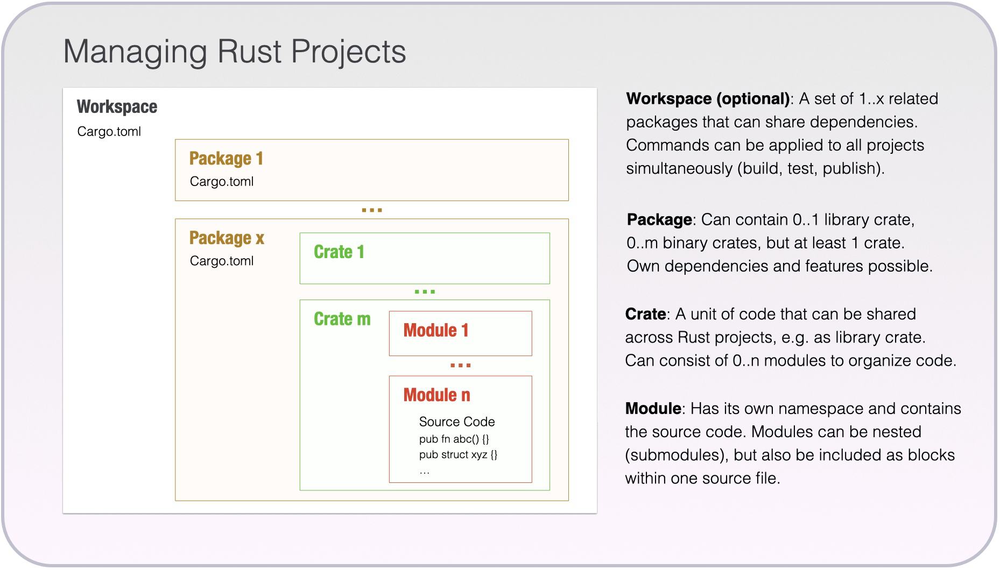

## Why Rust Exists
Rust was created at Mozilla Research around 2010 and reached 1.0 in 2015. The motivation was straightforward and familiar to anyone who has debugged a segfault at 2am: **systems programming is unsafe by default**, and the traditional tools (C, C++) leave memory safety entirely to the programmer.

The designers asked a pointed question: *can we have the performance of C with memory safety guaranteed at compile time, without a garbage collector?*

The answer is Rust.

### The Core Design Decisions
**1. Ownership replaces manual memory management.** Rather than `malloc`/`free` or smart pointers bolted on after the fact, Rust builds ownership into the type system. The compiler tracks who owns what, and memory is freed automatically when the owner goes out of scope. No GC, no runtime overhead.

###### 2. Borrowing replaces raw pointers.
Instead of passing pointers around freely, Rust has a formal concept of *borrowing* — you can lend a reference to data without transferring ownership. The compiler (the *borrow checker*) enforces that references are always valid. No dangling pointers, no use-after-free.

###### 3. Fearless concurrency.
Data races are a compile error. The same ownership rules that prevent memory bugs also make entire classes of concurrency bugs impossible.

###### 4. Zero-cost abstractions.
Rust's high-level features (iterators, generics, traits) compile down to the same machine code you'd write by hand. You don't pay for what you don't use — the same guarantee C++ makes, but delivered more consistently.

###### 5. Explicit over implicit.
Rust rarely does things behind your back. Integer overflow is checked in debug builds and wraps in release (with explicit opt-in). Type coercions are almost never automatic. Mutability must be declared. This is intentionally more verbose than C++ in places, in exchange for fewer surprises.

## How a Rust Project Is Structured
Three nested concepts organize Rust code: **packages**, **crates**, and **modules**. They map roughly — but not exactly — onto what you know from C and Python.

[{fig-align="center" width=9in}](https://iota-for-flutter.github.io/tutorial/fundamentals/rust/project-structure.html)

### Packages and Crates
A **crate** is the fundamental unit of compilation. The Rust compiler takes a crate and produces either an executable or a library. Think of it as the equivalent of a compiled C library (`.a`, `.so`) or a Python package on PyPI — the distributable unit that other projects depend on.

Two kinds of crates:

- **Binary crate** — has a `main()` entry point, produces an executable. Root file is `src/main.rs`.
- **Library crate** — no `main()`, produces a library for other code to use. Root file is `src/lib.rs`.

A **package** is what Cargo manages: a directory with a `Cargo.toml` manifest. A package contains at least one crate. Most projects you will work on are a single package with a single binary crate:

```
my_project/
├── Cargo.toml      # manifest: name, version, dependencies
├── Cargo.lock      # exact resolved dependency versions (commit this to git)
└── src/
    └── main.rs     # root of the binary crate
```

A library package looks the same but with `src/lib.rs` instead. A package can contain both a `main.rs` and a `lib.rs`, producing a binary and a library from the same source tree.

### Modules
A **module** is a namespace within a crate — the closest equivalent to a Python module. Modules organize code into logical units and control what is visible outside (`pub`) versus private. Items are **private by default** — you opt into visibility explicitly.

##### 1. Inline
:::{.subheading}
Right here, right now!
:::

You can declare a module inline:

```rust
mod math {
    pub fn add(a: i32, b: i32) -> i32 { a + b }

    fn internal_helper() { }   // private: not accessible outside this module
}

// call it
math::add(1, 2);
```

##### 2. File Based
:::{.subheading}
Rust looks for src/math.rs
:::

For larger code, modules live in their own files. Writing `mod math;` in `main.rs` tells Rust to look for the module's code in `src/math.rs`:

```
src/
├── main.rs     ← contains: mod math;
└── math.rs     ← the math module
```

##### 3. Directory Based
:::{.subheading}
Rust looks for src/math/mod.rs
:::

A module that has its own submodules gets a directory instead:

```
src/
├── main.rs
└── math/
    ├── mod.rs      # the math module root
    └── geometry.rs # submodule, accessed as math::geometry
```

:::{.callout-warning title="Rauchen est Verbotten"}
For cases 2 and 3, Rust decides which to use based on which file exists. You cannot have both `src/math.rs` and `src/math/mod.rs`.
:::

#### Visibility
Four levels, from narrowest to widest:

| Keyword      | Visible to                                         |
|--------------|----------------------------------------------------|
| (none)       | Only code within the same module                   |
| `pub(super)` | The parent module only                             |
| `pub(crate)` | Anywhere within this crate, but not external users |
| `pub`        | Everyone — including external users of the crate   |

```rust
// src/geometry/shapes.rs
pub struct Circle {
    pub radius: f64,        // visible to all
    center: Point,          // private — only code in this module can touch it
}

pub fn area(c: &Circle) -> f64 {
    std::f64::consts::PI * c.radius * c.radius
}

pub(crate) fn internal_check() { }  // crate-internal only
```

#### Submodules
A module can contain other modules. You declare them in the parent's `mod.rs` the same way you declare top-level modules in `main.rs`:

```rust
// src/geometry/mod.rs
pub mod shapes;      // public submodule — accessible as geometry::shapes
pub mod transforms;  // public submodule — accessible as geometry::transforms
mod utils;           // private submodule — internal to geometry, invisible outside
```

You reference them with `::`:

```rust
use geometry::shapes::Circle;
use geometry::transforms::rotate;
```

Or fully qualified without `use`:

```rust
let c = geometry::shapes::Circle { radius: 5.0 };
```

##### This Hole is Deep
The nesting is arbitrarily deep. The directory layout mirrors the module tree at each level:

```
src/
├── main.rs
└── geometry/
    ├── mod.rs              # pub mod shapes; pub mod transforms;
    ├── shapes/
    │   ├── mod.rs          # pub mod circle; pub mod rectangle;
    │   ├── circle.rs       # geometry::shapes::circle
    │   └── rectangle.rs    # geometry::shapes::rectangle
    └── transforms.rs       # geometry::transforms
```

Each level follows the same rule: a `mod.rs` declares what is inside it, and child files or directories implement those submodules.

#### Spreading a Module's API Across Files
The internal file structure does not have to match the public API. `pub use` re-exports items from submodules into the parent's namespace, so callers see a flat surface regardless of how the code is organized internally:

```rust
// src/geometry/mod.rs
mod shapes;      // private — callers cannot reach geometry::shapes directly
mod transforms;  // private

// re-export selected items into geometry:: directly
pub use shapes::Circle;
pub use shapes::Rectangle;
pub use transforms::rotate;
```

Now from the outside:

```rust
use geometry::Circle;   // works — even though Circle lives in shapes.rs
use geometry::rotate;   // works — even though rotate lives in transforms.rs
```

The internal structure is hidden. The public surface of `geometry` looks like one flat module. This is how most published Rust libraries are organized: files and submodules for the authors' benefit, `pub use` for a clean external interface.

`mod.rs` itself can also define things directly in the module's namespace alongside its declarations:

```rust
// src/geometry/mod.rs
pub mod shapes;

// these live in geometry:: directly, not in any submodule
pub struct Point { pub x: f64, pub y: f64 }
pub fn origin() -> Point { Point { x: 0.0, y: 0.0 } }
```

#### Bringing Items Into Scope
`use` avoids writing the full path repeatedly:

```rust
use geometry::shapes::Circle;          // bring one item into scope
use geometry::shapes::*;               // bring everything public — use sparingly
use geometry::{shapes, transforms};    // bring multiple submodules at once
```

::: {.callout-note title="Inline Modules: `mod Name { }`"}
You can declare and define a module in one place, without a separate file:

```rust
mod config {
    pub const MAX_RETRIES: u32 = 3;
    pub fn default_timeout() -> u64 { 30 }
}
```

This is the right choice for small, tightly related helpers that do not warrant their own file. The most common use case, however, is **unit tests**. The idiomatic Rust pattern puts tests in an inline module at the bottom of the file they test:

```rust
// src/math.rs
pub fn add(a: i32, b: i32) -> i32 { a + b }

#[cfg(test)]
mod tests {
    use super::*;   // reach up to the parent module's items

    #[test]
    fn test_add() {
        assert_eq!(add(2, 3), 5);
    }
}
```

`#[cfg(test)]` means the module is compiled only when running `cargo test` — it is absent from release builds entirely. `use super::*` brings the parent module's items into scope, which is why `add` can be called directly without a path prefix. For anything beyond a handful of items, a separate file is almost always cleaner.
:::

### External Dependencies
Dependencies from crates.io (Rust's public registry, the equivalent of PyPI) go in `Cargo.toml`:

```toml
[dependencies]
serde = { version = "1.0", features = ["derive"] }
regex = "1.10"
```

Run `cargo add regex` from the command line and Cargo writes the entry for you. Then use it in code:

```rust
use regex::Regex;
```

This is the `pip install` + `import` of Rust, collapsed into one tool that also handles building, testing, and formatting.

### The Analogy Table
| Concept               | C                        | Python              | Rust              |
|-----------------------|--------------------------|---------------------|-------------------|
| Distributable unit    | `.a` / `.so`             | Package (PyPI)      | Crate (crates.io) |
| Project manifest      | Makefile                 | `pyproject.toml`    | `Cargo.toml`      |
| Namespace / file unit | (file, no formal system) | Module (`.py` file) | Module (`mod`)    |
| Import                | `#include`               | `import`            | `use`             |
| Package manager       | (none built in)          | pip                 | cargo             |

## The Basics
[Common Programming Concepts](https://doc.rust-lang.org/book/ch03-00-common-programming-concepts.html) by *The Rust Programming Language*.

### Variables and Mutability
In C you declare a variable and it's mutable by default. In Rust, variables are **immutable by default**. You opt into mutability with `mut`.

```rust
let x = 5;          // immutable
let mut y = 5;      // mutable
y += 1;             // fine
// x += 1;          // compile error
```

This isn't just style — the compiler uses immutability information to reason about your program. It's a habit worth building early.

### Types
Rust is statically typed. Types are usually inferred, but you can annotate explicitly. The primitive types will be familiar:

```rust
let a: i32  = -42;       // signed 32-bit integer
let b: u64  = 1_000_000; // unsigned 64-bit (underscores ok in literals)
let c: f64  = 3.14;      // 64-bit float
let d: bool = true;
let e: char = 'z';       // Unicode scalar, 4 bytes (not u8!)
```

Integer types: `i8`, `i16`, `i32`, `i64`, `i128`, `isize` and their `u` counterparts. `isize`/`usize` are pointer-sized, like `ptrdiff_t`/`size_t` in C.

No implicit numeric conversions. You cast explicitly with `as`:

```rust
let x: i32 = 42;
let y: f64 = x as f64;
```

### Functions
```rust
fn add(a: i32, b: i32) -> i32 {
    a + b       // no semicolon = expression = return value
}

fn greet(name: &str) {
    println!("Hello, {}!", name);  // no return value = returns ()
}
```

The last expression in a block is its value. `return` exists but is idiomatic only for early returns.

### Control Flow
```rust
// if is an expression
let max = if a > b { a } else { b };

// loop
loop {
    break;   // only way to exit a bare loop
}

// while
while x > 0 {
    x -= 1;
}

// for over a range
for i in 0..10 {        // 0 to 9
    println!("{}", i);
}

// for over a collection
let nums = vec![1, 2, 3];
for n in &nums {
    println!("{}", n);
}
```

## Macros
[Macros](https://doc.rust-lang.org/book/ch20-05-macros.html) as per *The Rust Programming Language*.

Throughout this chapter you have seen `println!`, `vec!`, `format!`, and `panic!`. The `!` signals a **macro call**, not a function call. Macros in Rust are code that writes code at compile time, before the compiler type-checks anything.

The practical reason macros exist: some things ordinary functions cannot do. `println!` accepts a variable number of arguments of different types — impossible for a regular Rust function without significant compromise. Macros solve this by expanding at compile time into whatever code is needed.

```rust
println!("hello");                    // no arguments
println!("{}", x);                    // one argument
println!("{} and {}", x, y);          // two arguments, different types fine
```

Common macros you will use regularly:

| Macro              | Purpose                                                             |
|--------------------|---------------------------------------------------------------------|
| `println!(...)`    | Print to stdout with newline                                        |
| `eprintln!(...)`   | Print to stderr with newline                                        |
| `format!(...)`     | Build a `String` using the same syntax as `println!`                |
| `vec![...]`        | Create a `Vec<T>` from a list of values                             |
| `panic!(...)`      | Terminate the program with an error message                         |
| `assert!(cond)`    | Panic if a condition is false                                       |
| `assert_eq!(a, b)` | Panic if two values are not equal (prints both on failure)          |
| `todo!()`          | Placeholder that compiles but panics at runtime                     |
| `dbg!(expr)`       | Print the file, line, and value of an expression; returns the value |

`#[derive(...)]` is a different kind of macro — a *procedural macro* — that generates trait implementations automatically:

```rust
#[derive(Debug, Clone, PartialEq)]
struct Point { x: f64, y: f64 }

// Now you can:
println!("{:?}", p);    // Debug formatting
let p2 = p.clone();     // Clone
assert_eq!(p, p2);      // PartialEq
```

You can write your own macros with `macro_rules!` (declarative macros) or procedural macro crates. For most work, the standard library macros and [`derive`](https://doc.rust-lang.org/book/ch20-05-macros.html#custom-derive-macros) cover what you need.

## Memory Management
[Understanding Ownership](https://doc.rust-lang.org/book/ch04-00-understanding-ownership.html) in *The Rust Programming Language*.

This is the heart of Rust. If you understand this section, you understand Rust.

### The Stack and the Heap
Same as C/C++:

- **Stack** — fixed-size values, automatically allocated and freed. Fast.
- **Heap** — dynamic allocation, lives until explicitly freed. Flexible.

In C you manage the heap manually. In Rust the compiler does it for you via ownership rules, at zero runtime cost.

### Ownership
Every value in Rust has exactly one **owner**. When the owner goes out of scope, the value is freed. This is RAII, but enforced by the type system rather than by convention.

```rust
{
    let s = String::from("hello");  // s owns the heap-allocated string
    // use s...
}   // s goes out of scope: memory freed automatically. No free(), no delete.
```

**Move semantics** — when you assign an owned value to another variable, the original owner is invalidated. This prevents double-free:

```rust
let s1 = String::from("hello");
let s2 = s1;         // ownership moves to s2
// println!("{}", s1); // compile error: s1 no longer valid
println!("{}", s2);  // fine
```

This is like C++ move semantics, but the compiler *forces* you to use them correctly. You can't accidentally use a moved-from value.

**Copy types** — primitives like integers implement the `Copy` trait, so assignment copies the value rather than moving it (same as C):

```rust
let x = 5;
let y = x;  // x is copied, not moved
println!("{}", x);  // fine: x still valid
```

### Borrowing
Moving ownership around constantly would be tedious. *Borrowing* lets you pass references to data without transferring ownership. Like pointers, but guaranteed safe.

```rust
fn print_len(s: &String) {    // borrows s, doesn't take ownership
    println!("{}", s.len());
}

let s = String::from("hello");
print_len(&s);               // lend s to the function
println!("{}", s);           // s still valid after the call
```

**The borrow rules** (enforced at compile time):

1. You can have *either* one mutable reference *or* any number of immutable references — never both at the same time.
2. References must always be valid (no dangling references).

```rust
let mut s = String::from("hello");

let r1 = &s;      // immutable borrow
let r2 = &s;      // another immutable borrow — fine
// let r3 = &mut s; // compile error: can't borrow as mutable while immutable borrows exist

println!("{} {}", r1, r2);
// r1 and r2 go out of use here

let r3 = &mut s;  // now a mutable borrow is fine
r3.push_str(", world");
```

This feels restrictive at first. In practice it eliminates a huge class of bugs: data races, iterator invalidation, use-after-free. The compiler is your enforcer.

### Slices
A slice is a reference to a contiguous sequence — a view into an array or string without copying:

```rust
let a = [1, 2, 3, 4, 5];
let slice = &a[1..3];    // [2, 3] — no copy

let s = String::from("hello world");
let word = &s[0..5];     // "hello" — &str, no copy
```

`&str` (string slice) and `&[T]` (array slice) are the idiomatic ways to pass read-only sequence data to functions.

### The String Types
Rust has two main string types, which confuses newcomers:

| Type     | Owned?      | Mutable? | Analogy                             |
|----------|-------------|----------|-------------------------------------|
| `String` | Yes         | Yes      | `std::string` in C++                |
| `&str`   | No (a view) | No       | `const char*` or `std::string_view` |

```rust
let owned: String = String::from("hello");
let view: &str = "world";          // string literals are &str
let slice: &str = &owned[0..3];    // borrow part of owned
```

Functions that just need to read a string should accept `&str` — it works with both `String` and string literals.

### Lifetimes
::: {.subheading}
Brief Introduction
:::

Lifetimes are Rust's way of ensuring references don't outlive the data they point to. In most code the compiler infers them. You only write lifetime annotations when the compiler can't figure it out — usually in function signatures that return references:

```rust
fn longest<'a>(x: &'a str, y: &'a str) -> &'a str {
    if x.len() > y.len() { x } else { y }
}
```

The `'a` says "the returned reference lives at least as long as both inputs." Don't worry about this too deeply at first — the compiler will tell you when you need an annotation and the error messages are good.

## Smart Pointers
[Smart Pointers](https://doc.rust-lang.org/book/ch15-00-smart-pointers.html) in *The Rust Programming Language*.

When you need heap allocation beyond what `Vec` and `String` already handle, Rust provides smart pointer types. C++ developers will recognize the ideas.

### `Box<T>`
::: {.subheading}
Single Ownership on the Heap
:::

`Box<T>` allocates `T` on the heap and owns it. When the box goes out of scope, the memory is freed. This is the Rust equivalent of `std::unique_ptr<T>`.

```rust
let b = Box::new(5);
println!("{}", *b);     // dereference with *
```

Boxes are useful in two main situations.

**Recursive types** — a type that contains itself cannot be given a fixed size without a pointer, because the size calculation would be infinite:

```rust
enum List {
    Cons(i32, Box<List>),   // Box breaks the infinite size cycle
    Nil,
}
```

**Large values** — moving a large struct by value copies all its bytes on the stack; boxing it moves only a pointer.

### `Rc<T>`
::: {.subheading}
Shared Ownership, Single Thread
:::

`Rc<T>` (reference counted) allows multiple owners of the same heap value. The value is freed when the last owner is dropped. Equivalent to `std::shared_ptr<T>`, but **not thread-safe**.

```rust
use std::rc::Rc;

let a = Rc::new(String::from("shared"));
let b = Rc::clone(&a);   // increments reference count, no copy of the data
let c = Rc::clone(&a);

println!("{} owners", Rc::strong_count(&a));  // 3
// value freed when a, b, and c all go out of scope
```

`Rc<T>` gives you immutable shared access. To mutate through an `Rc`, combine it with `RefCell<T>` (interior mutability — an advanced topic for when you need it).

### `Arc<T>`
::: {.subheading}
Shared Ownership Across Threads
:::

`Arc<T>` (atomically reference counted) is the thread-safe version of `Rc<T>`. Use this when sharing data across threads.

```rust
use std::sync::Arc;
use std::thread;

let data = Arc::new(vec![1, 2, 3]);
let data_clone = Arc::clone(&data);

let handle = thread::spawn(move || {
    println!("{:?}", data_clone);
});

handle.join().unwrap();
println!("{:?}", data);   // original still valid
```

For mutable shared state across threads, pair `Arc` with `Mutex<T>`:

```rust
use std::sync::{Arc, Mutex};

let counter = Arc::new(Mutex::new(0));
```

### Quick Reference
| Type     | Ownership | Thread-safe | C++ analogy                           |
|----------|-----------|-------------|---------------------------------------|
| `Box<T>` | Single    | Yes         | `unique_ptr<T>`                       |
| `Rc<T>`  | Shared    | No          | `shared_ptr<T>` (single-threaded)     |
| `Arc<T>` | Shared    | Yes         | `shared_ptr<T>` with atomic ref count |

## Structs, Enums, and Traits
### Structs
[Structs](https://doc.rust-lang.org/book/ch05-00-structs.html) as per *The Rust Programming Language*.

```rust
struct Point {
    x: f64,
    y: f64,
}

impl Point {
    // Associated function (like a static method) — constructor by convention
    fn new(x: f64, y: f64) -> Self {
        Point { x, y }   // field shorthand when names match
    }

    // Method — first arg is &self (immutable) or &mut self (mutable)
    fn distance_from_origin(&self) -> f64 {
        (self.x * self.x + self.y * self.y).sqrt()
    }
}

let p = Point::new(3.0, 4.0);
println!("{}", p.distance_from_origin()); // 5.0
```

No inheritance. Composition over inheritance is idiomatic Rust.

### Enums
[Enums and Pattern Matching](https://doc.rust-lang.org/book/ch06-00-enums.html) as per *The Rust Programming Language*.

Rust enums are algebraic data types — each variant can carry different data. This is far more powerful than C enums.

```rust
enum Shape {
    Circle(f64),               // radius
    Rectangle(f64, f64),       // width, height
    Triangle { base: f64, height: f64 },  // named fields
}

impl Shape {
    fn area(&self) -> f64 {
        match self {
            Shape::Circle(r)             => std::f64::consts::PI * r * r,
            Shape::Rectangle(w, h)       => w * h,
            Shape::Triangle { base, height } => 0.5 * base * height,
        }
    }
}
```

Two enums you'll use constantly:

```rust
// Option<T> replaces null
enum Option<T> {
    Some(T),
    None,
}

// Result<T, E> replaces error codes and exceptions
enum Result<T, E> {
    Ok(T),
    Err(E),
}
```

### Traits
Traits are Rust's answer to interfaces. A trait defines behaviour; structs implement it.

```rust
trait Describe {
    fn describe(&self) -> String;
}

impl Describe for Point {
    fn describe(&self) -> String {
        format!("({}, {})", self.x, self.y)
    }
}

impl Describe for Shape {
    fn describe(&self) -> String {
        format!("area = {:.2}", self.area())
    }
}

// Accept any type that implements Describe
fn print_description(item: &impl Describe) {
    println!("{}", item.describe());
}
```

Common standard library traits you'll encounter:

- `Debug` — enables `{:?}` formatting (usually derived)
- `Clone` — explicit deep copy
- `Copy` — implicit copy on assignment (primitives)
- `Iterator` — gives you `map`, `filter`, `collect`, etc.
- `Display` — enables `{}` formatting

Derive macros implement common traits automatically:

```rust
#[derive(Debug, Clone)]
struct Point { x: f64, y: f64 }
// Now you can: println!("{:?}", p);
```

## Generics and Trait Bounds
[Generic Types, Traits, and Lifetimes](https://doc.rust-lang.org/book/ch10-00-generics.html) by *The Rust Programming Language*.

Generics are Rust's equivalent of C++ templates, but they interact with the trait system in a way that makes constraints explicit and checked at compile time. A generic function works over any type, constrained by trait bounds:

```rust
fn largest<T: PartialOrd>(a: T, b: T) -> T {
    if a > b { a } else { b }
}

println!("{}", largest(5, 10));      // works with i32
println!("{}", largest(3.0, 2.5));  // works with f64
```

The `T: PartialOrd` bound says "T must implement `PartialOrd`" — the trait that provides `>`, `<`, and so on. Without the bound, the compiler rejects the use of `>` on an unconstrained `T`. Unlike C++ templates, there are no surprise errors at instantiation time; the bounds are checked against the generic definition itself.

Generic structs work the same way:

```rust
struct Pair<T> {
    first: T,
    second: T,
}

impl<T: std::fmt::Display> Pair<T> {
    fn show(&self) {
        println!("({}, {})", self.first, self.second);
    }
}
```

Multiple bounds use `+`:

```rust
fn print_debug<T: Debug + Clone>(item: T) {
    let copy = item.clone();
    println!("{:?}", copy);
}
```

### `impl Trait` vs `dyn Trait`
There are two ways to accept a trait in a function signature, and the choice matters for performance.

**`impl Trait` — static dispatch.** The compiler generates a separate, specialized function for each concrete type at compile time. No runtime overhead, but the type must be known at compile time.

```rust
fn make_sound(animal: &impl Animal) {
    animal.speak();
}
```

**`dyn Trait` — dynamic dispatch.** A fat pointer containing the data address and a vtable of function pointers, resolved at runtime. Slightly slower, but lets you hold mixed types in a collection or return different concrete types from one function.

```rust
fn make_sounds(animals: &[Box<dyn Animal>]) {
    for a in animals {
        a.speak();   // resolved at runtime via vtable
    }
}
```

This is the Rust equivalent of virtual methods in C++. The analogy is direct: `Box<dyn Trait>` is roughly what a pointer-to-base class with a vtable is in C++. Prefer `impl Trait` when the type is known at compile time; reach for `dyn Trait` when you need runtime polymorphism or heterogeneous collections.

## Pattern Matching
[Pattern Matching](https://doc.rust-lang.org/book/ch19-00-patterns.html) as per *The Rust Programming Language*.

Pattern matching in Rust is deeper than a switch statement. It simultaneously **tests the structure** of a value and **extracts** data from it. Every `match` arm is a pattern, and the compiler guarantees you have handled every possible case — exhaustiveness is enforced at compile time.

### The `match` Expression
[`match`](https://doc.rust-lang.org/book/ch19-01-all-the-places-for-patterns.html#match-arms) as per *The Rust Programming Language*.

```rust
let n = 7;

match n {
    1       => println!("one"),
    2 | 3   => println!("two or three"),    // | means "or"
    4..=9   => println!("four through nine"), // ..= is an inclusive range
    _       => println!("something else"),  // _ is a wildcard, matches anything
}
```

`match` is an expression — it produces a value, and all arms must have the same type:

```rust
let label = match n {
    1       => "one",
    2 | 3   => "two or three",
    4..=9   => "single digit",
    _       => "large",
};
```

### Matching on `Option<T>`
`Option<T>` represents a value that may or may not exist. It replaces `NULL` entirely and forces you to handle the absent case.

```rust
let maybe: Option<i32> = Some(42);

match maybe {
    Some(n) => println!("got {}", n),   // n is bound to 42
    None    => println!("nothing here"),
}
```

The `Some(n)` pattern does two things simultaneously: it checks that the value *is* a `Some`, and it binds the inner value to `n`. You cannot access `n` outside that arm — the compiler will not let you pretend a `None` is a value.

Compare this to C:

```c
int *p = maybe_get_value();
printf("%d\n", *p);   // crashes at runtime if p is NULL
```

In Rust, not handling `None` is a compile error, not a runtime discovery.

Patterns compose. Nested `Option` values can be matched in one expression:

```rust
let nested: Option<Option<i32>> = Some(Some(7));

match nested {
    Some(Some(n)) => println!("deep value: {}", n),
    Some(None)    => println!("outer Some, inner None"),
    None          => println!("outer None"),
}
```

### Matching on `Result<T, E>`
`Result<T, E>` represents either success (`Ok`) or failure (`Err`). It is how Rust returns errors from functions — no exceptions, no out-of-band error codes.

```rust
let result: Result<i32, &str> = Ok(100);

match result {
    Ok(n)  => println!("success: {}", n),
    Err(e) => println!("failed: {}", e),
}
```

The error variant can carry any type, and you can match on it just as deeply:

```rust
use std::num::ParseIntError;

fn parse_and_double(s: &str) -> Result<i32, ParseIntError> {
    let n: i32 = s.trim().parse()?;   // ? propagates Err early
    Ok(n * 2)
}

match parse_and_double("21") {
    Ok(n)  => println!("result: {}", n),   // prints 42
    Err(e) => println!("parse error: {}", e),
}
```

### Destructuring Structs and Tuples
Patterns work directly on the structure of any type. You are not comparing fields one at a time — you are writing the *shape* of the data you expect, and the compiler matches it.

```rust
struct Point { x: f64, y: f64 }

let p = Point { x: 3.0, y: -1.0 };

match p {
    Point { x: 0.0, y: 0.0 } => println!("at origin"),
    Point { x, y: 0.0 }      => println!("on x-axis at {}", x),
    Point { x: 0.0, y }      => println!("on y-axis at {}", y),
    Point { x, y }            => println!("at ({}, {})", x, y),
}
```

Tuples destructure the same way:

```rust
let pair = (true, 42);

match pair {
    (true, n)  => println!("true with {}", n),
    (false, _) => println!("false"),
}
```

Enum variants that carry data are matched by their payload structure:

```rust
enum Message {
    Quit,
    Move { x: i32, y: i32 },
    Write(String),
    Color(u8, u8, u8),
}

match msg {
    Message::Quit              => println!("quit"),
    Message::Move { x, y }    => println!("move to {},{}", x, y),
    Message::Write(text)       => println!("write: {}", text),
    Message::Color(r, g, b)   => println!("color: {},{},{}", r, g, b),
}
```

### Match Guards
An `if` condition can be added to any arm. The pattern must match *and* the guard must be true for the arm to fire:

```rust
let n = 7;

match n {
    n if n < 0      => println!("negative"),
    0               => println!("zero"),
    n if n % 2 == 0 => println!("positive even"),
    n               => println!("positive odd: {}", n),
}
```

### Binding with `@`
The `@` operator lets you bind a name to a value *while also* testing it against a sub-pattern. This is useful when you need to both check a range and use the specific value:

```rust
match n {
    small @ 1..=9  => println!("{} is a single digit", small),
    large          => println!("{} is large", large),
}
```

### `if let` and `while let`
When you only care about one variant, a full `match` is verbose. `if let` handles one case and ignores the rest:

```rust
let config: Option<&str> = Some("debug");

if let Some(level) = config {
    println!("log level: {}", level);
}
// None is silently ignored
```

`while let` loops until a pattern stops matching — useful for draining a collection:

```rust
let mut stack = vec![1, 2, 3];

while let Some(top) = stack.pop() {
    println!("{}", top);   // prints 3, 2, 1
}
```

### `let` and Function Arguments Are Also Patterns
This surprises people coming from other languages: `let` itself is a pattern match. Any irrefutable pattern (one that always matches) is valid on the left-hand side of a `let`:

```rust
let (a, b, c) = (1, 2, 3);     // tuple destructuring
let Point { x, y } = p;         // struct destructuring
```

Function parameters destructure too:

```rust
fn sum_pair(&(a, b): &(i32, i32)) -> i32 {
    a + b
}
```

Pattern matching is not a special feature bolted onto Rust — it is woven into the language as the primary way to inspect and extract data.

### Exhaustiveness
The compiler rejects a `match` that does not cover all cases:

```rust
enum Direction { North, South, East, West }

let dir = Direction::North;

match dir {
    Direction::North => println!("north"),
    Direction::South => println!("south"),
    // compile error: Direction::East and Direction::West not covered
}
```

Adding a new variant to an enum breaks every exhaustive match in the codebase at compile time. You cannot silently miss a case. This is one of the most powerful refactoring guarantees Rust offers.

## Closures and Iterators
### Closures
A closure is an anonymous function that can capture values from its surrounding scope. C++ programmers will recognize them as lambdas.

```rust
let add = |a, b| a + b;
println!("{}", add(2, 3));   // 5

let threshold = 10;
let above = |n| n > threshold;   // captures threshold from the enclosing scope
println!("{}", above(15));        // true
```

Closures infer parameter and return types from context. You can annotate explicitly if needed:

```rust
let square = |x: f64| -> f64 { x * x };
```

**Capture modes.** Rust closures capture by reference by default. If you need the closure to own its captured data — to send it to another thread, for example — use `move`:

```rust
let name = String::from("world");
let greet = move || println!("hello, {}", name);   // name is moved in
greet();
// name is no longer accessible here
```

### Iterators
The `Iterator` trait powers a functional-style pipeline over any collection. The adapters are *lazy* — nothing is computed until you drive the iterator with a terminal operation.

```rust
let nums = vec![1, 2, 3, 4, 5, 6];

let result: Vec<i32> = nums.iter()
    .filter(|&&x| x % 2 == 0)   // keep even numbers
    .map(|&x| x * x)             // square each one
    .collect();                  // drive the iteration, build a Vec

println!("{:?}", result);   // [4, 16, 36]
```

Common adapters:

| Method                  | What it does                              |
|-------------------------|-------------------------------------------|
| `.map(f)`               | Transform each element                    |
| `.filter(p)`            | Keep elements where the predicate is true |
| `.fold(init, f)`        | Reduce to a single accumulated value      |
| `.enumerate()`          | Pair each element with its index          |
| `.zip(iter)`            | Combine two iterators element by element  |
| `.take(n)`              | Stop after n elements                     |
| `.skip(n)`              | Skip the first n elements                 |
| `.flat_map(f)`          | Map, then flatten one level               |
| `.any(p)` / `.all(p)`   | Short-circuit boolean tests               |
| `.sum()` / `.product()` | Numeric reductions                        |

Terminal operations that drive the iteration:

```rust
let v = vec![1, 2, 3, 4, 5];

let total: i32  = v.iter().sum();                           // 15
let count       = v.iter().filter(|&&x| x > 2).count();    // 3
let found       = v.iter().find(|&&x| x == 3);             // Some(&3)
let doubled: Vec<i32> = v.iter().map(|&x| x * 2).collect();
```

**`.iter()` vs `.into_iter()` vs `.iter_mut()`:**

| Method         | Yields   | Effect on collection |
|----------------|----------|----------------------|
| `.iter()`      | `&T`     | Borrows              |
| `.iter_mut()`  | `&mut T` | Mutably borrows      |
| `.into_iter()` | `T`      | Consumes             |

```rust
let mut v = vec![1, 2, 3];

for x in v.iter_mut() {
    *x *= 2;
}
println!("{:?}", v);   // [2, 4, 6]
```

The compiler optimizes iterator chains aggressively. A chain of `.filter().map().collect()` typically compiles to the same machine code as an equivalent hand-written loop.

## Error Handling
Rust has no exceptions. Errors are values, returned via `Result<T, E>`.

```rust
use std::fs;
use std::io;

fn read_file(path: &str) -> Result<String, io::Error> {
    let content = fs::read_to_string(path)?;  // ? propagates error
    Ok(content)
}

// Caller handles the result
match read_file("data.txt") {
    Ok(content) => println!("{}", content),
    Err(e)      => eprintln!("Failed: {}", e),
}
```

### `Result` Is Just an Enum
It is worth pausing on this. `Result<T, E>` is not a special language construct. It is an ordinary enum defined in the standard library:

```rust
enum Result<T, E> {
    Ok(T),
    Err(E),
}
```

That's it. Everything you have learned about matching enums applies directly. `Ok` and `Err` are variants that carry data, exactly like `Shape::Circle(f64)` or `Message::Write(String)`. The compiler treats them no differently. What makes `Result` powerful is the combination of that simple structure with the pattern matching tools built into the language.

### `if let` for Error Handling
Because `Result` is an enum, `if let` works on it naturally. The most common form you will see in real code handles only the error case and ignores success:

```rust
if let Err(e) = commander.dispatch(command, &mut stdout) {
    eprintln!("Error: {}", e);
    std::process::exit(1);
}
```

Read this as: "if the result matches the `Err(e)` pattern, bind the error value to `e` and run the block." If `dispatch` returned `Ok(...)`, the pattern does not match, the block is skipped, and execution continues normally.

The full `match` equivalent makes the relationship clear:

```rust
match commander.dispatch(command, &mut stdout) {
    Ok(_)  => {}    // success — do nothing, keep going
    Err(e) => {
        eprintln!("Error: {}", e);
        std::process::exit(1);
    }
}
```

`if let` is the compact form for when you only care about one variant. You can go the other direction too — handle success and ignore errors:

```rust
if let Ok(content) = read_file("data.txt") {
    println!("{}", content);
}
// if it failed, silently move on
```

### `while let` for Repeated Operations
`while let` extends the same idea into a loop. It keeps running as long as the pattern matches and stops the moment it does not:

```rust
while let Ok(line) = read_next_line(&mut reader) {
    process(line);
}
// loop ends when read_next_line returns Err (end of file, I/O error, etc.)
```

This is particularly natural for anything that produces a stream of results: reading lines, polling a queue, consuming an iterator of fallible operations. The loop structure mirrors the data structure.

### The `?` Operator
Inside a function that returns `Result`, the `?` operator is shorthand for "if this is an `Err`, return it immediately to the caller; if it is `Ok`, unwrap and continue."

```rust
fn read_file(path: &str) -> Result<String, io::Error> {
    let content = fs::read_to_string(path)?;  // returns Err early if it fails
    Ok(content)
}
```

Without `?`, the equivalent code is:

```rust
fn read_file(path: &str) -> Result<String, io::Error> {
    let content = match fs::read_to_string(path) {
        Ok(c)  => c,
        Err(e) => return Err(e),
    };
    Ok(content)
}
```

`?` eliminates that boilerplate. In a function that makes several fallible calls, it keeps the happy path readable while still propagating every error to the caller.

### Choosing the Right Tool
| Situation                             | Use                             |
|---------------------------------------|---------------------------------|
| Handle both `Ok` and `Err` explicitly | `match`                         |
| Act only on error, ignore success     | `if let Err(e) = ...`           |
| Act only on success, ignore error     | `if let Ok(v) = ...`            |
| Loop until failure                    | `while let Ok(v) = ...`         |
| Propagate error to caller             | `?`                             |
| Prototype or test — crash on error    | `.unwrap()` or `.expect("msg")` |

### `.unwrap()` and `.expect()`
For quick scripts or prototypes, `.unwrap()` panics on error (like an unchecked assertion). `.expect("message")` does the same but prints your message alongside the error, which makes debugging easier:

```rust
let content = read_file("data.txt").unwrap();           // panics with default message
let content = read_file("data.txt").expect("could not read data file");  // clearer
```

Use both only in tests and exploratory code. Prefer explicit handling in production code.

## Common Collections
```rust
// Vec<T> — growable array (like std::vector)
let mut v: Vec<i32> = Vec::new();
v.push(1);
v.push(2);
v.push(3);
let third = v[2];           // 3 — panics if index is out of bounds
let safe = v.get(10);       // None — returns Option<&i32> instead of panicking

// HashMap<K, V>
use std::collections::HashMap;
let mut map = HashMap::new();
map.insert("key", 42);
let val = map.get("key");   // Option<&i32>

// Iterate
for (k, v) in &map {
    println!("{}: {}", k, v);
}
```

## Cargo
::: {.subheading}
The Build System
:::

[Packages, Crates, and Modules](https://doc.rust-lang.org/book/ch07-00-managing-growing-projects-with-packages-crates-and-modules.html) as per *The Rust Programming Language*.

Cargo is Rust's build tool, package manager, and test runner. You'll use it for everything.

```bash
cargo new my_project    # create new project
cargo build             # debug build
cargo build --release   # optimized build
cargo run               # build and run
cargo test              # run all tests
cargo check             # fast type-check without building
cargo clippy            # linter
cargo fmt               # formatter
```

Dependencies go in `Cargo.toml`:

```toml
[dependencies]
serde = { version = "1.0", features = ["derive"] }
regex = "1.10"
```

`cargo add serde` adds a dependency from the command line. The ecosystem (crates.io) is large and high quality.

## Key Differences from C/C++
::: {.subheading}
Quick Reference
:::

| C/C++                          | Rust                                   |
|--------------------------------|----------------------------------------|
| `int x = 5;`                   | `let x: i32 = 5;`                      |
| Mutable by default             | Immutable by default (`mut` to opt in) |
| `void` return                  | `()` return (unit type)                |
| `NULL` / `nullptr`             | `None` (in `Option<T>`)                |
| Exceptions                     | `Result<T, E>`                         |
| `struct` + methods (C++ class) | `struct` + `impl` block                |
| Virtual methods / vtable       | Trait objects (`dyn Trait`)            |
| Templates                      | Generics + trait bounds                |
| `#include`                     | `use`                                  |
| Header files                   | No headers — modules handle visibility |
| Manual `free` / `delete`       | Automatic via ownership                |
| Undefined behaviour on misuse  | Compile error on misuse                |
| `printf`                       | `println!("{}",  val)`                 |

## Where to Go Next
- The [Rust Book](https://doc.rust-lang.org/book/) is free online and excellent.
- [Rustlings](https://github.com/rust-lang/rustlings) is a set of small exercises that build muscle memory quickly.
- [docs.rs](https://docs.rs) is the standard library and crate documentation hub — well worth bookmarking.

The compiler error messages are unusually good. Read them carefully — they usually tell you exactly what's wrong and often suggest the fix.
